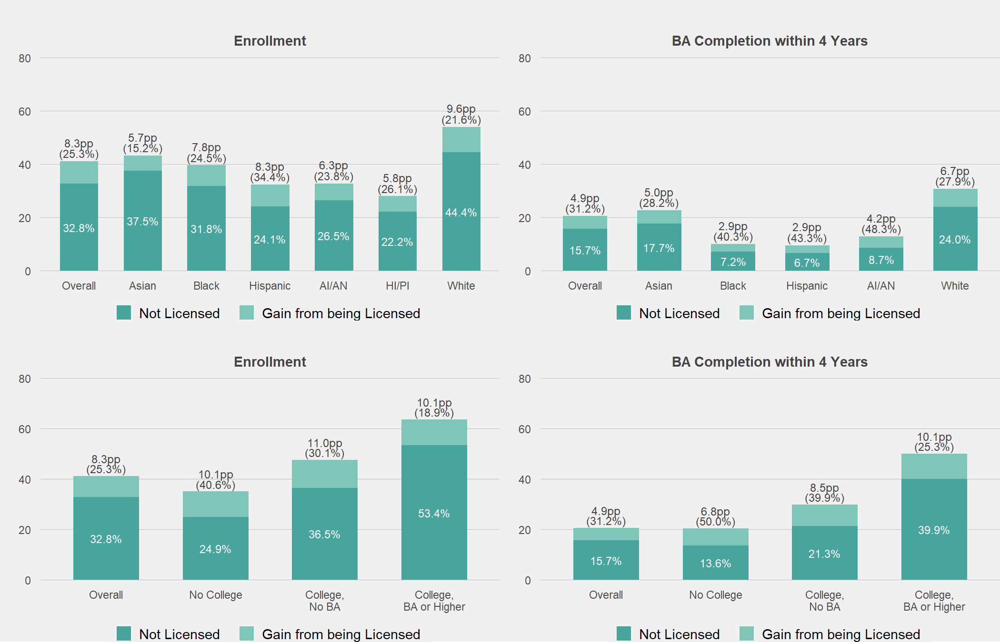
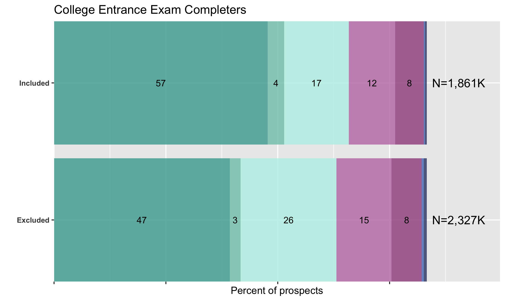
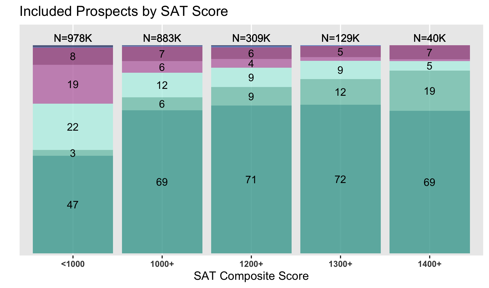
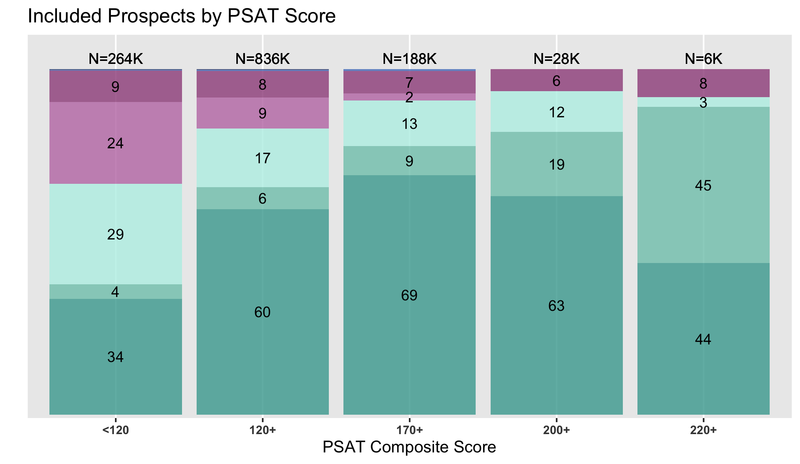
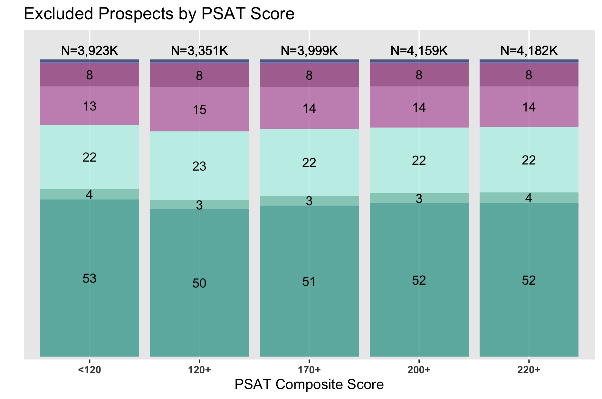
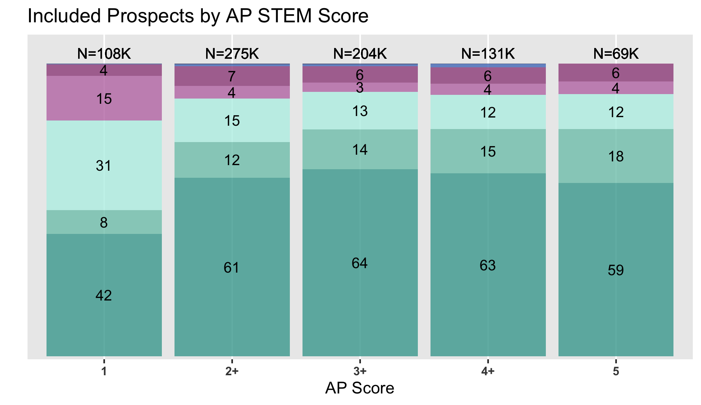
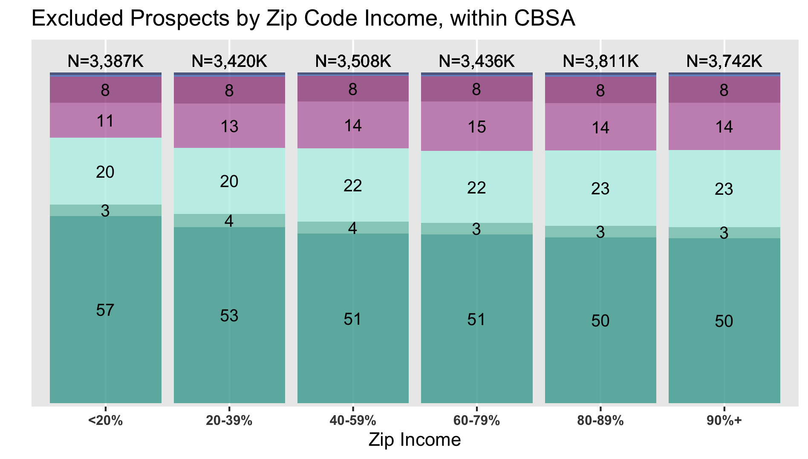
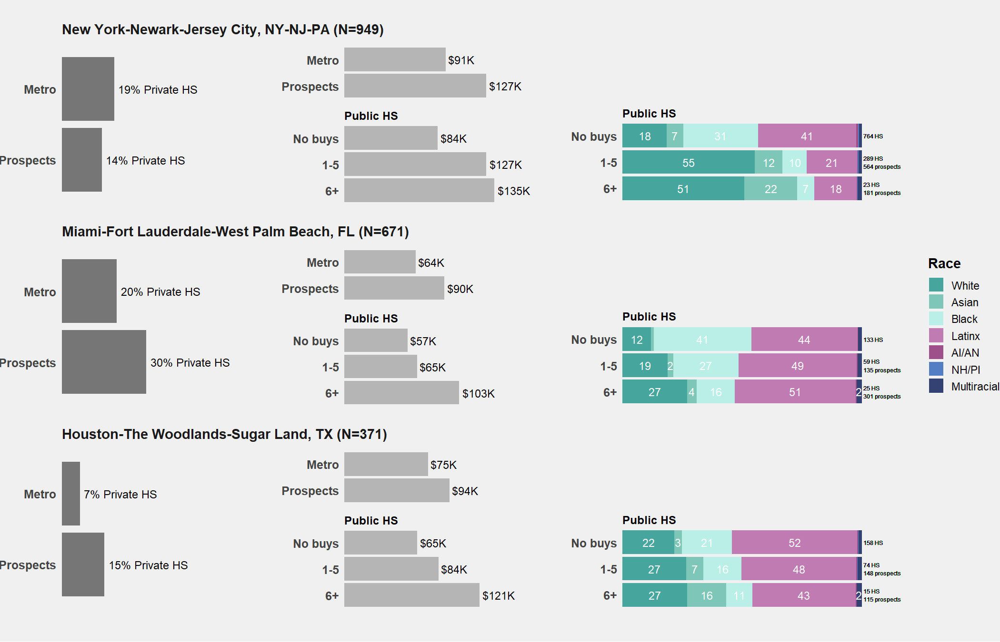
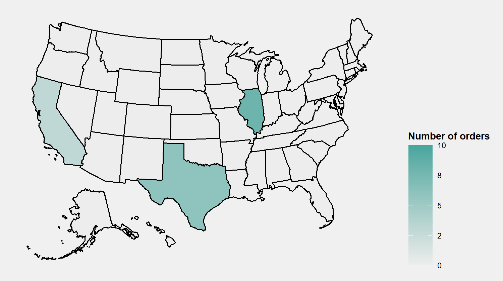

## The market for college access

A two-sided matching problem in which market allocates students to colleges (Hoxby, 1997; Hoxby, 2009)

-   Barriers to efficient market:
    -   transportation costs; information costs
-   Students
    -   Goal: want to attend college
    -   Information problem: Don't know where they will be admitted, how much it will cost
-   Colleges want to enroll students
    -   Enrollment goals: academic profile; revenue; diversity; internal constituents
    -   Information problem: Don't know who/where the "good" students are, how to contact them

<br>

Matchmaking

-   "Inquiries" (student as first contact)
  -   Students send test scores or fill out inquiry form
-   The enrollment problem
    - Most colleges cannot survive/thrive solely from students who reach out on their own
    - Must find desirable prospects who can be convinced to apply/enroll

---

## Student lists products

"Student list" products are a matchmaking intermediary that connects colleges to prospects

-   Third-party vendors obtain data and contact info about prospecs (e.g., Testing orgs, search engines)
-   Vendors sell contact information of prospects to colleges looking for students
    - Colleges choose prospect profiles by filtering on search filters (e.g., zip code, test score)

<br>

Policy concerns about student list products

- Problem with underlying products
  - Search filters incorporate "racialized inputs" (Norris, 2021) that systematically disadvantage underrepresented students of color
- Problem with utilization of products
  - University administrators may choose combinations of search filters that result in racial exclusion

<br>

Research questions

1. What is relationship between search filters and racial composition of included vs excluded students?
1. How do public universities use racialized search filters in concert with other search filters when purchasing student lists?
3. What is observed racial composition of student list purchases that utilize racialized search filters in concert with other search filters?

---

## Research overview

Research questions

<br>

1.  **What is relationship between search filters and racial composition of included vs excluded students?**
    - Reconstruct College Board student list product using nationally representative sample of 9th graders from 2009 (NCES High School Longitudinal Survey)
    - Simulate which students are included versus excluded when certain search filters are utilized
<br>

2.  **How do public universities use racialized search filters in concert with other search filters when purchasing student lists?**
    - Analyze 830 student lists purchased by 14 public universities, collected via public records requests
<br>

3.  **What is observed racial composition of student list purchases that utilize racialized search filters in concert with other search filters?**
    - Analyze targeted student list purchases, where we obtained both the order details and deidentified prospect-level data

--- .section

# Literature Review

--- 

## Scholarship on recruiting from sociology

Enrollment funnel: prospects >> leads >> inquires >> applicants >> admits >> enrolled

- Most scholarship on enrollment management focuses on latter stages (admissions, financial aid)
- Body of research in sociology that analyzes recruiting "in the wild"
    
<br>
Recruiting from perspective of high school students (Holland, 2019)

- Underrepresented students sensitive to feeling "wanted" by colleges

<br>
Connections between high schools and colleges from organizational behavior perspective

- Off-campus recruiting visits indicate a network tie and enrollment priorities
- recruiting from perspective of private college (Stevens, 2007), private HS counselors (Khan, 2011)
- Recruiting visits by public research univs   (e.g., Salazar, Jaquette, and Han, 2021; and Salazar, 2022)

<br>
Recruiting at open-access PSIs for adults  (e.g., and Cottom, 2017; and Posecznick, 2017)

- For-profits have demand in Black/Latinx communities because traditional colleges ignore them

<br>
Scholarship assumes that recruiting is something done wholly done by individual colleges

- Third-party products and vendors structure recruiting behavior by colleges
- How do products incorporate structural inequality? How are they utilized by colleges?

--- .section

# Background

--- &twocol

## Where do student lists fit in recruiting

*** =left

Prospects

- Population of desirable potential students

Leads

- Prospects whose contact info has been obtained

Inquiries

- Prospects who have contacted the institution
  - Institution as first contact (leads)
  - Student as first contact

<br>
Interventions along the funnel

- Convert prospects to leads
  - purchase student lists
- Convert leads/inquiries to applicants
  - Email, mail, targeted social media
- Convert admits to enrolles
  - Financial aid packages

*** =right

<center>**The enrollment funnel**</center>

<br>


Source: [pngwing.com](https://www.pngwing.com/en/free-png-krrpy)

--- 

## College Board and ACT student list products

Sources of student list data

- Test takers (e.g., PSAT, SAT, AP), pre-test questionnaire (demographics, preferences)
- More recently, from college search engines (e.g., College Board Big Future)  
- Students can opt in or out

<br>
What information does a list contain ([College Board template](https://drive.google.com/file/d/1Qvc_QRi9izEF1W78Lh4nNi5NsXjCZqUE))

- Contact, demographic, college preferences, limited academic achievement

<br>
Pricing

- Historically, price-per-prospect (e.g., \$0.50 per name); now a subscription model


<br>

Buying lists: "search filters" control which prospects included in purchase

- Commonly used search filters ([Link to ACT filters](https://helpcenter.encoura.org/hc/en-us/articles/360035260452-Prospect-Search-Filters-))
  - e.g., HS GPA, test score range, gender, race, geography (e.g., state), enrollment probability
- Salazar, Jaquette, and Han (2022) categorizes College Board search filters into four buckets:
  - Geographic
  - Academic
  - Demographic
  - Student preferences

---

## Filters used in 830 lists purchased by 14 public universities


```r
orders_filters %>% 
  filter(is_asu == 'all') %>% 
  group_by(filters) %>% 
  summarise(
    num_total = sum(num_total), 
    total = sum(total), 
    pct = sum(num_total) / sum(total)
  ) %>% 
  ungroup() %>% 
  add_row(filters = 'academic', num_total = 0) %>% 
  add_row(filters = 'geographic', num_total = 0) %>% 
  add_row(filters = 'demographic', num_total = 0) %>% 
  add_row(filters = 'student preferences', num_total = 0) %>% 
  mutate(
    filters_label = recode_factor(
      filters,
      'citizenship' = 'Citizenship',
      'rotc' = 'ROTC',
      'financial_aid' = 'Financial aid',
      'national_recognition_programs' = 'NRP',
      'edu_aspirations' = 'Education aspirations',
      'college_setting' = 'College setting',
      'college_studentbody' = 'College student body',
      'college_living_plans' = 'College living plans',
      'college_location' = 'College location',
      'college_type' = 'College type',
      'major' = 'Major',
      'college_size' = 'College size',
      'student preferences' = '   ',
      'first_gen_parent' = 'First generation',
      'low_ses' = 'Low SES',
      'gender' = 'Gender',
      'race' = 'Race',
      'demographic' = '  ',
      'proximity_search' = 'Proximity search',
      'county' = 'County',
      'intl' = 'International',
      'cbsa' = 'CBSA',
      'segment' = 'Segment',
      'geomarket' = 'Geomarket',
      'zip' = 'Zip code',
      'states_fil' = 'State',
      'geographic' = ' ',
      'hs_math' = 'HS math',
      'sat_reading_writing' = 'SAT reading/writing',
      'sat_reading' = 'SAT reading',
      'sat_writing' = 'SAT writing',
      'sat_math' = 'SAT math',
      'ap_score' = 'AP score',
      'rank' = 'Rank',
      'psat' = 'PSAT',
      'sat' = 'SAT',
      'gpa' = 'GPA',
      'academic' = '',
      'hsgrad_class' = 'HS grad class'
    )
  ) %>% 
  filter(!filters %in% c('hs_math', 'proximity_search', 'rotc', 'citizenship')) %>% 
  ggplot(aes(x = filters_label, y = num_total)) +
  geom_bar(stat = 'identity', fill = '#7ec7b8') +
  geom_text(aes(label = if_else(filters %in% c('academic', 'geographic', 'demographic', 'student preferences'), str_c(str_to_sentence(filters), ' filters'), ''), y = 0), hjust = 0, vjust = 0.8, size = 2, fontface = 'bold') +
  geom_text(aes(y = num_total, label = if_else(!filters %in% c('academic', 'geographic', 'demographic', 'student preferences'), str_c(round(pct * 100), '%'), '')), hjust = -0.1, size = 2) +
  scale_y_continuous(expand = expansion(mult = c(0.01, 0.1))) +
  xlab('') + ylab('Number of orders') +
  guides(fill = guide_legend(reverse = T)) +
  coord_flip()
```

```
## Warning in grid.Call(C_textBounds, as.graphicsAnnot(x$label), x$x,
## x$y, : font family not found in Windows font database

## Warning in grid.Call(C_textBounds, as.graphicsAnnot(x$label), x$x,
## x$y, : font family not found in Windows font database

## Warning in grid.Call(C_textBounds, as.graphicsAnnot(x$label), x$x,
## x$y, : font family not found in Windows font database

## Warning in grid.Call(C_textBounds, as.graphicsAnnot(x$label), x$x,
## x$y, : font family not found in Windows font database

## Warning in grid.Call(C_textBounds, as.graphicsAnnot(x$label), x$x,
## x$y, : font family not found in Windows font database

## Warning in grid.Call(C_textBounds, as.graphicsAnnot(x$label), x$x,
## x$y, : font family not found in Windows font database

## Warning in grid.Call(C_textBounds, as.graphicsAnnot(x$label), x$x,
## x$y, : font family not found in Windows font database
```


---

# College Board Search and student outcomes
## Howell, Hurwitz, Mabel et al. (2021)


```r
create_cb_figure <- function(categories, values, plot_title, fill_values = rev(color_palette[1:2])) {
  cb_fig_df <- data.frame(
    category = rep(categories, each = 2),
    subcategory = rep(c('Not Licensed', 'Gain from being Licensed'), length(categories)), 
    value = values
  )
  
  cb_fig_df$category <- factor(cb_fig_df$category, levels = categories)
  
  cb_fig_df %>%
    left_join(
      cb_fig_df %>%
        pivot_wider(id_cols = category, names_from = subcategory, values_from = value) %>%
        mutate(
          total = `Not Licensed` + `Gain from being Licensed`,
          pct_change = `Gain from being Licensed` / `Not Licensed` * 100
        ),
      by = 'category') %>% 
    ggplot(aes(x = category, y = value, fill = subcategory, width = 0.6)) +
    geom_bar(position = 'stack', stat = 'identity') +
    geom_text(aes(y = value, label = if_else(subcategory == 'Not Licensed', str_c(sprintf('%.1f', value), '%'), '')), color = color_text, size = 2, position = position_stack(vjust = 0.5)) +
    geom_text(aes(y = total + 3, label = if_else(subcategory == 'Not Licensed', str_c('(', sprintf('%.1f', pct_change), '%)'), '')), color = '#444444', size = 2) +
    geom_text(aes(y = total + 7, label = if_else(subcategory == 'Not Licensed', str_c(sprintf('%.1f', `Gain from being Licensed`), 'pp'), '')), color = '#444444', size = 2) +
    ggtitle(plot_title) +
    xlab('') + ylab('') + 
    scale_y_continuous(expand = expansion(mult = c(0, 0.05)), limits = c(0, 80)) +
    scale_fill_manual(values = fill_values) +
    theme(
        plot.margin = margin(t = 0.6, unit = 'cm'),
        panel.grid.major.y = element_line(size = 0.1, color = 'gray'),
        legend.title = element_blank(),
        legend.position = 'bottom',
        legend.margin = margin(t = -0.5, unit = 'cm'),
        legend.text = element_text(margin = margin(r = 0.2, unit = 'cm'))
      ) +
      guides(fill = guide_legend(reverse = T))
}

grid.arrange(
  create_cb_figure(
    c('Overall', 'Asian', 'Black', 'Hispanic', 'AI/AN', 'HI/PI', 'White'),
    c(32.8, 8.3, 37.5, 5.7, 31.8, 7.8, 24.1, 8.3, 26.5, 6.3, 22.2, 5.8, 44.4, 9.6),
    'Enrollment'
  ),
  create_cb_figure(
    c('Overall', 'Asian', 'Black', 'Hispanic', 'AI/AN', 'White'),
    c(15.7, 4.9, 17.7, 5.0, 7.2, 2.9, 6.7, 2.9, 8.7, 4.2, 24.0, 6.7),
    'BA Completion within 4 Years'
  ),
  create_cb_figure(
    c('Overall', 'No College', 'College,\nNo BA', 'College,\nBA or Higher'),
    c(32.8, 8.3, 24.9, 10.1, 36.5, 11.0, 53.4, 10.1),
    'Enrollment'
  ),
  create_cb_figure(
    c('Overall', 'No College', 'College,\nNo BA', 'College,\nBA or Higher'),
    c(15.7, 4.9, 13.6, 6.8, 21.3, 8.5, 39.9, 10.1),
    'BA Completion within 4 Years'
  ),
  ncol = 2
)
```

```
## Warning in grid.Call(C_textBounds, as.graphicsAnnot(x$label), x$x,
## x$y, : font family not found in Windows font database

## Warning in grid.Call(C_textBounds, as.graphicsAnnot(x$label), x$x,
## x$y, : font family not found in Windows font database

## Warning in grid.Call(C_textBounds, as.graphicsAnnot(x$label), x$x,
## x$y, : font family not found in Windows font database

## Warning in grid.Call(C_textBounds, as.graphicsAnnot(x$label), x$x,
## x$y, : font family not found in Windows font database

## Warning in grid.Call(C_textBounds, as.graphicsAnnot(x$label), x$x,
## x$y, : font family not found in Windows font database

## Warning in grid.Call(C_textBounds, as.graphicsAnnot(x$label), x$x,
## x$y, : font family not found in Windows font database

## Warning in grid.Call(C_textBounds, as.graphicsAnnot(x$label), x$x,
## x$y, : font family not found in Windows font database

## Warning in grid.Call(C_textBounds, as.graphicsAnnot(x$label), x$x,
## x$y, : font family not found in Windows font database

## Warning in grid.Call(C_textBounds, as.graphicsAnnot(x$label), x$x,
## x$y, : font family not found in Windows font database

## Warning in grid.Call(C_textBounds, as.graphicsAnnot(x$label), x$x,
## x$y, : font family not found in Windows font database

## Warning in grid.Call(C_textBounds, as.graphicsAnnot(x$label), x$x,
## x$y, : font family not found in Windows font database

## Warning in grid.Call(C_textBounds, as.graphicsAnnot(x$label), x$x,
## x$y, : font family not found in Windows font database

## Warning in grid.Call(C_textBounds, as.graphicsAnnot(x$label), x$x,
## x$y, : font family not found in Windows font database

## Warning in grid.Call(C_textBounds, as.graphicsAnnot(x$label), x$x,
## x$y, : font family not found in Windows font database

## Warning in grid.Call(C_textBounds, as.graphicsAnnot(x$label), x$x,
## x$y, : font family not found in Windows font database

## Warning in grid.Call(C_textBounds, as.graphicsAnnot(x$label), x$x,
## x$y, : font family not found in Windows font database

## Warning in grid.Call(C_textBounds, as.graphicsAnnot(x$label), x$x,
## x$y, : font family not found in Windows font database

## Warning in grid.Call(C_textBounds, as.graphicsAnnot(x$label), x$x,
## x$y, : font family not found in Windows font database

## Warning in grid.Call(C_textBounds, as.graphicsAnnot(x$label), x$x,
## x$y, : font family not found in Windows font database

## Warning in grid.Call(C_textBounds, as.graphicsAnnot(x$label), x$x,
## x$y, : font family not found in Windows font database

## Warning in grid.Call(C_textBounds, as.graphicsAnnot(x$label), x$x,
## x$y, : font family not found in Windows font database

## Warning in grid.Call(C_textBounds, as.graphicsAnnot(x$label), x$x,
## x$y, : font family not found in Windows font database

## Warning in grid.Call(C_textBounds, as.graphicsAnnot(x$label), x$x,
## x$y, : font family not found in Windows font database

## Warning in grid.Call(C_textBounds, as.graphicsAnnot(x$label), x$x,
## x$y, : font family not found in Windows font database

## Warning in grid.Call(C_textBounds, as.graphicsAnnot(x$label), x$x,
## x$y, : font family not found in Windows font database

## Warning in grid.Call(C_textBounds, as.graphicsAnnot(x$label), x$x,
## x$y, : font family not found in Windows font database

## Warning in grid.Call(C_textBounds, as.graphicsAnnot(x$label), x$x,
## x$y, : font family not found in Windows font database

## Warning in grid.Call(C_textBounds, as.graphicsAnnot(x$label), x$x,
## x$y, : font family not found in Windows font database

## Warning in grid.Call(C_textBounds, as.graphicsAnnot(x$label), x$x,
## x$y, : font family not found in Windows font database

## Warning in grid.Call(C_textBounds, as.graphicsAnnot(x$label), x$x,
## x$y, : font family not found in Windows font database

## Warning in grid.Call(C_textBounds, as.graphicsAnnot(x$label), x$x,
## x$y, : font family not found in Windows font database

## Warning in grid.Call(C_textBounds, as.graphicsAnnot(x$label), x$x,
## x$y, : font family not found in Windows font database

## Warning in grid.Call(C_textBounds, as.graphicsAnnot(x$label), x$x,
## x$y, : font family not found in Windows font database

## Warning in grid.Call(C_textBounds, as.graphicsAnnot(x$label), x$x,
## x$y, : font family not found in Windows font database

## Warning in grid.Call(C_textBounds, as.graphicsAnnot(x$label), x$x,
## x$y, : font family not found in Windows font database

## Warning in grid.Call(C_textBounds, as.graphicsAnnot(x$label), x$x,
## x$y, : font family not found in Windows font database

## Warning in grid.Call(C_textBounds, as.graphicsAnnot(x$label), x$x,
## x$y, : font family not found in Windows font database

## Warning in grid.Call(C_textBounds, as.graphicsAnnot(x$label), x$x,
## x$y, : font family not found in Windows font database

## Warning in grid.Call(C_textBounds, as.graphicsAnnot(x$label), x$x,
## x$y, : font family not found in Windows font database

## Warning in grid.Call(C_textBounds, as.graphicsAnnot(x$label), x$x,
## x$y, : font family not found in Windows font database

## Warning in grid.Call(C_textBounds, as.graphicsAnnot(x$label), x$x,
## x$y, : font family not found in Windows font database

## Warning in grid.Call(C_textBounds, as.graphicsAnnot(x$label), x$x,
## x$y, : font family not found in Windows font database
```



<br>
also see: Smith, Howell, and Hurwitz (2022) for effect of university purchasing profile on college choice


--- .section

# Conceptual Framework

--- 

## Sociology of race


Selection devices allocate individuals to categories based on input factors (Hirschman and Bosk, 2020)

- Discretionary selection devices
  - Decisions incorporate judgment of individual evaluators (e.g., holistic admissions)
- Standardized selection devices
  - decisions based on mathematical function in which input values determine outcome value
  - "actuarial" selection devices predict outcomes based on analysis of past cases
- Student list products are discretionary selection devices

<br>

Standardized selection devices and racial inequality
  - May reduce racial inequality if source of inequality is bias from individual decision-maker
  - Do not reduce inequality due to structural racism (Bonilla-Silva, 1997)
    - Structural racism is “systematic racial bias embedded in the ‘normal’ functions of laws and social relations,” whereby processes viewed as neutral or common-sense systematically disadvantage marginalized groups (Tiako, South, and Ray, 2021, p. 1143)
    - "colorblind" selection devices reproduce inequality by utilizing inputs related to race BECAUSE MARGINALIZED GROUPS HAVE BEEN HISTORICALLY EXCLUDED FROM INPUT
    
<br>    
Discretionary selection devices

- Sensitive to bias from decision-makers and inputs related to race


--- 

## Racialized inputs

<br>
Racialized inputs (Norris, 2021)

- Inputs that are "theoretically and empirically correlated with historical racial disadvantage" (p. 5)
- reconstructs inputs used by Moody’s city government credit rating algorithm
- SOME QUOTE HERE FROM NORRIS
<br>
Geography inputs

- US racially segregated due to historic and current laws/policies/practices
- Zip code an input in algorithm that predicts crime recidivism (O'Neil, 2016; Benjamin, 2019)
  - Zip code a search filter on CB/ACT student list products
- Geodemographic classifications classify localities by consumer behavior (Leyshon and Thrift, 1999)
  - CB Geodemographic filters classify census tracts by past college enrollment (College Board, 2011)

<br>
Inputs based on predictive analytics

- Analyze determinants of an outcome in past cases, use results as an input to select future cases (e.g., ACT probability of enrollment filter)

--- 

## RQ1: relationship between filters and racial composition

Standardized college entrance exams and AP exams as racialized inputs

- Differences in test-taking and scores by race a function of historic/contemporary school segregation, differences in school funding and access to curricula (e.g., Reardon, Kalogrides, and Shores, 2019; Rodriguez and Hernandez-Hamed, 2020)
- Concerns about bias in question items (e.g., and Freedle, 2003; Santelices and Wilson, 2010)


<br>

**P1**: The condition of taking standardized assessments is associated with racial disparities in who is included versus excluded in student list products.

<br>

**P2**: As test score threshold increases, the proportion of underrepresented minority students included in student lists declines relative to the proportion who are excluded.

<br>

**P3**. As purchases filter on more affluent geographic localities (e.g., zip codes), the proportion of underrepresented minority students included in student lists declines relative to the proportion who are excluded.

<br>

Filtering on multiple racialized inputs has compounding effect on racial inequality


--- .section

# Methods

--- .subsection

# Data 

---

## HSLS09 & Student List Project

High School Longitudinal Study of 2009 (HSLS09)


-  Unweighted analysis sample (n=16,530) 
  - Includes students who completed 2012/2013 survey follow-ups and obtained high school transcript data
- Weighted analysis sample represent approximately 4.2 million U.S. 9th graders in 2009

<br>

Student List Project


- Issued public records requests for student list data (2016-2020) to all public universities in four states (CA, IL, MN, TX)
- Target student list vendors: College Board, ACT
- For each purchased list, sought two pieces of data
  - "Order summary" specifying search filter criteria ([LINK](https://drive.google.com/file/d/1gPZ-WWw0gdFT7VtzBN3hKLnj2DzoaqnY/view))
  - De-identified prospect-level student list ([LINK](https://drive.google.com/file/d/1Qvc_QRi9izEF1W78Lh4nNi5NsXjCZqUE/view))


---

## Summary of data received

<!-- html table generated in R 4.2.1 by xtable 1.8-4 package -->
<!-- Tue Mar 21 20:06:16 2023 -->
<table border=1>
  <tr style="text-align:center;"><th>State</th><th># received order summary</th><th># no order summary</th><th># received list</th><th># no list</th><th># received both</th><th># did not receive both</th></tr> <tr> <td align="center"> CA </td> <td align="center">   9 </td> <td align="center">  23 </td> <td align="center">  13 </td> <td align="center">  19 </td> <td align="center">   9 </td> <td align="center">  23 </td> </tr>
  <tr> <td align="center"> IL </td> <td align="center">   9 </td> <td align="center">   3 </td> <td align="center">   9 </td> <td align="center">   3 </td> <td align="center">   8 </td> <td align="center">   4 </td> </tr>
  <tr> <td align="center"> TX </td> <td align="center">  15 </td> <td align="center">  20 </td> <td align="center">  16 </td> <td align="center">  19 </td> <td align="center">  10 </td> <td align="center">  25 </td> </tr>
   </table>


---

## Orders and prospects purchased


```r
orders_prospects_purchased %>% 
  ggplot(aes(x = total_students, y = reorder(univ_id, total_students), fill = univ_label)) +
  geom_bar(stat = 'identity') +
  geom_text(aes(label = str_c(total_orders, if_else(total_orders == 1, ' order', ' orders'))), hjust = -0.1, size = 2) +
  scale_x_continuous(labels = function(n) if_else(n < 1000000, str_c(n / 1000, 'K'), str_c(n / 1000000, 'M')), breaks = seq(0, 2.6e6, 2e5), expand = expansion(mult = c(0.01, 0.1)), limits = c(0, 2.7e6)) +
  scale_x_break(c(5e5, 2.2e6)) +
  scale_fill_manual(values = color_palette[1:2], name = 'University type') +
  xlab('Number of prospects') + ylab('') +
  theme(
    axis.ticks.y = element_blank(),
    axis.text.y = element_blank(),
    axis.ticks.x.top = element_blank(),
    axis.text.x.top = element_blank()
  )
```


--- .subsection

# Research design

--- 

## Variables & Analyses

RQ1: What is the relationship between student list search filters and the
racial composition of students who are included versus excluded from College Board student list purchases?

<br>

RQ2: 

<br>

- Dependent Variable: student race/ethnicity
- Independent Variables: measures of student list academic and geographic filters
  - Dichotomous measures of SAT, PSAT, AP completion 
  - Threshold measures of highest SAT, PSAT, AP scores, and GPA 
  - Economic measures of students' zipcode, county, CBSA from ACS
- Analyses: descriptive statistics
  - All analyses compare the racial composition of included versus excluded prospects when particular filters and/or filter thresholds are utilized to purchase prospect profiles
  

<!-- ## Summary of orders and prospects -->

<!-- ```{r purchased-data, results = 'asis', echo = F, message = F} -->
<!-- data.frame( -->
<!--   orders_total = num_orders, -->
<!--   orders_with_list = num_orders_w_list, -->
<!--   prospects_total = prettyNum(num_prospects, ','), -->
<!--   prospects_with_order = prettyNum(num_prospects_w_order, ',') -->
<!-- ) %>%  -->
<!--   xtable(align = rep('c', 5), display = rep('d', 5)) %>%  -->
<!--   print(add.to.row = list(pos = list(0), command = c('<tr style="text-align:center;"><th style="border-bottom:none;">RQ1</th><th style="border-bottom:none;">RQ3</th><th style="border-bottom:none;">RQ2</th><th style="border-bottom:none;">RQ3</th></tr><tr style="text-align:center;"><th># orders total</th><th># orders with list</th><th># prospects total</th><th># prospects with order</th></tr>')), include.colnames = F) -->
<!-- ``` -->

<!-- <br> -->

<!-- Empirical research questions -->

<!-- 1. Which filter criteria were selected in student lists purchases? -->
<!--   - Unit of analysis = order; 830 orders (by 14 universities) -->
<!-- 1. What are the characteristics of prospects included in student lists purchases? -->
<!--   - unit of analysis = university-prospect; 3,663,257 prospects (by 14 universities) -->
<!-- 1. **What is relationship between filter criteria and characteristics of purchased prospects?** -->
<!--   - Unit of analysis = order-prospect; 414 orders associated with 2,548,085 prospects -->

<!-- <br> -->
<!-- Case study research design because non-random sample -->

<!-- - RQ1 and RQ2 -->
<!--   - Internal validity: are orders/prospects representative of behavior of 14 universities in sample? -->
<!--   - External validity: cannot make inferences about population of public univs -->
<!-- - RQ3 -->
<!--   - Ixternal validity: set of search criteria yield same prospects regardless of which univ purchases -->
<!--   - Analyses focus on "deep dives" of conceptually important order combinations -->


--- .section

# Results

--- .subsection

# RQ1


--- &twocol .subsubsection

# Test Takers
## **P1**: Racial disparities in test-taking


*** =left 

<div class="row">
  <div class="column">
    
  </div>
  <div class="column">
    
  </div>
</div>

*** =right 

<div class="row">
  <div class="column">
    
  </div>
  <div class="column">
    
  </div>
</div>


--- &twocol .subsubsection

# Test thresholds
## **P2**: SAT, PSAT score thresholds and racial composition


*** =left 

<div class="row">
  <div class="column">
    
  </div>
  <div class="column">
    
  </div>
</div>

*** =right 

<div class="row">
  <div class="column">
    
  </div>
  <div class="column">
    
  </div>
</div>


--- &twocol

# Test thresholds
## **P2**: AP sScore thresholds and racial composition


*** =left 

<div class="row">
  <div class="column">
    
  </div>
  <div class="column">
    
  </div>
</div>

*** =right 

<div class="row">
  <div class="column">
    
  </div>
  <div class="column">
    
  </div>
</div>

--- .subsubsection

# Geography
## **P3**: Zip code affluence and racial composition


<div class="row">
  <div class="column">
    
  </div>
  <div class="column">
    
  </div>
</div>

--- 

# Geography
## Zip vs county, affluence percentiles within CBSA


*** =left 

<div class="row">
  <div class="column">
    
  </div>
  <div class="column">
    
  </div>
</div>

*** =right 

<div class="row">
  <div class="column">
    
  </div>
  <div class="column">
    
  </div>
</div>

--- .subsubsection

# Academic & Geographic
## GPA (3.0+) and SAT or PSAT (across score thresholds)


<div class="row">
  <div class="column">
    
  </div>
  <div class="column">
    
  </div>
</div>

---

# Academic & Geographic
## GPA (3.0+), PSAT (150+) or SAT (1050+), and Zip (across income thresholds)


<div class="row">
  <div class="column">
    
  </div>
  <div class="column">
    
  </div>
</div>

---

# Academic & Geographic
## GPA (3.0+) and AP (across score thresholds)


<div class="row">
  <div class="column">
    
  </div>
  <div class="column">
    
  </div>
</div>


--- .subsection

# RQ2


--- .subsubsection

# Broad patterns
## Filters used in order purchases


```r
orders_filters %>% 
  add_row(univ_label = 'Research', filters = 'academic', is_asu = 'all', num = 0) %>% 
  add_row(univ_label = 'MA/doctoral', filters = 'academic', is_asu = 'all', num = 0) %>% 
  add_row(univ_label = 'Research', filters = 'geographic', is_asu = 'all', num = 0) %>% 
  add_row(univ_label = 'MA/doctoral', filters = 'geographic', is_asu = 'all', num = 0) %>% 
  add_row(univ_label = 'Research', filters = 'demographic', is_asu = 'all', num = 0) %>% 
  add_row(univ_label = 'MA/doctoral', filters = 'demographic', is_asu = 'all', num = 0) %>% 
  add_row(univ_label = 'Research', filters = 'student preferences', is_asu = 'all', num = 0) %>% 
  add_row(univ_label = 'MA/doctoral', filters = 'student preferences', is_asu = 'all', num = 0) %>% 
  mutate(
    filters_label = recode_factor(
      filters,
      'citizenship' = 'Citizenship',
      'rotc' = 'ROTC',
      'financial_aid' = 'Financial aid',
      'national_recognition_programs' = 'NRP',
      'edu_aspirations' = 'Education aspirations',
      'college_setting' = 'College setting',
      'college_studentbody' = 'College student body',
      'college_living_plans' = 'College living plans',
      'college_location' = 'College location',
      'college_type' = 'College type',
      'major' = 'Major',
      'college_size' = 'College size',
      'student preferences' = '   ',
      'first_gen_parent' = 'First generation',
      'low_ses' = 'Low SES',
      'gender' = 'Gender',
      'race' = 'Race',
      'demographic' = '  ',
      'proximity_search' = 'Proximity search',
      'county' = 'County',
      'intl' = 'International',
      'cbsa' = 'CBSA',
      'segment' = 'Segment',
      'geomarket' = 'Geomarket',
      'zip' = 'Zip code',
      'states_fil' = 'State',
      'geographic' = ' ',
      'hs_math' = 'HS math',
      'sat_reading_writing' = 'SAT reading/writing',
      'sat_reading' = 'SAT reading',
      'sat_writing' = 'SAT writing',
      'sat_math' = 'SAT math',
      'ap_score' = 'AP score',
      'rank' = 'Rank',
      'psat' = 'PSAT',
      'sat' = 'SAT',
      'gpa' = 'GPA',
      'academic' = '',
      'hsgrad_class' = 'HS grad class'
    )
  ) %>% 
  filter(!filters %in% c('hs_math', 'proximity_search', 'rotc', 'citizenship')) %>% 
  ggplot(aes(x = filters_label, y = num, fill = is_asu)) +
  geom_bar(stat = 'identity') +
  geom_text(aes(label = if_else(filters %in% c('academic', 'geographic', 'demographic', 'student preferences') & univ_label == 'Research', str_c(str_to_sentence(filters), ' filters'), ''), y = 0), hjust = 0, vjust = 0.8, size = 2, fontface = 'bold') +
  geom_text(aes(y = num_total, label = if_else(!filters %in% c('academic', 'geographic', 'demographic', 'student preferences') & is_asu != 'asu', str_c(round(pct * 100), '%'), '')), hjust = -0.1, size = 2) +
  scale_y_continuous(expand = expansion(mult = c(0.01, 0.1))) +
  scale_fill_manual(values = rev(color_palette[c(1, 2)]), name = 'ASU') +
  xlab('') + ylab('Number of orders') +
  guides(fill = guide_legend(reverse = T)) +
  facet_wrap(~ factor(univ_label, levels = c('Research', 'MA/doctoral'))) +
  coord_flip() + 
  theme(
    legend.position = 'none'
  )
```

```
## Warning: Removed 8 rows containing missing values (`geom_text()`).
```

```
## Warning in grid.Call(C_textBounds, as.graphicsAnnot(x$label), x$x,
## x$y, : font family not found in Windows font database

## Warning in grid.Call(C_textBounds, as.graphicsAnnot(x$label), x$x,
## x$y, : font family not found in Windows font database

## Warning in grid.Call(C_textBounds, as.graphicsAnnot(x$label), x$x,
## x$y, : font family not found in Windows font database
```

```
## Warning in grid.Call.graphics(C_text, as.graphicsAnnot(x$label), x$x,
## x$y, : font family not found in Windows font database
```

```
## Warning in grid.Call(C_textBounds, as.graphicsAnnot(x$label), x$x,
## x$y, : font family not found in Windows font database

## Warning in grid.Call(C_textBounds, as.graphicsAnnot(x$label), x$x,
## x$y, : font family not found in Windows font database
```


--- .subsubsection

# Combination of filters
## Filter combos used in order purchases


```r
bind_cols(
  orders_filters_combo %>% 
    filter(univ_type == 'research') %>% 
    select(filter_combos, n, pct) %>% 
    head(10) %>%
    mutate(pct = str_c(round(pct * 100), '%')),
  orders_filters_combo %>% 
    filter(univ_type == 'regional') %>% 
    select(filter_combos, n, pct) %>% 
    head(10) %>%
    mutate(pct = str_c(round(pct * 100), '%'))
) %>% 
  xtable(align = c('c', 'p', 'c', 'c', 'p', 'c', 'c'), display = c('d', 's', 'd', 's', 's', 'd', 's')) %>% 
  print(add.to.row = list(pos = list(0), command = c('<tr><th colspan="3" style="text-align:center;">Research</th><th colspan="3" style="text-align:center;">MA/doctoral</th></tr><tr><th>Filters</th><th>Count</th><th>Percent</th><th>Filters</th><th>Count</th><th>Percent</th></tr>')), include.colnames = F)
```

```
## New names:
## • `filter_combos` -> `filter_combos...1`
## • `n` -> `n...2`
## • `pct` -> `pct...3`
## • `filter_combos` -> `filter_combos...4`
## • `n` -> `n...5`
## • `pct` -> `pct...6`
```

<!-- html table generated in R 4.2.1 by xtable 1.8-4 package -->
<!-- Tue Mar 21 20:06:17 2023 -->
<table border=1>
  <tr><th colspan="3" style="text-align:center;">Research</th><th colspan="3" style="text-align:center;">MA/doctoral</th></tr><tr><th>Filters</th><th>Count</th><th>Percent</th><th>Filters</th><th>Count</th><th>Percent</th></tr> <tr> <td> HS grad class, GPA, SAT, PSAT, Rank, State, Race </td> <td align="center">  39 </td> <td align="center"> 10% </td> <td> HS grad class, GPA, SAT, Zip code </td> <td align="center"> 206 </td> <td align="center"> 45% </td> </tr>
  <tr> <td> HS grad class, PSAT, State </td> <td align="center">  27 </td> <td align="center"> 7% </td> <td> HS grad class, GPA, PSAT, Zip code </td> <td align="center"> 145 </td> <td align="center"> 32% </td> </tr>
  <tr> <td> HS grad class, GPA, PSAT, State, Race </td> <td align="center">  20 </td> <td align="center"> 5% </td> <td> HS grad class, SAT, State </td> <td align="center">  31 </td> <td align="center"> 7% </td> </tr>
  <tr> <td> HS grad class, PSAT, State, Low SES </td> <td align="center">  20 </td> <td align="center"> 5% </td> <td> HS grad class, GPA, SAT, PSAT, Zip code </td> <td align="center">  28 </td> <td align="center"> 6% </td> </tr>
  <tr> <td> HS grad class, GPA, PSAT, State </td> <td align="center">  17 </td> <td align="center"> 5% </td> <td> HS grad class, GPA, SAT, State </td> <td align="center">   7 </td> <td align="center"> 2% </td> </tr>
  <tr> <td> HS grad class, GPA, SAT, State </td> <td align="center">  16 </td> <td align="center"> 4% </td> <td> HS grad class, SAT, Geomarket </td> <td align="center">   6 </td> <td align="center"> 1% </td> </tr>
  <tr> <td> HS grad class, GPA, AP score, Geomarket </td> <td align="center">  15 </td> <td align="center"> 4% </td> <td> HS grad class, GPA, SAT, County </td> <td align="center">   5 </td> <td align="center"> 1% </td> </tr>
  <tr> <td> HS grad class, GPA, SAT, PSAT, State, Segment, Gender </td> <td align="center">  13 </td> <td align="center"> 3% </td> <td> HS grad class, GPA, SAT, PSAT, County </td> <td align="center">   4 </td> <td align="center"> 1% </td> </tr>
  <tr> <td> HS grad class, PSAT, Geomarket </td> <td align="center">  12 </td> <td align="center"> 3% </td> <td> HS grad class, GPA, PSAT, State </td> <td align="center">   2 </td> <td align="center"> 0% </td> </tr>
  <tr> <td> HS grad class, SAT, State, Low SES, College size </td> <td align="center">  11 </td> <td align="center"> 3% </td> <td> HS grad class, SAT, Geomarket, College type </td> <td align="center">   2 </td> <td align="center"> 0% </td> </tr>
   </table>


--- .subsection

# RQ3 


--- .subsubsection

# Characteristics by filters
## Prospect characteristics across individual filter criteria


```r
rq3 %>% 
  mutate_if(is.numeric, ~if_else(. < 1, . * 100, .)) %>% 
  mutate_if(is.numeric, round, 0) %>% 
  mutate_if(is.numeric, ~if_else(row_number() == 18, str_c('$', round(. / 1000), 'K'), prettyNum(., big.mark = ','))) %>% 
  mutate(
    row_subj = recode_factor(
      row_subj,
      'n' = ' ',
      'pct_instate' = '% In-state',
      'pct_outofstate' = '% Out-of-state',
      'pct_white' = '% White',
      'pct_asian' = '% Asian',
      'pct_black' = '% Black',
      'pct_latinx' = '% Latinx',
      'pct_aian' = '% AI/AN',
      'pct_nhpi' = '% NH/PI',
      'pct_multiracial' = '% Multiracial',
      'pct_raceother' = '% Other',
      'pct_noresponse' = '% No response',
      'pct_racemissing' = '% Missing',
      'pct_male' = '% Male',
      'pct_female' = '% Female',
      'pct_genderother' = '% Other ',
      'pct_gendermissing' = '% Missing ',
      'med_income' = 'Median income',
      'pct_city' = '% City',
      'pct_suburban' = '% Suburban',
      'pct_fringe' = '% Rural - Fringe',
      'pct_distant' = '% Rural - Distant',
      'pct_remote' = '% Rural - Remote',
      'pct_localemissing' = '% Missing  '
    )
  ) %>%
  arrange(row_subj) %>% 
  add_column('x1' = if_else(.$row_subj == ' ', 'Total', ' '), .before = 'row_subj') %>% 
  add_column('x2' = ' ', .before = 'filter_zip') %>% 
  add_column('x3' = ' ', .before = 'filter_race') %>% 
  xtable(align = c('c', 'l', 'l', rep('c', 15))) %>% 
  print(
    html.table.attributes = 'style="font-size:11px;"',
    add.to.row = list(
      pos = list(0, 1, 3, 13, 17, 18),
      command = c('<tr style="text-align: center;"><th colspan="3" style="border-bottom: none;"></th><th colspan="5">Academic</th><th style="border-bottom: none;"><th colspan="5">Geographic</th><th style="border-bottom: none;"></th><th colspan="2">Demographic</th></tr><tr style="text-align:center;"><th width="15px;"></th><th></th><th>All domestic</th><th>GPA</th><th>PSAT</th><th>SAT</th><th>HS rank</th><th>AP score</th><th width="5px;"></th><th>Zip code</th><th>State</th><th>Geomarket</th><th>Segment</th><th>CBSA</th><th width="5px;"></th><th>Race</th><th>Gender</th></tr>', '<tr style="font-weight:900"><td colspan="2">Location</td></tr>', '<tr style="font-weight:900"><td colspan="2">Race/ethnicity</td></tr>', '<tr style="font-weight:900"><td colspan="2">Gender</td></tr>', '<tr style="font-weight:900"><td colspan="2">Household income</td></tr>', '<tr style="font-weight:900"><td colspan="2">Locale</td></tr>')
    ),
    include.colnames = F
  )
```

<!-- html table generated in R 4.2.1 by xtable 1.8-4 package -->
<!-- Tue Mar 21 20:06:18 2023 -->
<table style="font-size:11px;">
  <tr style="text-align: center;"><th colspan="3" style="border-bottom: none;"></th><th colspan="5">Academic</th><th style="border-bottom: none;"><th colspan="5">Geographic</th><th style="border-bottom: none;"></th><th colspan="2">Demographic</th></tr><tr style="text-align:center;"><th width="15px;"></th><th></th><th>All domestic</th><th>GPA</th><th>PSAT</th><th>SAT</th><th>HS rank</th><th>AP score</th><th width="5px;"></th><th>Zip code</th><th>State</th><th>Geomarket</th><th>Segment</th><th>CBSA</th><th width="5px;"></th><th>Race</th><th>Gender</th></tr> <tr> <td> Total </td> <td>   </td> <td align="center"> 3,547,620 </td> <td align="center"> 1,101,266 </td> <td align="center"> 1,812,447 </td> <td align="center"> 971,237 </td> <td align="center"> 146,660 </td> <td align="center"> 75,479 </td> <td align="center">   </td> <td align="center"> 165,924 </td> <td align="center"> 1,173,678 </td> <td align="center"> 1,056,951 </td> <td align="center"> 186,519 </td> <td align="center"> 146,313 </td> <td align="center">   </td> <td align="center"> 279,626 </td> <td align="center"> 39,546 </td> </tr>
   <tr style="font-weight:900"><td colspan="2">Location</td></tr><tr> <td>   </td> <td> % In-state </td> <td align="center"> 38 </td> <td align="center"> 62 </td> <td align="center"> 30 </td> <td align="center"> 54 </td> <td align="center"> 83 </td> <td align="center"> 42 </td> <td align="center">   </td> <td align="center"> 98 </td> <td align="center"> 48 </td> <td align="center"> 17 </td> <td align="center"> 15 </td> <td align="center"> 4 </td> <td align="center">   </td> <td align="center"> 59 </td> <td align="center"> 6 </td> </tr>
  <tr> <td>   </td> <td> % Out-of-state </td> <td align="center"> 62 </td> <td align="center"> 38 </td> <td align="center"> 70 </td> <td align="center"> 46 </td> <td align="center"> 17 </td> <td align="center"> 58 </td> <td align="center">   </td> <td align="center"> 2 </td> <td align="center"> 52 </td> <td align="center"> 83 </td> <td align="center"> 85 </td> <td align="center"> 96 </td> <td align="center">   </td> <td align="center"> 41 </td> <td align="center"> 94 </td> </tr>
   <tr style="font-weight:900"><td colspan="2">Race/ethnicity</td></tr><tr> <td>   </td> <td> % White </td> <td align="center"> 48 </td> <td align="center"> 45 </td> <td align="center"> 50 </td> <td align="center"> 47 </td> <td align="center"> 51 </td> <td align="center"> 17 </td> <td align="center">   </td> <td align="center"> 43 </td> <td align="center"> 42 </td> <td align="center"> 57 </td> <td align="center"> 51 </td> <td align="center"> 53 </td> <td align="center">   </td> <td align="center"> 25 </td> <td align="center"> 47 </td> </tr>
  <tr> <td>   </td> <td> % Asian </td> <td align="center"> 16 </td> <td align="center"> 15 </td> <td align="center"> 17 </td> <td align="center"> 15 </td> <td align="center"> 10 </td> <td align="center"> 7 </td> <td align="center">   </td> <td align="center"> 13 </td> <td align="center"> 18 </td> <td align="center"> 13 </td> <td align="center"> 27 </td> <td align="center"> 28 </td> <td align="center">   </td> <td align="center"> 5 </td> <td align="center"> 38 </td> </tr>
  <tr> <td>   </td> <td> % Black </td> <td align="center"> 5 </td> <td align="center"> 7 </td> <td align="center"> 4 </td> <td align="center"> 7 </td> <td align="center"> 8 </td> <td align="center"> 17 </td> <td align="center">   </td> <td align="center"> 8 </td> <td align="center"> 5 </td> <td align="center"> 4 </td> <td align="center"> 3 </td> <td align="center"> 2 </td> <td align="center">   </td> <td align="center"> 11 </td> <td align="center"> 1 </td> </tr>
  <tr> <td>   </td> <td> % Latinx </td> <td align="center"> 21 </td> <td align="center"> 24 </td> <td align="center"> 19 </td> <td align="center"> 22 </td> <td align="center"> 23 </td> <td align="center"> 46 </td> <td align="center">   </td> <td align="center"> 27 </td> <td align="center"> 24 </td> <td align="center"> 16 </td> <td align="center"> 11 </td> <td align="center"> 8 </td> <td align="center">   </td> <td align="center"> 46 </td> <td align="center"> 6 </td> </tr>
  <tr> <td>   </td> <td> % AI/AN </td> <td align="center"> 1 </td> <td align="center"> 1 </td> <td align="center"> 1 </td> <td align="center"> 0 </td> <td align="center"> 1 </td> <td align="center"> 1 </td> <td align="center">   </td> <td align="center"> 1 </td> <td align="center"> 1 </td> <td align="center"> 0 </td> <td align="center"> 0 </td> <td align="center"> 0 </td> <td align="center">   </td> <td align="center"> 2 </td> <td align="center"> 0 </td> </tr>
  <tr> <td>   </td> <td> % NH/PI </td> <td align="center"> 0 </td> <td align="center"> 0 </td> <td align="center"> 0 </td> <td align="center"> 0 </td> <td align="center"> 0 </td> <td align="center"> 1 </td> <td align="center">   </td> <td align="center"> 0 </td> <td align="center"> 0 </td> <td align="center"> 0 </td> <td align="center"> 0 </td> <td align="center"> 0 </td> <td align="center">   </td> <td align="center"> 0 </td> <td align="center"> 0 </td> </tr>
  <tr> <td>   </td> <td> % Multiracial </td> <td align="center"> 5 </td> <td align="center"> 5 </td> <td align="center"> 5 </td> <td align="center"> 5 </td> <td align="center"> 5 </td> <td align="center"> 10 </td> <td align="center">   </td> <td align="center"> 4 </td> <td align="center"> 6 </td> <td align="center"> 5 </td> <td align="center"> 5 </td> <td align="center"> 5 </td> <td align="center">   </td> <td align="center"> 9 </td> <td align="center"> 5 </td> </tr>
  <tr> <td>   </td> <td> % Other </td> <td align="center"> 0 </td> <td align="center"> 0 </td> <td align="center"> 0 </td> <td align="center"> 0 </td> <td align="center"> 0 </td> <td align="center"> 0 </td> <td align="center">   </td> <td align="center"> 0 </td> <td align="center"> 0 </td> <td align="center"> 0 </td> <td align="center"> 0 </td> <td align="center"> 0 </td> <td align="center">   </td> <td align="center"> 0 </td> <td align="center"> 0 </td> </tr>
  <tr> <td>   </td> <td> % No response </td> <td align="center"> 4 </td> <td align="center"> 3 </td> <td align="center"> 3 </td> <td align="center"> 3 </td> <td align="center"> 2 </td> <td align="center"> 1 </td> <td align="center">   </td> <td align="center"> 4 </td> <td align="center"> 3 </td> <td align="center"> 4 </td> <td align="center"> 3 </td> <td align="center"> 3 </td> <td align="center">   </td> <td align="center"> 2 </td> <td align="center"> 3 </td> </tr>
  <tr> <td>   </td> <td> % Missing </td> <td align="center"> 0 </td> <td align="center"> 0 </td> <td align="center"> 1 </td> <td align="center"> 0 </td> <td align="center"> 0 </td> <td align="center"> 0 </td> <td align="center">   </td> <td align="center"> 1 </td> <td align="center"> 1 </td> <td align="center"> 1 </td> <td align="center"> 0 </td> <td align="center"> 0 </td> <td align="center">   </td> <td align="center"> 0 </td> <td align="center"> 0 </td> </tr>
   <tr style="font-weight:900"><td colspan="2">Gender</td></tr><tr> <td>   </td> <td> % Male </td> <td align="center"> 34 </td> <td align="center"> 19 </td> <td align="center"> 37 </td> <td align="center"> 18 </td> <td align="center"> 0 </td> <td align="center"> 3 </td> <td align="center">   </td> <td align="center"> 46 </td> <td align="center"> 24 </td> <td align="center"> 48 </td> <td align="center"> 6 </td> <td align="center"> 0 </td> <td align="center">   </td> <td align="center"> 11 </td> <td align="center"> 0 </td> </tr>
  <tr> <td>   </td> <td> % Female </td> <td align="center"> 36 </td> <td align="center"> 23 </td> <td align="center"> 40 </td> <td align="center"> 20 </td> <td align="center"> 1 </td> <td align="center"> 15 </td> <td align="center">   </td> <td align="center"> 54 </td> <td align="center"> 27 </td> <td align="center"> 52 </td> <td align="center"> 9 </td> <td align="center"> 0 </td> <td align="center">   </td> <td align="center"> 12 </td> <td align="center"> 33 </td> </tr>
  <tr> <td>   </td> <td> % Other  </td> <td align="center"> 0 </td> <td align="center"> 0 </td> <td align="center"> 0 </td> <td align="center"> 0 </td> <td align="center"> 0 </td> <td align="center"> 0 </td> <td align="center">   </td> <td align="center"> 0 </td> <td align="center"> 0 </td> <td align="center"> 0 </td> <td align="center"> 0 </td> <td align="center"> 0 </td> <td align="center">   </td> <td align="center"> 0 </td> <td align="center"> 0 </td> </tr>
  <tr> <td>   </td> <td> % Missing  </td> <td align="center"> 30 </td> <td align="center"> 58 </td> <td align="center"> 22 </td> <td align="center"> 63 </td> <td align="center"> 99 </td> <td align="center"> 82 </td> <td align="center">   </td> <td align="center"> 0 </td> <td align="center"> 49 </td> <td align="center"> 0 </td> <td align="center"> 85 </td> <td align="center"> 1 </td> <td align="center">   </td> <td align="center"> 77 </td> <td align="center"> 67 </td> </tr>
   <tr style="font-weight:900"><td colspan="2">Household income</td></tr><tr> <td>   </td> <td> Median income </td> <td align="center"> $107K </td> <td align="center"> $105K </td> <td align="center"> $108K </td> <td align="center"> $105K </td> <td align="center"> $99K </td> <td align="center"> $90K </td> <td align="center">   </td> <td align="center"> $97K </td> <td align="center"> $105K </td> <td align="center"> $107K </td> <td align="center"> $130K </td> <td align="center"> $135K </td> <td align="center">   </td> <td align="center"> $94K </td> <td align="center"> $127K </td> </tr>
   <tr style="font-weight:900"><td colspan="2">Locale</td></tr><tr> <td>   </td> <td> % City </td> <td align="center"> 27 </td> <td align="center"> 27 </td> <td align="center"> 27 </td> <td align="center"> 26 </td> <td align="center"> 26 </td> <td align="center"> 31 </td> <td align="center">   </td> <td align="center"> 31 </td> <td align="center"> 30 </td> <td align="center"> 23 </td> <td align="center"> 24 </td> <td align="center"> 22 </td> <td align="center">   </td> <td align="center"> 29 </td> <td align="center"> 26 </td> </tr>
  <tr> <td>   </td> <td> % Suburban </td> <td align="center"> 44 </td> <td align="center"> 47 </td> <td align="center"> 44 </td> <td align="center"> 48 </td> <td align="center"> 53 </td> <td align="center"> 40 </td> <td align="center">   </td> <td align="center"> 42 </td> <td align="center"> 42 </td> <td align="center"> 46 </td> <td align="center"> 54 </td> <td align="center"> 57 </td> <td align="center">   </td> <td align="center"> 47 </td> <td align="center"> 49 </td> </tr>
  <tr> <td>   </td> <td> % Rural - Fringe </td> <td align="center"> 22 </td> <td align="center"> 20 </td> <td align="center"> 22 </td> <td align="center"> 20 </td> <td align="center"> 15 </td> <td align="center"> 23 </td> <td align="center">   </td> <td align="center"> 19 </td> <td align="center"> 22 </td> <td align="center"> 23 </td> <td align="center"> 19 </td> <td align="center"> 19 </td> <td align="center">   </td> <td align="center"> 19 </td> <td align="center"> 23 </td> </tr>
  <tr> <td>   </td> <td> % Rural - Distant </td> <td align="center"> 6 </td> <td align="center"> 6 </td> <td align="center"> 5 </td> <td align="center"> 6 </td> <td align="center"> 6 </td> <td align="center"> 5 </td> <td align="center">   </td> <td align="center"> 7 </td> <td align="center"> 6 </td> <td align="center"> 6 </td> <td align="center"> 2 </td> <td align="center"> 1 </td> <td align="center">   </td> <td align="center"> 6 </td> <td align="center"> 2 </td> </tr>
  <tr> <td>   </td> <td> % Rural - Remote </td> <td align="center"> 1 </td> <td align="center"> 0 </td> <td align="center"> 1 </td> <td align="center"> 0 </td> <td align="center"> 0 </td> <td align="center"> 0 </td> <td align="center">   </td> <td align="center"> 1 </td> <td align="center"> 1 </td> <td align="center"> 1 </td> <td align="center"> 0 </td> <td align="center"> 0 </td> <td align="center">   </td> <td align="center"> 0 </td> <td align="center"> 0 </td> </tr>
  <tr> <td>   </td> <td> % Missing   </td> <td align="center"> 0 </td> <td align="center"> 0 </td> <td align="center"> 0 </td> <td align="center"> 0 </td> <td align="center"> 0 </td> <td align="center"> 0 </td> <td align="center">   </td> <td align="center"> 0 </td> <td align="center"> 0 </td> <td align="center"> 0 </td> <td align="center"> 0 </td> <td align="center"> 0 </td> <td align="center">   </td> <td align="center"> 0 </td> <td align="center"> 0 </td> </tr>
   </table>


--- .subsubsection

# Geodemographic segment filters
## Filter by neighborhood segments


```r
en_df <- data.frame(
  cluster = c(51:83, 'Total'),
  sat_math = c(546, 480, 561, 458, 566, 420, 541, 533, 561, 589, 585, 596, 548, 466, 440, 499, 519, 552, 534, 613, 405, 399, 528, 433, 459, 514, 502, 594, 550, 534, 491, 496, 500, 512),
  sat_cr = c(533, 470, 544, 443, 565, 411, 519, 489, 562, 590, 567, 595, 541, 466, 433, 492, 501, 558, 521, 598, 408, 397, 514, 435, 457, 509, 492, 578, 551, 527, 483, 491, 490, 502),
  pct_outofstate = c(0.32, 0.3, 0.32, 0.25, 0.52, 0.29, 0.52, 0.28, 0.52, 0.63, 0.51, 0.67, 0.39, 0.48, 0.23, 0.2, 0.27, 0.52, 0.37, 0.65, 0.39, 0.31, 0.29, 0.29, 0.28, 0.27, 0.26, 0.56, 0.57, 0.39, 0.27, 0.29, 0.19, 0.32),
  pct_nonwhite = c(0.3, 0.58, 0.5, 0.83, 0.24, 0.93, 0.47, 0.87, 0.24, 0.37, 0.3, 0.24, 0.23, 0.34, 0.93, 0.12, 0.53, 0.35, 0.19, 0.29, 0.97, 0.87, 0.42, 0.84, 0.85, 0.38, 0.18, 0.26, 0.32, 0.39, 0.57, 0.21, 0.26, 0.43),
  pct_aid = c(0.57, 0.71, 0.55, 0.76, 0.63, 0.66, 0.43, 0.69, 0.74, 0.36, 0.4, 0.72, 0.65, 0.29, 0.78, 0.76, 0.59, 0.65, 0.65, 0.61, 0.68, 0.47, 0.62, 0.79, 0.72, 0.64, 0.75, 0.39, 0.74, 0.65, 0.72, 0.75, 0.71, 0.65),
  med_income = c(95432, 63578, 92581, 38977, 71576, 35308, 67394, 68213, 54750, 104174, 123858, 59824, 69347, 49829, 45081, 50453, 60960, 57902, 88100, 86381, 42661, 32708, 90849, 44065, 50421, 61332, 62372, 134400, 40909, 49877, 63030, 53465, 49335, 70231)
) %>% 
  mutate(
    pct_outofstate = percent(pct_outofstate, accuracy = 1),
    pct_nonwhite = percent(pct_nonwhite, accuracy = 1),
    pct_aid = percent(pct_aid, accuracy = 1),
    med_income = dollar(med_income)
  ) %>% 
  xtable(align = c('l', 'l', rep('c', 6))) %>% 
  print(type = 'html', html.table.attributes = 'style="font-size:10px;" id="cluster-en"', add.to.row = list(
      pos = list(0),
      command = c('<tr style="text-align:center;"><th style="text-align:left;">2011 D+ Cluster</th><th>SAT Math</th><th>SAT CR</th><th>Going Out of State</th><th>Percent NonWhite</th><th>Need Financial Aid</th><th>Med Income</th></tr>')),
      include.colnames = F
  )
```

<!-- html table generated in R 4.2.1 by xtable 1.8-4 package -->
<!-- Tue Mar 21 20:06:18 2023 -->
<table style="font-size:10px;" id="cluster-en">
  <tr style="text-align:center;"><th style="text-align:left;">2011 D+ Cluster</th><th>SAT Math</th><th>SAT CR</th><th>Going Out of State</th><th>Percent NonWhite</th><th>Need Financial Aid</th><th>Med Income</th></tr> <tr> <td> 51 </td> <td align="center"> 546.00 </td> <td align="center"> 533.00 </td> <td align="center"> 32% </td> <td align="center"> 30% </td> <td align="center"> 57% </td> <td align="center"> $95,432 </td> </tr>
  <tr> <td> 52 </td> <td align="center"> 480.00 </td> <td align="center"> 470.00 </td> <td align="center"> 30% </td> <td align="center"> 58% </td> <td align="center"> 71% </td> <td align="center"> $63,578 </td> </tr>
  <tr> <td> 53 </td> <td align="center"> 561.00 </td> <td align="center"> 544.00 </td> <td align="center"> 32% </td> <td align="center"> 50% </td> <td align="center"> 55% </td> <td align="center"> $92,581 </td> </tr>
  <tr> <td> 54 </td> <td align="center"> 458.00 </td> <td align="center"> 443.00 </td> <td align="center"> 25% </td> <td align="center"> 83% </td> <td align="center"> 76% </td> <td align="center"> $38,977 </td> </tr>
  <tr> <td> 55 </td> <td align="center"> 566.00 </td> <td align="center"> 565.00 </td> <td align="center"> 52% </td> <td align="center"> 24% </td> <td align="center"> 63% </td> <td align="center"> $71,576 </td> </tr>
  <tr> <td> 56 </td> <td align="center"> 420.00 </td> <td align="center"> 411.00 </td> <td align="center"> 29% </td> <td align="center"> 93% </td> <td align="center"> 66% </td> <td align="center"> $35,308 </td> </tr>
  <tr> <td> 57 </td> <td align="center"> 541.00 </td> <td align="center"> 519.00 </td> <td align="center"> 52% </td> <td align="center"> 47% </td> <td align="center"> 43% </td> <td align="center"> $67,394 </td> </tr>
  <tr> <td> 58 </td> <td align="center"> 533.00 </td> <td align="center"> 489.00 </td> <td align="center"> 28% </td> <td align="center"> 87% </td> <td align="center"> 69% </td> <td align="center"> $68,213 </td> </tr>
  <tr> <td> 59 </td> <td align="center"> 561.00 </td> <td align="center"> 562.00 </td> <td align="center"> 52% </td> <td align="center"> 24% </td> <td align="center"> 74% </td> <td align="center"> $54,750 </td> </tr>
  <tr> <td> 60 </td> <td align="center"> 589.00 </td> <td align="center"> 590.00 </td> <td align="center"> 63% </td> <td align="center"> 37% </td> <td align="center"> 36% </td> <td align="center"> $104,174 </td> </tr>
  <tr> <td> 61 </td> <td align="center"> 585.00 </td> <td align="center"> 567.00 </td> <td align="center"> 51% </td> <td align="center"> 30% </td> <td align="center"> 40% </td> <td align="center"> $123,858 </td> </tr>
  <tr> <td> 62 </td> <td align="center"> 596.00 </td> <td align="center"> 595.00 </td> <td align="center"> 67% </td> <td align="center"> 24% </td> <td align="center"> 72% </td> <td align="center"> $59,824 </td> </tr>
  <tr> <td> 63 </td> <td align="center"> 548.00 </td> <td align="center"> 541.00 </td> <td align="center"> 39% </td> <td align="center"> 23% </td> <td align="center"> 65% </td> <td align="center"> $69,347 </td> </tr>
  <tr> <td> 64 </td> <td align="center"> 466.00 </td> <td align="center"> 466.00 </td> <td align="center"> 48% </td> <td align="center"> 34% </td> <td align="center"> 29% </td> <td align="center"> $49,829 </td> </tr>
  <tr> <td> 65 </td> <td align="center"> 440.00 </td> <td align="center"> 433.00 </td> <td align="center"> 23% </td> <td align="center"> 93% </td> <td align="center"> 78% </td> <td align="center"> $45,081 </td> </tr>
  <tr> <td> 66 </td> <td align="center"> 499.00 </td> <td align="center"> 492.00 </td> <td align="center"> 20% </td> <td align="center"> 12% </td> <td align="center"> 76% </td> <td align="center"> $50,453 </td> </tr>
  <tr> <td> 67 </td> <td align="center"> 519.00 </td> <td align="center"> 501.00 </td> <td align="center"> 27% </td> <td align="center"> 53% </td> <td align="center"> 59% </td> <td align="center"> $60,960 </td> </tr>
  <tr> <td> 68 </td> <td align="center"> 552.00 </td> <td align="center"> 558.00 </td> <td align="center"> 52% </td> <td align="center"> 35% </td> <td align="center"> 65% </td> <td align="center"> $57,902 </td> </tr>
  <tr> <td> 69 </td> <td align="center"> 534.00 </td> <td align="center"> 521.00 </td> <td align="center"> 37% </td> <td align="center"> 19% </td> <td align="center"> 65% </td> <td align="center"> $88,100 </td> </tr>
  <tr> <td> 70 </td> <td align="center"> 613.00 </td> <td align="center"> 598.00 </td> <td align="center"> 65% </td> <td align="center"> 29% </td> <td align="center"> 61% </td> <td align="center"> $86,381 </td> </tr>
  <tr> <td> 71 </td> <td align="center"> 405.00 </td> <td align="center"> 408.00 </td> <td align="center"> 39% </td> <td align="center"> 97% </td> <td align="center"> 68% </td> <td align="center"> $42,661 </td> </tr>
  <tr> <td> 72 </td> <td align="center"> 399.00 </td> <td align="center"> 397.00 </td> <td align="center"> 31% </td> <td align="center"> 87% </td> <td align="center"> 47% </td> <td align="center"> $32,708 </td> </tr>
  <tr> <td> 73 </td> <td align="center"> 528.00 </td> <td align="center"> 514.00 </td> <td align="center"> 29% </td> <td align="center"> 42% </td> <td align="center"> 62% </td> <td align="center"> $90,849 </td> </tr>
  <tr> <td> 74 </td> <td align="center"> 433.00 </td> <td align="center"> 435.00 </td> <td align="center"> 29% </td> <td align="center"> 84% </td> <td align="center"> 79% </td> <td align="center"> $44,065 </td> </tr>
  <tr> <td> 75 </td> <td align="center"> 459.00 </td> <td align="center"> 457.00 </td> <td align="center"> 28% </td> <td align="center"> 85% </td> <td align="center"> 72% </td> <td align="center"> $50,421 </td> </tr>
  <tr> <td> 76 </td> <td align="center"> 514.00 </td> <td align="center"> 509.00 </td> <td align="center"> 27% </td> <td align="center"> 38% </td> <td align="center"> 64% </td> <td align="center"> $61,332 </td> </tr>
  <tr> <td> 77 </td> <td align="center"> 502.00 </td> <td align="center"> 492.00 </td> <td align="center"> 26% </td> <td align="center"> 18% </td> <td align="center"> 75% </td> <td align="center"> $62,372 </td> </tr>
  <tr> <td> 78 </td> <td align="center"> 594.00 </td> <td align="center"> 578.00 </td> <td align="center"> 56% </td> <td align="center"> 26% </td> <td align="center"> 39% </td> <td align="center"> $134,400 </td> </tr>
  <tr> <td> 79 </td> <td align="center"> 550.00 </td> <td align="center"> 551.00 </td> <td align="center"> 57% </td> <td align="center"> 32% </td> <td align="center"> 74% </td> <td align="center"> $40,909 </td> </tr>
  <tr> <td> 80 </td> <td align="center"> 534.00 </td> <td align="center"> 527.00 </td> <td align="center"> 39% </td> <td align="center"> 39% </td> <td align="center"> 65% </td> <td align="center"> $49,877 </td> </tr>
  <tr> <td> 81 </td> <td align="center"> 491.00 </td> <td align="center"> 483.00 </td> <td align="center"> 27% </td> <td align="center"> 57% </td> <td align="center"> 72% </td> <td align="center"> $63,030 </td> </tr>
  <tr> <td> 82 </td> <td align="center"> 496.00 </td> <td align="center"> 491.00 </td> <td align="center"> 29% </td> <td align="center"> 21% </td> <td align="center"> 75% </td> <td align="center"> $53,465 </td> </tr>
  <tr> <td> 83 </td> <td align="center"> 500.00 </td> <td align="center"> 490.00 </td> <td align="center"> 19% </td> <td align="center"> 26% </td> <td align="center"> 71% </td> <td align="center"> $49,335 </td> </tr>
  <tr> <td> Total </td> <td align="center"> 512.00 </td> <td align="center"> 502.00 </td> <td align="center"> 32% </td> <td align="center"> 43% </td> <td align="center"> 65% </td> <td align="center"> $70,231 </td> </tr>
   </table>


---

## Filter by high school segments


```r
hs_df <- data.frame(
  cluster = c(51:79, 'Total'),
  sat_math = c(462, 489, 471, 376, 489, 536, 434, 592, 499, 523, 485, 474, 440, 606, 515, 498, 526, 541, 390, 595, 400, 528, 451, 654, 514, 600, 595, 473, 594, 514),
  sat_cr = c(457, 496, 484, 371, 481, 508, 435, 577, 489, 549, 370, 473, 427, 542, 503, 515, 546, 540, 395, 581, 412, 544, 438, 579, 502, 584, 508, 468, 585, 502),
  pct_outofstate = c(0.14, 0.81, 0.28, 0.33, 0.39, 0.73, 0.29, 0.51, 0.19, 0.23, 0.33, 0.34, 0.28, 0.37, 0.28, 0.37, 0.48, 0.41, 0.36, 0.56, 0.57, 0.35, 0.24, 0.76, 0.31, 0.72, 0.64, 0.48, 0.61, 0.32),
  pct_nonwhite = c(0.33, 0.99, 0.38, 0.96, 0.46, 0.43, 0.82, 0.27, 0.18, 0.3, 0.89, 0.92, 0.86, 0.89, 0.43, 0.37, 0.41, 0.26, 0.92, 0.33, 0.98, 0.25, 0.89, 0.8, 0.2, 0.5, 0.75, 0.43, 0.26, 0.44),
  pct_aid = c(0.68, 0.77, 0.62, 0.38, 0.44, 0.49, 0.79, 0.32, 0.74, 0.33, 0.09, 0.67, 0.72, 0.57, 0.65, 0.73, 0.69, 0.62, 0.74, 0.48, 0.8, 0.64, 0.76, 0.46, 0.71, 0.28, 0.39, 0.22, 0.71, 0.65),
  med_income = c(40918, 64730, 60833, 38146, 71845, 63967, 48301, 104509, 47685, 70175, 61385, 55515, 49238, 81911, 72692, 60272, 71279, 79260, 43391, 105721, 43137, 70018, 48406, 59089, 72850, 90265, 39490, 56703, 65180, 70223)
) %>% 
  mutate(
    pct_outofstate = percent(pct_outofstate, accuracy = 1),
    pct_nonwhite = percent(pct_nonwhite, accuracy = 1),
    pct_aid = percent(pct_aid, accuracy = 1),
    med_income = dollar(med_income)
  ) %>% 
  xtable(align = c('l', 'l', rep('c', 6))) %>% 
  print(type = 'html', html.table.attributes = 'style="font-size:10px;" id="cluster-hs"', add.to.row = list(
      pos = list(0),
      command = c('<tr style="text-align:center;"><th style="text-align:left;">2011 D+ Cluster</th><th>SAT Math</th><th>SAT CR</th><th>Going Out of State</th><th>Percent NonWhite</th><th>Need Financial Aid</th><th>Med Income</th></tr>')),
      include.colnames = F
  )
```

<!-- html table generated in R 4.2.1 by xtable 1.8-4 package -->
<!-- Tue Mar 21 20:06:18 2023 -->
<table style="font-size:10px;" id="cluster-hs">
  <tr style="text-align:center;"><th style="text-align:left;">2011 D+ Cluster</th><th>SAT Math</th><th>SAT CR</th><th>Going Out of State</th><th>Percent NonWhite</th><th>Need Financial Aid</th><th>Med Income</th></tr> <tr> <td> 51 </td> <td align="center"> 462.00 </td> <td align="center"> 457.00 </td> <td align="center"> 14% </td> <td align="center"> 33% </td> <td align="center"> 68% </td> <td align="center"> $40,918 </td> </tr>
  <tr> <td> 52 </td> <td align="center"> 489.00 </td> <td align="center"> 496.00 </td> <td align="center"> 81% </td> <td align="center"> 99% </td> <td align="center"> 77% </td> <td align="center"> $64,730 </td> </tr>
  <tr> <td> 53 </td> <td align="center"> 471.00 </td> <td align="center"> 484.00 </td> <td align="center"> 28% </td> <td align="center"> 38% </td> <td align="center"> 62% </td> <td align="center"> $60,833 </td> </tr>
  <tr> <td> 54 </td> <td align="center"> 376.00 </td> <td align="center"> 371.00 </td> <td align="center"> 33% </td> <td align="center"> 96% </td> <td align="center"> 38% </td> <td align="center"> $38,146 </td> </tr>
  <tr> <td> 55 </td> <td align="center"> 489.00 </td> <td align="center"> 481.00 </td> <td align="center"> 39% </td> <td align="center"> 46% </td> <td align="center"> 44% </td> <td align="center"> $71,845 </td> </tr>
  <tr> <td> 56 </td> <td align="center"> 536.00 </td> <td align="center"> 508.00 </td> <td align="center"> 73% </td> <td align="center"> 43% </td> <td align="center"> 49% </td> <td align="center"> $63,967 </td> </tr>
  <tr> <td> 57 </td> <td align="center"> 434.00 </td> <td align="center"> 435.00 </td> <td align="center"> 29% </td> <td align="center"> 82% </td> <td align="center"> 79% </td> <td align="center"> $48,301 </td> </tr>
  <tr> <td> 58 </td> <td align="center"> 592.00 </td> <td align="center"> 577.00 </td> <td align="center"> 51% </td> <td align="center"> 27% </td> <td align="center"> 32% </td> <td align="center"> $104,509 </td> </tr>
  <tr> <td> 59 </td> <td align="center"> 499.00 </td> <td align="center"> 489.00 </td> <td align="center"> 19% </td> <td align="center"> 18% </td> <td align="center"> 74% </td> <td align="center"> $47,685 </td> </tr>
  <tr> <td> 60 </td> <td align="center"> 523.00 </td> <td align="center"> 549.00 </td> <td align="center"> 23% </td> <td align="center"> 30% </td> <td align="center"> 33% </td> <td align="center"> $70,175 </td> </tr>
  <tr> <td> 61 </td> <td align="center"> 485.00 </td> <td align="center"> 370.00 </td> <td align="center"> 33% </td> <td align="center"> 89% </td> <td align="center"> 9% </td> <td align="center"> $61,385 </td> </tr>
  <tr> <td> 62 </td> <td align="center"> 474.00 </td> <td align="center"> 473.00 </td> <td align="center"> 34% </td> <td align="center"> 92% </td> <td align="center"> 67% </td> <td align="center"> $55,515 </td> </tr>
  <tr> <td> 63 </td> <td align="center"> 440.00 </td> <td align="center"> 427.00 </td> <td align="center"> 28% </td> <td align="center"> 86% </td> <td align="center"> 72% </td> <td align="center"> $49,238 </td> </tr>
  <tr> <td> 64 </td> <td align="center"> 606.00 </td> <td align="center"> 542.00 </td> <td align="center"> 37% </td> <td align="center"> 89% </td> <td align="center"> 57% </td> <td align="center"> $81,911 </td> </tr>
  <tr> <td> 65 </td> <td align="center"> 515.00 </td> <td align="center"> 503.00 </td> <td align="center"> 28% </td> <td align="center"> 43% </td> <td align="center"> 65% </td> <td align="center"> $72,692 </td> </tr>
  <tr> <td> 66 </td> <td align="center"> 498.00 </td> <td align="center"> 515.00 </td> <td align="center"> 37% </td> <td align="center"> 37% </td> <td align="center"> 73% </td> <td align="center"> $60,272 </td> </tr>
  <tr> <td> 67 </td> <td align="center"> 526.00 </td> <td align="center"> 546.00 </td> <td align="center"> 48% </td> <td align="center"> 41% </td> <td align="center"> 69% </td> <td align="center"> $71,279 </td> </tr>
  <tr> <td> 68 </td> <td align="center"> 541.00 </td> <td align="center"> 540.00 </td> <td align="center"> 41% </td> <td align="center"> 26% </td> <td align="center"> 62% </td> <td align="center"> $79,260 </td> </tr>
  <tr> <td> 69 </td> <td align="center"> 390.00 </td> <td align="center"> 395.00 </td> <td align="center"> 36% </td> <td align="center"> 92% </td> <td align="center"> 74% </td> <td align="center"> $43,391 </td> </tr>
  <tr> <td> 70 </td> <td align="center"> 595.00 </td> <td align="center"> 581.00 </td> <td align="center"> 56% </td> <td align="center"> 33% </td> <td align="center"> 48% </td> <td align="center"> $105,721 </td> </tr>
  <tr> <td> 71 </td> <td align="center"> 400.00 </td> <td align="center"> 412.00 </td> <td align="center"> 57% </td> <td align="center"> 98% </td> <td align="center"> 80% </td> <td align="center"> $43,137 </td> </tr>
  <tr> <td> 72 </td> <td align="center"> 528.00 </td> <td align="center"> 544.00 </td> <td align="center"> 35% </td> <td align="center"> 25% </td> <td align="center"> 64% </td> <td align="center"> $70,018 </td> </tr>
  <tr> <td> 73 </td> <td align="center"> 451.00 </td> <td align="center"> 438.00 </td> <td align="center"> 24% </td> <td align="center"> 89% </td> <td align="center"> 76% </td> <td align="center"> $48,406 </td> </tr>
  <tr> <td> 74 </td> <td align="center"> 654.00 </td> <td align="center"> 579.00 </td> <td align="center"> 76% </td> <td align="center"> 80% </td> <td align="center"> 46% </td> <td align="center"> $59,089 </td> </tr>
  <tr> <td> 75 </td> <td align="center"> 514.00 </td> <td align="center"> 502.00 </td> <td align="center"> 31% </td> <td align="center"> 20% </td> <td align="center"> 71% </td> <td align="center"> $72,850 </td> </tr>
  <tr> <td> 76 </td> <td align="center"> 600.00 </td> <td align="center"> 584.00 </td> <td align="center"> 72% </td> <td align="center"> 50% </td> <td align="center"> 28% </td> <td align="center"> $90,265 </td> </tr>
  <tr> <td> 77 </td> <td align="center"> 595.00 </td> <td align="center"> 508.00 </td> <td align="center"> 64% </td> <td align="center"> 75% </td> <td align="center"> 39% </td> <td align="center"> $39,490 </td> </tr>
  <tr> <td> 78 </td> <td align="center"> 473.00 </td> <td align="center"> 468.00 </td> <td align="center"> 48% </td> <td align="center"> 43% </td> <td align="center"> 22% </td> <td align="center"> $56,703 </td> </tr>
  <tr> <td> 79 </td> <td align="center"> 594.00 </td> <td align="center"> 585.00 </td> <td align="center"> 61% </td> <td align="center"> 26% </td> <td align="center"> 71% </td> <td align="center"> $65,180 </td> </tr>
  <tr> <td> Total </td> <td align="center"> 514.00 </td> <td align="center"> 502.00 </td> <td align="center"> 32% </td> <td align="center"> 44% </td> <td align="center"> 65% </td> <td align="center"> $70,223 </td> </tr>
   </table>


---

## Segment filter prospects by metro


```r
uiuc_income_figure <- uiuc_income %>% 
  mutate(
    count_type = recode_factor(
      ord_type,
      'prospect' = 'Prospects',
      'metro' = 'Metro'
    ),
    cbsa_name = str_replace(cbsa_name, ' Metro Area', '')
  ) %>% 
  ggplot(aes(y = count_type, x = income_2564)) + 
  geom_bar(stat = 'identity', fill = extra_colors[[1]]) + 
  geom_text(mapping = aes(label = str_c('$', round(income_2564 / 1000), 'K')), size = 2, hjust = -0.1) +
  scale_x_continuous(expand = expansion(mult = c(0, 0.04)), limits = c(0, 250000)) +
  scale_y_discrete(expand = expansion(mult = c(0.01, 0.1))) +
  xlab('') + ylab('') +
  facet_wrap(~ factor(cbsa_name, levels = c('New York-Newark-Jersey City, NY-NJ-PA', 'Los Angeles-Long Beach-Anaheim, CA', 'Philadelphia-Camden-Wilmington, PA-NJ-DE-MD', 'Washington-Arlington-Alexandria, DC-VA-MD-WV')), ncol = 1) +
  guides(fill = guide_legend(reverse = T)) +
  theme(
    # plot.background = element_rect(color = 'gray'),
    # panel.background = element_rect(color = 'red'),
    axis.text.x = element_blank(),
    axis.text.y = element_text(color = '#444444', size = 6, face = 'bold', hjust = 1),
    strip.text.x = element_text(size = 7, face = 'bold', hjust = 0, margin = margin(2, 0, 2, 0, 'mm'))
  )

uiuc_race_figure_data <- uiuc_race %>% 
  mutate(
    race = recode_factor(
      race,
      'unknown' = 'Missing',
      'noresponse' = 'No response',
      'other' = 'Other',
      'tworaces' = 'Multiracial',
      'nativehawaii' = 'NH/PI',
      'amerindian' = 'AI/AN',
      'hispanic' = 'Latinx',
      'black' = 'Black',
      'asian' = 'Asian',
      'white' = 'White'
    ),
    count_type = recode_factor(
      ord_type,
      'prospect' = 'Prospects',
      'metro' = 'Metro'
    ),
    cbsa_name = str_replace(cbsa_name, ' Metro Area', '')
  ) 

uiuc_race_figure_totals <- uiuc_race_full %>% 
  mutate(
    count_type = recode_factor(
        ord_type,
        'prospect' = 'Prospects',
        'metro' = 'Metro'
    )
  ) %>% 
  group_by(cbsa_name, count_type) %>% 
  summarise(
    count = sum(count)
  ) %>% 
  ungroup()
```

```
## `summarise()` has grouped output by 'cbsa_name'. You can override
## using the `.groups` argument.
```

```r
uiuc_race_figure <- uiuc_race_figure_data %>% 
  filter(!race %in% c('Missing', 'No response')) %>% 
  ggplot(aes(y = count_type, x = pct, fill = race)) + 
  geom_bar(position = 'stack', stat = 'identity') + 
  geom_text(mapping = aes(label = if_else(pct > 0.02, as.character(round(pct * 100)), '')), size = 2, position = position_stack(vjust = 0.5), color = color_text) +
  geom_text(data = uiuc_race_figure_totals, mapping = aes(x = 1, fill = NULL, label = if_else(count_type != 'Metro', str_c('N=', prettyNum(count, big.mark = ',')), '')), size = 2, hjust = -0.15) +
  # scale_fill_brewer(palette = 'BrBG', direction = -1, name = 'Race') +
  scale_fill_manual(values = rev(color_palette[1:7]), name = 'Race') +
  scale_x_continuous(expand = expansion(mult = c(0, 0.04)), limits = c(0, 1.14)) +
  scale_y_discrete(expand = expansion(mult = c(0.01, 0.1))) +
  xlab('') + ylab('') +
  facet_wrap(~ factor(cbsa_name, levels = c('New York-Newark-Jersey City, NY-NJ-PA', 'Los Angeles-Long Beach-Anaheim, CA', 'Philadelphia-Camden-Wilmington, PA-NJ-DE-MD', 'Washington-Arlington-Alexandria, DC-VA-MD-WV')), ncol = 1) +
  guides(fill = guide_legend(reverse = T)) +
  theme(
    # plot.background = element_rect(color = 'gray'),
    # panel.background = element_rect(color = 'red'),
    axis.text.x = element_blank(),
    axis.text.y = element_blank(),
    strip.text.x = element_text(color = NA, size = 7, face = 'bold', hjust = 0, margin = margin(2, 0, 2, 0, 'mm')),
    plot.margin = unit(c(5.5, 0, 5.5, -45), 'pt')
  )

grid.arrange(
  uiuc_income_figure,
  uiuc_race_figure,
  ncol = 2
)
```

```
## Warning in grid.Call(C_stringMetric, as.graphicsAnnot(x$label)): font
## family not found in Windows font database
```

```
## Warning in grid.Call(C_textBounds, as.graphicsAnnot(x$label), x$x,
## x$y, : font family not found in Windows font database

## Warning in grid.Call(C_textBounds, as.graphicsAnnot(x$label), x$x,
## x$y, : font family not found in Windows font database

## Warning in grid.Call(C_textBounds, as.graphicsAnnot(x$label), x$x,
## x$y, : font family not found in Windows font database

## Warning in grid.Call(C_textBounds, as.graphicsAnnot(x$label), x$x,
## x$y, : font family not found in Windows font database

## Warning in grid.Call(C_textBounds, as.graphicsAnnot(x$label), x$x,
## x$y, : font family not found in Windows font database

## Warning in grid.Call(C_textBounds, as.graphicsAnnot(x$label), x$x,
## x$y, : font family not found in Windows font database

## Warning in grid.Call(C_textBounds, as.graphicsAnnot(x$label), x$x,
## x$y, : font family not found in Windows font database

## Warning in grid.Call(C_textBounds, as.graphicsAnnot(x$label), x$x,
## x$y, : font family not found in Windows font database
```

```
## Warning in grid.Call.graphics(C_text, as.graphicsAnnot(x$label), x$x,
## x$y, : font family not found in Windows font database
```

```
## Warning in grid.Call(C_textBounds, as.graphicsAnnot(x$label), x$x,
## x$y, : font family not found in Windows font database

## Warning in grid.Call(C_textBounds, as.graphicsAnnot(x$label), x$x,
## x$y, : font family not found in Windows font database
```

```
## Warning in grid.Call.graphics(C_text, as.graphicsAnnot(x$label), x$x,
## x$y, : font family not found in Windows font database
```

```
## Warning in grid.Call(C_textBounds, as.graphicsAnnot(x$label), x$x,
## x$y, : font family not found in Windows font database
```


---

## Segment filter prospects interactive map

<iframe src="https://mpatricia01.github.io/public_requests_eda/outputs/maps/map_segment_green.html" id="uiuc-deep-dive-map" width=100% height=100% allowtransparency="true"></iframe>


--- .subsubsection

# Women in STEM
## Women in STEM prospects by metro


```r
ucsd_income_figure <- ucsd_income %>% 
  mutate(
    count_type = recode_factor(
      ord_type,
      'sat' = 'SAT',
      'ap' = 'AP',
      'metro' = 'Metro'
    ),
    cbsa_name = str_replace(str_replace(cbsa_name, 'Roswell', 'Alpharetta'), ' Metro Area', '')
  ) %>% 
  ggplot(aes(y = count_type, x = income_2564)) + 
  geom_bar(stat = 'identity', fill = extra_colors[[1]]) + 
  geom_text(mapping = aes(label = str_c('$', round(income_2564 / 1000), 'K')), size = 2, hjust = -0.1) +
  scale_x_continuous(expand = expansion(mult = c(0, 0.04)), limits = c(0, 163000)) +
  scale_y_discrete(expand = expansion(mult = c(0.01, 0.1))) +
  xlab('') + ylab('') +
  facet_wrap(~ cbsa_name, ncol = 1) +
  guides(fill = guide_legend(reverse = T)) +
  theme(
    # plot.background = element_rect(color = 'gray'),
    # panel.background = element_rect(color = 'red'),
    axis.text.x = element_blank(),
    axis.text.y = element_text(color = '#444444', size = 6, face = 'bold', hjust = 1),
    strip.text.x = element_text(size = 7, face = 'bold', hjust = 0, margin = margin(2, 0, 2, 0, 'mm'))
  )

ucsd_race_figure_data <- ucsd_race %>% 
  mutate(
    race = recode_factor(
      race,
      'missing' = 'Missing',
      'noresponse' = 'No response',
      'other' = 'Other',
      'tworaces' = 'Multiracial',
      'nativehawaii' = 'NH/PI',
      'amerindian' = 'AI/AN',
      'hispanic' = 'Latinx',
      'black' = 'Black',
      'asian' = 'Asian',
      'white' = 'White'
    ),
    count_type = recode_factor(
      ord_type,
      'sat' = 'SAT',
      'ap' = 'AP',
      'metro' = 'Metro'
    ),
    cbsa_name = str_replace(cbsa_name, ' Metro Area', '')
  )

ucsd_race_figure_totals <- ucsd_race_full %>% 
  mutate(
    count_type = recode_factor(
      ord_type,
      'sat' = 'SAT',
      'ap' = 'AP',
      'metro' = 'Metro'
    )
  ) %>% 
  group_by(cbsa_name, count_type) %>% 
  summarise(
    count = sum(count)
  ) %>% 
  ungroup()
```

```
## `summarise()` has grouped output by 'cbsa_name'. You can override
## using the `.groups` argument.
```

```r
ucsd_race_figure <- ucsd_race_figure_data %>% 
  filter(!race %in% c('Missing', 'No response')) %>% 
  ggplot(aes(y = count_type, x = pct, fill = race)) + 
  geom_bar(position = 'stack', stat = 'identity') + 
  geom_text(mapping = aes(label = if_else(pct > 0.02, as.character(round(pct * 100)), '')), size = 2, position = position_stack(vjust = 0.5), color = color_text) +
  geom_text(data = ucsd_race_figure_totals, mapping = aes(x = 1, fill = NULL, label = if_else(count_type != 'Metro', str_c('N=', count), '')), size = 2, hjust = -0.2) +
  # scale_fill_brewer(palette = 'BrBG', direction = -1, name = 'Race') +
  scale_fill_manual(values = rev(color_palette[1:7]), name = 'Race') +
  scale_x_continuous(expand = expansion(mult = c(0, 0.04)), limits = c(0, 1.14)) +
  scale_y_discrete(expand = expansion(mult = c(0.01, 0.1))) +
  xlab('') + ylab('') +
  facet_wrap(~ cbsa_name, ncol = 1) +
  guides(fill = guide_legend(reverse = T)) +
  theme(
    # plot.background = element_rect(color = 'gray'),
    # panel.background = element_rect(color = 'red'),
    axis.text.x = element_blank(),
    axis.text.y = element_blank(),
    strip.text.x = element_text(color = NA, size = 7, face = 'bold', hjust = 0, margin = margin(2, 0, 2, 0, 'mm')),
    plot.margin = unit(c(5.5, 0, 5.5, 2), 'pt')
  )

grid.arrange(
  ucsd_income_figure,
  ucsd_race_figure,
  ncol = 2,
  widths = c(2, 3)
)
```

```
## Warning in grid.Call(C_textBounds, as.graphicsAnnot(x$label), x$x,
## x$y, : font family not found in Windows font database

## Warning in grid.Call(C_textBounds, as.graphicsAnnot(x$label), x$x,
## x$y, : font family not found in Windows font database

## Warning in grid.Call(C_textBounds, as.graphicsAnnot(x$label), x$x,
## x$y, : font family not found in Windows font database

## Warning in grid.Call(C_textBounds, as.graphicsAnnot(x$label), x$x,
## x$y, : font family not found in Windows font database

## Warning in grid.Call(C_textBounds, as.graphicsAnnot(x$label), x$x,
## x$y, : font family not found in Windows font database

## Warning in grid.Call(C_textBounds, as.graphicsAnnot(x$label), x$x,
## x$y, : font family not found in Windows font database

## Warning in grid.Call(C_textBounds, as.graphicsAnnot(x$label), x$x,
## x$y, : font family not found in Windows font database

## Warning in grid.Call(C_textBounds, as.graphicsAnnot(x$label), x$x,
## x$y, : font family not found in Windows font database
```

```
## Warning in grid.Call.graphics(C_text, as.graphicsAnnot(x$label), x$x,
## x$y, : font family not found in Windows font database
```

```
## Warning in grid.Call(C_textBounds, as.graphicsAnnot(x$label), x$x,
## x$y, : font family not found in Windows font database

## Warning in grid.Call(C_textBounds, as.graphicsAnnot(x$label), x$x,
## x$y, : font family not found in Windows font database
```

```
## Warning in grid.Call.graphics(C_text, as.graphicsAnnot(x$label), x$x,
## x$y, : font family not found in Windows font database
```

```
## Warning in grid.Call(C_textBounds, as.graphicsAnnot(x$label), x$x,
## x$y, : font family not found in Windows font database
```


--- .subsubsection

# Targeting URM students
## Race and ethnicity variables, aggregated vs. alone


```r
poc_cb_totals <- poc_cb %>%
  group_by(cbsa_code) %>% 
  summarise(total = sum(count)) %>% 
  ungroup()

poc_cb_figure <- poc_cb %>% 
  left_join(poc_cb_totals, by = 'cbsa_code') %>% 
  mutate(
    race = recode_factor(
      race,
      'unknown' = 'Missing',
      'noresponse' = 'No response',
      'other' = 'Other',
      'tworaces' = 'Multiracial',
      'nativehawaii' = 'NH/PI',
      'amerindian' = 'AI/AN',
      'black' = 'Black',
      'asian' = 'Asian',
      'white' = 'White',
      'hispanic' = 'Latinx'
    ),
    cbsa_name = str_c(cbsa_name, ' (N=', total, ')')
  ) %>% 
  ggplot(aes(x = race, y = pct)) +
  geom_bar(stat = 'identity', fill = color_palette[[1]]) +
  geom_text(aes(label = str_c(round(pct * 100), '%')), hjust = -0.1, size = 2) +
  scale_y_continuous(expand = expansion(mult = c(0.01, 0.1)), limits = c(0, 1)) +
  xlab('') + ylab('') +
  facet_wrap(~ factor(cbsa_name, levels = c('New York-Newark-Jersey City, NY-NJ-PA (N=949)', 'Miami-Fort Lauderdale-West Palm Beach, FL (N=671)', 'Houston-The Woodlands-Sugar Land, TX (N=371)')), ncol = 1) +
  coord_flip() +
  theme(
    axis.text.x = element_blank(),
    axis.text.y = element_text(color = '#444444', size = 6, face = 'bold', hjust = 1),
    strip.text.x = element_text(size = 7, face = 'bold', hjust = 0, margin = margin(2, 0, 2, 0, 'mm')),
    plot.margin = unit(c(5.5, 0, 5.5, 0), 'pt')
  )

poc_common_figure <- poc_common %>% 
  mutate(
    race = recode_factor(
      race,
      'native_hawaiian' = 'NH/PI',
      'american_indian' = 'AI/AN',
      'black' = 'Black',
      'asian' = 'Asian',
      'white' = 'White',
      'is_hisp' = 'Latinx'
    )
  ) %>% 
  ggplot(aes(x = race, y = pct)) +
  geom_bar(stat = 'identity', fill = color_palette[[1]]) +
  geom_text(aes(label = str_c(round(pct * 100), '%')), hjust = -0.1, size = 2) +
  scale_y_continuous(expand = expansion(mult = c(0.01, 0.1))) +
  xlab('') + ylab('') +
  facet_wrap(~ factor(cbsa_name, levels = c('New York-Newark-Jersey City, NY-NJ-PA', 'Miami-Fort Lauderdale-West Palm Beach, FL', 'Houston-The Woodlands-Sugar Land, TX')), ncol = 1) +
  coord_flip() +
  theme(
    axis.text.x = element_blank(),
    axis.text.y = element_text(color = '#444444', size = 6, face = 'bold', hjust = 1),
    strip.text.x = element_text(color = NA, size = 7, face = 'bold', hjust = 0, margin = margin(2, 0, 2, 0, 'mm')),
    strip.background = element_rect(fill = '#f0f0f0', color = NA),
    plot.margin = unit(c(5.5, 0, 5.5, -20), 'pt')
  )

poc_cb_figure + poc_common_figure + plot_annotation(title = 'Aggregate race/ethnicity variable                                                                        Multiple races and ethnicities', theme = theme(plot.title = element_text(size = 7, color = 'black')))
```

```
## Warning in grid.Call(C_textBounds, as.graphicsAnnot(x$label), x$x,
## x$y, : font family not found in Windows font database

## Warning in grid.Call(C_textBounds, as.graphicsAnnot(x$label), x$x,
## x$y, : font family not found in Windows font database

## Warning in grid.Call(C_textBounds, as.graphicsAnnot(x$label), x$x,
## x$y, : font family not found in Windows font database

## Warning in grid.Call(C_textBounds, as.graphicsAnnot(x$label), x$x,
## x$y, : font family not found in Windows font database

## Warning in grid.Call(C_textBounds, as.graphicsAnnot(x$label), x$x,
## x$y, : font family not found in Windows font database

## Warning in grid.Call(C_textBounds, as.graphicsAnnot(x$label), x$x,
## x$y, : font family not found in Windows font database

## Warning in grid.Call(C_textBounds, as.graphicsAnnot(x$label), x$x,
## x$y, : font family not found in Windows font database
```

```
## Warning in grid.Call.graphics(C_text, as.graphicsAnnot(x$label), x$x,
## x$y, : font family not found in Windows font database
```

```
## Warning in grid.Call(C_textBounds, as.graphicsAnnot(x$label), x$x,
## x$y, : font family not found in Windows font database

## Warning in grid.Call(C_textBounds, as.graphicsAnnot(x$label), x$x,
## x$y, : font family not found in Windows font database
```

```
## Warning in grid.Call.graphics(C_text, as.graphicsAnnot(x$label), x$x,
## x$y, : font family not found in Windows font database
```

```
## Warning in grid.Call(C_textBounds, as.graphicsAnnot(x$label), x$x,
## x$y, : font family not found in Windows font database

## Warning in grid.Call(C_textBounds, as.graphicsAnnot(x$label), x$x,
## x$y, : font family not found in Windows font database
```


---

## Purchased profiles for students of color by metro


```r
poc_hs_figure <- poc_hs %>% 
  left_join(poc_cb_totals, by = 'cbsa_code') %>% 
  mutate(
    control = recode_factor(
      control,
      'public' = 'Public HS',
      'private' = 'Private HS'
    ),
    count_type = recode_factor(
      ord_type,
      'prospect' = 'Prospects',
      'metro' = 'Metro'
    ),
    cbsa_name = str_c(cbsa_name, ' (N=', total, ')')
  ) %>% 
  filter(control == 'Private HS') %>% 
  ggplot(aes(y = count_type, x = pct, fill = control)) + 
  geom_bar(stat = 'identity', fill = extra_colors[[2]]) + 
  geom_text(mapping = aes(label = str_c(round(pct * 100), '% ', control)), size = 2, hjust = -0.05) +
  scale_x_continuous(expand = expansion(mult = c(0, 0.04)), limits = c(0, 1.5)) +
  # scale_y_discrete(expand = expansion(mult = c(0.01, 0.1))) +
  xlab('') + ylab('') +
  facet_wrap(~ factor(cbsa_name, levels = c('New York-Newark-Jersey City, NY-NJ-PA (N=949)', 'Miami-Fort Lauderdale-West Palm Beach, FL (N=671)', 'Houston-The Woodlands-Sugar Land, TX (N=371)')), ncol = 1) +
  guides(fill = guide_legend(reverse = T)) +
  theme(
    # plot.background = element_rect(color = 'gray'),
    # panel.background = element_rect(color = 'red'),
    axis.text.x = element_blank(),
    axis.text.y = element_text(color = '#444444', size = 6, face = 'bold', hjust = 1),
    strip.text.x = element_text(size = 7, face = 'bold', hjust = 0, margin = margin(2, 0, 2, 0, 'mm')),
    plot.margin = unit(c(5.5, 0, 5.5, -10), 'pt')
  )

poc_income_figure <- poc_income %>% 
  add_row(cbsa_code = '26420', cbsa_name = 'Houston-The Woodlands-Sugar Land, TX', ord_type = 'public', income_2564 = 0) %>% 
  add_row(cbsa_code = '26420', cbsa_name = 'Houston-The Woodlands-Sugar Land, TX', ord_type = 'private', income_2564 = 0) %>% 
  add_row(cbsa_code = '33100', cbsa_name = 'Miami-Fort Lauderdale-West Palm Beach, FL', ord_type = 'public', income_2564 = 0) %>% 
  add_row(cbsa_code = '33100', cbsa_name = 'Miami-Fort Lauderdale-West Palm Beach, FL', ord_type = 'private', income_2564 = 0) %>% 
  add_row(cbsa_code = '35620', cbsa_name = 'New York-Newark-Jersey City, NY-NJ-PA', ord_type = 'public', income_2564 = 0) %>% 
  add_row(cbsa_code = '35620', cbsa_name = 'New York-Newark-Jersey City, NY-NJ-PA', ord_type = 'private', income_2564 = 0) %>% 
  mutate(
    count_type = recode_factor(
      ord_type,
      'private_1+' = '1+',
      'private_zero' = ' No buys',
      'private' = ' ',
      'public_6+' = '6+',
      'public_1-5' = '1-5',
      'public_zero' = 'No buys',
      'public' = '',
      'prospect' = 'Prospects',
      'metro' = 'Metro'
    ),
    cbsa_name = str_replace(str_replace(cbsa_name, 'Pompano', 'West Palm'), ' Metro Area', '')
  ) %>% 
  filter(str_detect(ord_type, 'private', T)) %>% 
  ggplot(aes(y = count_type, x = income_2564)) + 
  geom_bar(stat = 'identity', fill = extra_colors[[1]]) + 
  geom_text(mapping = aes(label = if_else(income_2564 == 0, '', str_c('$', round(income_2564 / 1000), 'K'))), size = 2, hjust = -0.1) +
  geom_text(aes(label = if_else(income_2564 != 0, '', if_else(count_type == '', 'Public HS', 'Private HS')), x = 0), hjust = 0, vjust = 0.9, size = 2, fontface = 'bold') +
  scale_x_continuous(expand = expansion(mult = c(0, 0.04)), limits = c(0, 350000)) +
  scale_y_discrete(expand = expansion(mult = c(0.01, 0.1))) +
  xlab('') + ylab('') +
  facet_wrap(~ factor(cbsa_name, levels = c('New York-Newark-Jersey City, NY-NJ-PA', 'Miami-Fort Lauderdale-West Palm Beach, FL', 'Houston-The Woodlands-Sugar Land, TX')), ncol = 1) +
  guides(fill = guide_legend(reverse = T)) +
  theme(
    # plot.background = element_rect(color = 'gray'),
    # panel.background = element_rect(color = 'red'),
    axis.text.x = element_blank(),
    axis.text.y = element_text(color = '#444444', size = 6, face = 'bold', hjust = 1),
    strip.text.x = element_text(color = NA, size = 7, face = 'bold', hjust = 0, margin = margin(2, 0, 2, 0, 'mm')),
    plot.margin = unit(c(5.5, 0, 5.5, -120), 'pt')
  )

poc_race_figure <- poc_race %>% 
  # filter(count != 0) %>% 
  add_row(cbsa_code = '26420', cbsa_name = 'Houston-The Woodlands-Sugar Land, TX', ord_type = 'public', race = 'white', pct = 0) %>% 
  add_row(cbsa_code = '26420', cbsa_name = 'Houston-The Woodlands-Sugar Land, TX', ord_type = 'private', race = 'white', pct = 0) %>% 
  add_row(cbsa_code = '26420', cbsa_name = 'Houston-The Woodlands-Sugar Land, TX', ord_type = 'prospect', race = 'white', pct = 0) %>% 
  add_row(cbsa_code = '26420', cbsa_name = 'Houston-The Woodlands-Sugar Land, TX', ord_type = 'metro', race = 'white', pct = 0) %>% 
  add_row(cbsa_code = '33100', cbsa_name = 'Miami-Fort Lauderdale-West Palm Beach, FL', ord_type = 'public', race = 'white', pct = 0) %>% 
  add_row(cbsa_code = '33100', cbsa_name = 'Miami-Fort Lauderdale-West Palm Beach, FL', ord_type = 'private', race = 'white', pct = 0) %>% 
  add_row(cbsa_code = '33100', cbsa_name = 'Miami-Fort Lauderdale-West Palm Beach, FL', ord_type = 'prospect', race = 'white', pct = 0) %>% 
  add_row(cbsa_code = '33100', cbsa_name = 'Miami-Fort Lauderdale-West Palm Beach, FL', ord_type = 'metro', race = 'white', pct = 0) %>% 
  add_row(cbsa_code = '35620', cbsa_name = 'New York-Newark-Jersey City, NY-NJ-PA', ord_type = 'public', race = 'white', pct = 0) %>% 
  add_row(cbsa_code = '35620', cbsa_name = 'New York-Newark-Jersey City, NY-NJ-PA', ord_type = 'private', race = 'white', pct = 0) %>% 
  add_row(cbsa_code = '35620', cbsa_name = 'New York-Newark-Jersey City, NY-NJ-PA', ord_type = 'prospect', race = 'white', pct = 0) %>% 
  add_row(cbsa_code = '35620', cbsa_name = 'New York-Newark-Jersey City, NY-NJ-PA', ord_type = 'metro', race = 'white', pct = 0) %>% 
  mutate(
    race = recode_factor(
      race,
      'unknown' = 'Missing',
      'tworaces' = 'Multiracial',
      'nativehawaii' = 'NH/PI',
      'amerindian' = 'AI/AN',
      'hispanic' = 'Latinx',
      'black' = 'Black',
      'asian' = 'Asian',
      'white' = 'White'
    ),
    count_type = recode_factor(
      ord_type,
      'private_1+' = '1+',
      'private_zero' = ' No buys',
      'private' = ' ',
      'public_6+' = '6+',
      'public_1-5' = '1-5',
      'public_zero' = 'No buys',
      'public' = '',
      'prospect' = '  ',
      'metro' = '   '
    )
  ) %>% 
  filter(!race %in% c('Missing', 'No response'), str_detect(ord_type, 'private', T)) %>% 
  ggplot(aes(y = count_type, x = pct, fill = race)) + 
  geom_bar(position = 'stack', stat = 'identity') + 
  geom_text(mapping = aes(label = if_else(pct > 0.02, as.character(round(pct * 100)), '')), size = 2, position = position_stack(vjust = 0.5), color = color_text) +
  geom_text(aes(label = if_else(str_detect(count_type, '\\w'), '', if_else(count_type == '', 'Public HS', '')), x = 0), hjust = 0, vjust = 0.9, size = 2, fontface = 'bold') +
  geom_text(aes(x = 1, fill = NULL, label = if_else(str_detect(count_type, '\\w'), str_c(' ', num_hs, ' HS', if_else(num_prospects > 0, str_c('\n ', num_prospects, ' prospects'), '')), '')), size = 1, hjust = 0) +
  # scale_fill_brewer(palette = 'BrBG', direction = -1, name = 'Race') +
  scale_fill_manual(values = rev(color_palette[1:7]), name = 'Race') +
  scale_x_continuous(expand = expansion(mult = c(0, 0.04)), limits = c(0, 1.14)) +
  scale_y_discrete(expand = expansion(mult = c(0.01, 0.1))) +
  xlab('') + ylab('') +
  facet_wrap(~ factor(cbsa_name, levels = c('New York-Newark-Jersey City, NY-NJ-PA', 'Miami-Fort Lauderdale-West Palm Beach, FL', 'Houston-The Woodlands-Sugar Land, TX')), ncol = 1) +
  guides(fill = guide_legend(reverse = T)) +
  theme(
    # plot.background = element_rect(color = 'gray'),
    # panel.background = element_rect(color = 'red'),
    axis.text.x = element_blank(),
    axis.text.y = element_text(color = '#444444', size = 6, face = 'bold', hjust = 1),
    strip.text.x = element_text(color = NA, size = 7, face = 'bold', hjust = 0, margin = margin(2, 0, 2, 0, 'mm')),
    legend.margin = unit(c(0, 0, 0, 0), 'pt'),
    plot.margin = unit(c(4, 0, 5.5, -100), 'pt')
  )
```

```
## Warning: `legend.margin` must be specified using `margin()`
## ℹ For the old behavior use `legend.spacing`
```

```r
grid.arrange(
  poc_hs_figure,
  poc_income_figure,
  poc_race_figure,
  ncol = 3,
  widths = c(2, 1, 1)
)
```

```
## Warning in grid.Call(C_textBounds, as.graphicsAnnot(x$label), x$x,
## x$y, : font family not found in Windows font database
```

```
## Warning in grid.Call(C_textBounds, as.graphicsAnnot(x$label), x$x,
## x$y, : font family not found in Windows font database

## Warning in grid.Call(C_textBounds, as.graphicsAnnot(x$label), x$x,
## x$y, : font family not found in Windows font database

## Warning in grid.Call(C_textBounds, as.graphicsAnnot(x$label), x$x,
## x$y, : font family not found in Windows font database

## Warning in grid.Call(C_textBounds, as.graphicsAnnot(x$label), x$x,
## x$y, : font family not found in Windows font database

## Warning in grid.Call(C_textBounds, as.graphicsAnnot(x$label), x$x,
## x$y, : font family not found in Windows font database

## Warning in grid.Call(C_textBounds, as.graphicsAnnot(x$label), x$x,
## x$y, : font family not found in Windows font database

## Warning in grid.Call(C_textBounds, as.graphicsAnnot(x$label), x$x,
## x$y, : font family not found in Windows font database

## Warning in grid.Call(C_textBounds, as.graphicsAnnot(x$label), x$x,
## x$y, : font family not found in Windows font database

## Warning in grid.Call(C_textBounds, as.graphicsAnnot(x$label), x$x,
## x$y, : font family not found in Windows font database

## Warning in grid.Call(C_textBounds, as.graphicsAnnot(x$label), x$x,
## x$y, : font family not found in Windows font database

## Warning in grid.Call(C_textBounds, as.graphicsAnnot(x$label), x$x,
## x$y, : font family not found in Windows font database
```

```
## Warning in grid.Call.graphics(C_text, as.graphicsAnnot(x$label), x$x,
## x$y, : font family not found in Windows font database
```

```
## Warning in grid.Call(C_textBounds, as.graphicsAnnot(x$label), x$x,
## x$y, : font family not found in Windows font database

## Warning in grid.Call(C_textBounds, as.graphicsAnnot(x$label), x$x,
## x$y, : font family not found in Windows font database
```

```
## Warning in grid.Call.graphics(C_text, as.graphicsAnnot(x$label), x$x,
## x$y, : font family not found in Windows font database
```

```
## Warning in grid.Call(C_textBounds, as.graphicsAnnot(x$label), x$x,
## x$y, : font family not found in Windows font database

## Warning in grid.Call(C_textBounds, as.graphicsAnnot(x$label), x$x,
## x$y, : font family not found in Windows font database
```

```
## Warning in grid.Call.graphics(C_text, as.graphicsAnnot(x$label), x$x,
## x$y, : font family not found in Windows font database
```

```
## Warning in grid.Call(C_textBounds, as.graphicsAnnot(x$label), x$x,
## x$y, : font family not found in Windows font database

## Warning in grid.Call(C_textBounds, as.graphicsAnnot(x$label), x$x,
## x$y, : font family not found in Windows font database

## Warning in grid.Call(C_textBounds, as.graphicsAnnot(x$label), x$x,
## x$y, : font family not found in Windows font database
```




---

## Purchased profiles for students of color interactive map

<iframe src="https://mpatricia01.github.io/public_requests_eda/outputs/maps/map_poc_green.html" id="poc-prospects-deep-dive-map" width=100% height=100% allowtransparency="true"></iframe>


--- .subsubsection

# Zip code & test score filters
## Los Angeles prospects from top income decile zip codes


```r
asu_la_figure_totals <- asu_la_full %>% 
  mutate(
    count_type = recode_factor(
      in_zip_top10pct,
      `0` = 'Rest',
      `1` = 'Top 10%'
    ),
    ord_type = recode_factor(
      ord_type,
      'psat_high' = 'High PSAT order (1270-1520)',
      'psat_med' = 'Medium PSAT order (1190-1260)',
      'psat_low' = 'Low PSAT order (1110-1210)',
      'sat_med' = 'Medium SAT order (1140-1260)'
    )
  ) %>% 
  group_by(ord_type, count_type) %>% 
  summarise(
    count = sum(count)
  ) %>% 
  ungroup()
```

```
## `summarise()` has grouped output by 'ord_type'. You can override
## using the `.groups` argument.
```

```r
asu_la %>% 
  mutate(
    stu_race_cb = if_else(is.na(stu_race_cb), 999, unclass(stu_race_cb)),
    race = recode_factor(
      stu_race_cb,
      `999` = 'Missing',
      `0` = 'No response',
      `10` = 'Other',
      `12` = 'Multiracial',
      `8` = 'NH/PI',
      `1` = 'AI/AN',
      `4` = 'Latinx',
      `3` = 'Black',
      `2` = 'Asian',
      `9` = 'White'
    ),
    count_type = recode_factor(
      in_zip_top10pct,
      `0` = 'Rest',
      `1` = 'Top 10%'
    ),
    ord_type = recode_factor(
      ord_type,
      'psat_high' = 'High PSAT order (1270-1520)',
      'psat_med' = 'Medium PSAT order (1190-1260)',
      'psat_low' = 'Low PSAT order (1110-1210)',
      'sat_med' = 'Medium SAT order (1140-1260)'
    )
  ) %>% 
  filter(!race %in% c('Missing', 'No response')) %>% 
  ggplot(aes(y = count_type, x = pct, fill = race)) + 
  geom_bar(position = 'stack', stat = 'identity') + 
  geom_text(mapping = aes(label = if_else(pct > 0.02, as.character(round(pct * 100)), '')), size = 2, position = position_stack(vjust = 0.5), color = color_text) +
  geom_text(data = asu_la_figure_totals, mapping = aes(x = 1, fill = NULL, label = str_c('N=', prettyNum(count, ','))), size = 2, hjust = -0.1) +
  # scale_fill_brewer(palette = 'BrBG', direction = -1, name = 'Race') +
  scale_fill_manual(values = rev(color_palette[1:7]), name = 'Race') +
  scale_x_continuous(expand = expansion(mult = c(0, 0.04)), limits = c(0, 1.15)) +
  scale_y_discrete(expand = expansion(mult = c(0.01, 0.1))) +
  xlab('Percent of prospects') + ylab('') +
  facet_wrap(~ ord_type) +
  guides(fill = guide_legend(reverse = T)) +
  theme(
    axis.text.x = element_blank(),
    axis.text.y = element_text(color = '#444444', size = 6, face = 'bold', hjust = 1)
  )
```

```
## Warning in grid.Call(C_textBounds, as.graphicsAnnot(x$label), x$x,
## x$y, : font family not found in Windows font database

## Warning in grid.Call(C_textBounds, as.graphicsAnnot(x$label), x$x,
## x$y, : font family not found in Windows font database

## Warning in grid.Call(C_textBounds, as.graphicsAnnot(x$label), x$x,
## x$y, : font family not found in Windows font database

## Warning in grid.Call(C_textBounds, as.graphicsAnnot(x$label), x$x,
## x$y, : font family not found in Windows font database

## Warning in grid.Call(C_textBounds, as.graphicsAnnot(x$label), x$x,
## x$y, : font family not found in Windows font database

## Warning in grid.Call(C_textBounds, as.graphicsAnnot(x$label), x$x,
## x$y, : font family not found in Windows font database
```

```
## Warning in grid.Call.graphics(C_text, as.graphicsAnnot(x$label), x$x,
## x$y, : font family not found in Windows font database
```

```
## Warning in grid.Call(C_textBounds, as.graphicsAnnot(x$label), x$x,
## x$y, : font family not found in Windows font database

## Warning in grid.Call(C_textBounds, as.graphicsAnnot(x$label), x$x,
## x$y, : font family not found in Windows font database

## Warning in grid.Call(C_textBounds, as.graphicsAnnot(x$label), x$x,
## x$y, : font family not found in Windows font database
```


--- .section

# Discussion

--- 

## Data as capital, obfuscation, and policy research

Student list data derived from user-data of students laboring on platforms

- Marx (1978): formula for economic capital is $M - C - M'$
    - money ($M$); commodities ($C$)
- Data as capital (Sadowski, 2019)
    - Data an input into production commodities (e.g., software predicting hospital staff needs)
    - Data are a commodity extracted from labor of people using digital platforms
- College Board follows $M - C - M'-C-M''$: Invest money ($M$) to develop tests ($C$); sold to households ($M'$) yielding student list data ($C$); sold to universities ($M''$)
- Emerging trend: wrap student list data within a software-as-service recruiting product


<br>
Obfuscation (Cottom, 2020; Pasquale, 2015)

- Opacity of digital platforms is deliberate strategy to manage regulatory environments
- **Really** hard to collect data about student list products or "student success" products

<br>
Policy

- Policy should regulate products sold to schools, universities, and students
- Developing regulations requires on a body of research
- Education researchers must interrogate third-party products and vendors
    - Focus on structural inequality embedded in product design

--- #references

# References
## &nbsp;

<div style="overflow-y: scroll;height: 500px;">
<p><a id='bib-RN4775'></a><a href="#cite-RN4775">[1]</a><cite>
R. Benjamin.
<em>Race after technology: Abolitionist tools for the new Jim code</em>.
Medford, MA: Polity, 2019.
ISBN: 9781509526390 (hardback)
9781509526406 (paperback).</cite></p>

<p><a id='bib-RN4814'></a><a href="#cite-RN4814">[2]</a><cite>
E. Bonilla-Silva.
&ldquo;Rethinking racism: Toward a structural interpretation&rdquo;.
In: <em>American Sociological Review</em> 62.3 (1997), pp. 465-480.
ISSN: 0003-1224.
DOI: <a href="https://doi.org/10.2307/2657316">10.2307/2657316</a>.
URL: <a href="%3CGo%20to%20ISI%3E://WOS:A1997XG45300007">&lt;Go to ISI&gt;://WOS:A1997XG45300007</a>.</cite></p>

<p><a id='bib-RN4565'></a><a href="#cite-RN4565">[3]</a><cite>
College Board.
<em>Segment Analysis Service: An educationally relevant geodemographic tagging service</em>.
Tech. rep.
College Board, 2011.
URL: <a href="https://secure-media.collegeboard.org/mSSS/media/pdf/segment-analysis-service-overview.pdf">https://secure-media.collegeboard.org/mSSS/media/pdf/segment-analysis-service-overview.pdf</a>.</cite></p>

<p><a id='bib-cottom2017lower'></a><a href="#cite-cottom2017lower">[4]</a><cite>
T. M. Cottom.
<em>Lower ed: The troubling rise of for-profit colleges in the new economy</em>.
New Press, The, 2017.</cite></p>

<p><a id='bib-RN4774'></a><a href="#cite-RN4774">[5]</a><cite>
T. M. Cottom.
&ldquo;Where platform capitalism and racial capitalism meet: The sociology of race and racism in the digital society&rdquo;.
In: <em>Sociology of Race and Ethnicity</em> 6.4 (2020), pp. 441-449.
ISSN: 2332-6492.
DOI: <a href="https://doi.org/10.1177/2332649220949473">10.1177/2332649220949473</a>.
URL: <a href="https://doi.org/10.1177/2332649220949473">https://doi.org/10.1177/2332649220949473</a>.</cite></p>

<p><a id='bib-RN6012'></a><a href="#cite-RN6012">[6]</a><cite>
R. Freedle.
&ldquo;Correcting the SAT's ethnic and social-class bias: A method for reestimating SAT scores&rdquo;.
In: <em>Harvard Educational Review</em> 73.1 (2003), pp. 1&ndash;43.</cite></p>

<p><a id='bib-RN4778'></a><a href="#cite-RN4778">[7]</a><cite>
D. Hirschman and E. A. Bosk.
&ldquo;Standardizing biases: Selection devices and the quantification of race&rdquo;.
In: <em>Sociology of Race and Ethnicity</em> 6.3 (2020), pp. 348-364.
DOI: <a href="https://doi.org/10.1177/2332649219844797">10.1177/2332649219844797</a>.
URL: <a href="https://journals.sagepub.com/doi/abs/10.1177/2332649219844797">https://journals.sagepub.com/doi/abs/10.1177/2332649219844797</a>.</cite></p>

<p><a id='bib-RN4324'></a><a href="#cite-RN4324">[8]</a><cite>
M. M. Holland.
<em>Divergent paths to college: Race, class, and inequality in high schools</em>.
Rutgers University Press, 2019.
DOI: <a href="https://doi.org/10.36019/9780813590288">10.36019/9780813590288</a>.</cite></p>

<p><a id='bib-RN4739'></a><a href="#cite-RN4739">[9]</a><cite>
J. Howell, M. H. Hurwitz, Z. Mabel, et al.
<em>Participation in student search service is associated with higher college enrollment and completion</em>.
Tech. rep.
College Board, 2021.
URL: <a href="https://cbsearch.collegeboard.org/pdf/college-outreach-and-student-outcomes.pdf">https://cbsearch.collegeboard.org/pdf/college-outreach-and-student-outcomes.pdf</a>.</cite></p>

<p><a id='bib-RN2133'></a><a href="#cite-RN2133">[10]</a><cite>
C. M. Hoxby.
<em>How the changing market structure of U.S. higher education explains college tuition</em>.
Tech. rep. Working Paper 6323.
National Bureau of Economic Research, 1997.
URL: <a href="http://www.nber.org/papers/W6323.pdf">http://www.nber.org/papers/W6323.pdf</a>.</cite></p>

<p><a id='bib-RN2247'></a><a href="#cite-RN2247">[11]</a><cite>
C. M. Hoxby.
&ldquo;The changing selectivity of American colleges&rdquo;.
In: <em>Journal of Economic Perspectives</em> 23.4 (2009), pp. 95-118.
ISSN: 0895-3309.
URL: <a href="%3CGo%20to%20ISI%3E://000272677100005">&lt;Go to ISI&gt;://000272677100005</a>.</cite></p>

<p><a id='bib-RN4407'></a><a href="#cite-RN4407">[12]</a><cite>
S. R. Khan.
<em>Privilege: The making of an adolescent elite at St. Paul's School</em>.
Princeton studies in cultural sociology.
Princeton, N.J.: Princeton University Press, 2011, p. 232.
ISBN: 9780691145280 (alk. paper)
0691145288 (alk. paper)
9780691156231 (pbk.)
0691156239 (pbk.).</cite></p>

<p><a id='bib-RN4880'></a><a href="#cite-RN4880">[13]</a><cite>
A. Leyshon and N. Thrift.
&ldquo;Lists come alive: electronic systems of knowledge and the rise of credit-scoring in retail banking&rdquo;.
In: <em>Economy and Society</em> 28.3 (1999), pp. 434-466.
ISSN: 0308-5147.
DOI: <a href="https://doi.org/10.1080/03085149900000013">10.1080/03085149900000013</a>.
URL: <a href="https://doi.org/10.1080/03085149900000013">https://doi.org/10.1080/03085149900000013</a>.</cite></p>

<p><a id='bib-RN1025'></a><a href="#cite-RN1025">[14]</a><cite>
K. Marx.
&ldquo;Capital&rdquo;.
In: 
<em>The Marx-Engels Reader</em>.
Ed. by R. C. Tucker.
second.
New York: W.W. Norton and Company, 1978.</cite></p>

<p><a id='bib-RN4786'></a><a href="#cite-RN4786">[15]</a><cite>
D. Norris.
&ldquo;Embedding racism: City government credit ratings and the institutionalization of race in markets&rdquo;.
In: <em>Social Problems</em> (2021).
ISSN: 0037-7791.
DOI: <a href="https://doi.org/10.1093/socpro/spab066">10.1093/socpro/spab066</a>.
URL: <a href="https://doi.org/10.1093/socpro/spab066">https://doi.org/10.1093/socpro/spab066</a>.</cite></p>

<p><a id='bib-RN4849'></a><a href="#cite-RN4849">[16]</a><cite>
C. O'Neil.
<em>Weapons of math destruction: how big data increases inequality and threatens democracy</em>.
First edition..
New York: Crown, 2016, p. x, 259 pages.
ISBN: 9780553418811 (hardcover)
9780553418835 (softcover).</cite></p>

<p><a id='bib-RN4842'></a><a href="#cite-RN4842">[17]</a><cite>
F. Pasquale.
<em>The black box society: the secret algorithms that control money and information</em>.
Cambridge: Harvard University Press, 2015, p. 311.
ISBN: 9780674368279.</cite></p>

<p><a id='bib-RN4520'></a><a href="#cite-RN4520">[18]</a><cite>
A. Posecznick.
<em>Selling hope and college merit, markets, and recruitment in an unranked school</em>.
Ithaca ; London: Cornell University Press, 2017.
ISBN: 9781501707582
9781501709821.
URL: <a href="https://muse.jhu.edu/book/52616">https://muse.jhu.edu/book/52616</a>.</cite></p>

<p><a id='bib-RN4893'></a><a href="#cite-RN4893">[19]</a><cite>
S. F. Reardon, D. Kalogrides, and K. Shores.
&ldquo;The geography of racial/ethnic test score gaps&rdquo;.
In: <em>American Journal of Sociology</em> 124.4 (2019), pp. 1164-1221.
DOI: <a href="https://doi.org/10.1086/700678">10.1086/700678</a>.
URL: <a href="https://www.journals.uchicago.edu/doi/abs/10.1086/700678">https://www.journals.uchicago.edu/doi/abs/10.1086/700678</a>.</cite></p>

<p><a id='bib-RN4853'></a><a href="#cite-RN4853">[20]</a><cite>
A. Rodriguez and E. Hernandez-Hamed.
&ldquo;Understanding unfulfilled AP potential across the participation pipeline by race and income&rdquo;.
In: <em>Teachers College Record</em> 122.9 (2020), p. 38.
ISSN: 0161-4681.
URL: <a href="%3CGo%20to%20ISI%3E://WOS:000595649100009">&lt;Go to ISI&gt;://WOS:000595649100009</a>.</cite></p>

<p><a id='bib-RN4799'></a><a href="#cite-RN4799">[21]</a><cite>
J. Sadowski.
&ldquo;When data is capital: Datafication, accumulation, and extraction&rdquo;.
In: <em>Big Data &amp; Society</em> 6.1 (2019), p. 12.
ISSN: 2053-9517.
DOI: <a href="https://doi.org/10.1177/2053951718820549">10.1177/2053951718820549</a>.
URL: <a href="%3CGo%20to%20ISI%3E://WOS:000455488000001">&lt;Go to ISI&gt;://WOS:000455488000001</a>.</cite></p>

<p><a id='bib-RN4759'></a><a href="#cite-RN4759">[22]</a><cite>
K. G. Salazar.
&ldquo;Recruitment Redlining by Public Research Universities in the Los Angeles and Dallas Metropolitan Areas&rdquo;.
In: <em>The Journal of Higher Education</em> (2022), pp. 1&ndash;37.
DOI: <a href="https://doi.org/10.1080/00221546.2021.2004811">10.1080/00221546.2021.2004811</a>.
URL: <a href="https://doi.org/10.1080/00221546.2021.2004811">https://doi.org/10.1080/00221546.2021.2004811</a>.</cite></p>

<p><a id='bib-RN4758'></a><a href="#cite-RN4758">[23]</a><cite>
K. G. Salazar, O. Jaquette, and C. Han.
&ldquo;Coming Soon to a Neighborhood Near You? Off-Campus Recruiting by Public Research Universities&rdquo;.
In: <em>American Educational Research Journal</em> 58.6 (2021), pp. 1270-1314.
DOI: <a href="https://doi.org/10.3102/00028312211001810">10.3102/00028312211001810</a>.
URL: <a href="https://journals.sagepub.com/doi/abs/10.3102/00028312211001810">https://journals.sagepub.com/doi/abs/10.3102/00028312211001810</a>.</cite></p>

<p><a id='bib-list_empirics'></a><a href="#cite-list_empirics">[24]</a><cite>
K. G. Salazar, O. Jaquette, and C. Han.
<em>Geodemographics of student list purchases: a first look</em>.
Tech. rep.
Washington, DC: TICAS, 2022.
URL: <a href="https://ticas.org/wp-content/uploads/2022/09/Geodemographics-of-Student-List-Purchases_A-First-Look.pdf">https://ticas.org/wp-content/uploads/2022/09/Geodemographics-of-Student-List-Purchases_A-First-Look.pdf</a>.</cite></p>

<p><a id='bib-RN6011'></a><a href="#cite-RN6011">[25]</a><cite>
M. V. Santelices and M. Wilson.
&ldquo;Unfair Treatment? the case of Freedle, the SAT, and the standardization approach to differential item functioning&rdquo;.
In: <em>Harvard Educational Review</em> 80.1 (2010), pp. 106&ndash;133.</cite></p>

<p><a id='bib-RN4894'></a><a href="#cite-RN4894">[26]</a><cite>
J. Smith, J. Howell, and M. Hurwitz.
&ldquo;The impact of college outreach on high schoolers’ college choices: Results from over one thousand natural experiments&rdquo;.
In: <em>Education Finance and Policy</em> 17.1 (2022), pp. 105-128.
ISSN: 1557-3060.
DOI: <a href="https://doi.org/10.1162/edfp_a_00334">10.1162/edfp_a_00334</a>.
URL: <a href="https://doi.org/10.1162/edfp_a_00334">https://doi.org/10.1162/edfp_a_00334</a>.</cite></p>

<p><a id='bib-RN3519'></a><a href="#cite-RN3519">[27]</a><cite>
M. L. Stevens.
<em>Creating a class: College admissions and the education of elites</em>.
Cambridge, MA: Harvard University Press, 2007, p. 308.
ISBN: 9780674026735 (alk. paper) 067402673X (alk. paper).</cite></p>

<p><a id='bib-RN4760'></a><a href="#cite-RN4760">[28]</a><cite>
M. J. N. Tiako, E. South, and V. Ray.
&ldquo;Medical Schools as Racialized Organizations: A Primer&rdquo;.
In: <em>Annals of Internal Medicine</em> 174.8 (2021), pp. 1143-1144.
DOI: <a href="https://doi.org/10.7326/m21-0369%20%25m%2034058105%7D%7B10.7326/m21-0369%20%25m%2034058105%7D."></a></cite></p>
</div>

--- .section

# Appendix

--- .subsection

# RQ1

# Test Thresholds
## GPA


<div class="row">
  <div class="column">
    
  </div>
  <div class="column">
    
  </div>
</div>


--- .subsection

# RQ2

--- .subsubsection

# Academic filters
## GPA filter used


```r
orders_gpa_total <- orders_gpa %>% 
  group_by(univ_type) %>% 
  summarise(
    num_orders = sum(n_low)
  ) %>% 
  pull(num_orders, univ_type)

orders_gpa %>% 
  mutate(
    univ_label = recode_factor(
      univ_type,
      'research' = str_c('Research (N=', orders_gpa_total[['research']], ')'),
      'regional' = str_c('MA/doctoral (N=', orders_gpa_total[['regional']], ')')
    )
  ) %>% 
  ggplot(aes(x = factor(gpa_low, levels = c('A+', 'A', 'A-', 'B+', 'B', 'B-', 'C+', 'C', 'C-')), y = pct_low, fill = univ_label)) +
  geom_bar(position = 'dodge', stat = 'identity') +
  geom_text(aes(label = n_low), hjust = 0.5, vjust = 0, size = 2, position = position_dodge(0.9)) +
  scale_y_continuous(labels = label_percent(accuracy = 1)) +
  scale_fill_manual(values = color_palette, name = 'University type') +
  xlab('') + ylab('% of orders in university type')
```

```
## Warning in grid.Call(C_textBounds, as.graphicsAnnot(x$label), x$x,
## x$y, : font family not found in Windows font database

## Warning in grid.Call(C_textBounds, as.graphicsAnnot(x$label), x$x,
## x$y, : font family not found in Windows font database

## Warning in grid.Call(C_textBounds, as.graphicsAnnot(x$label), x$x,
## x$y, : font family not found in Windows font database

## Warning in grid.Call(C_textBounds, as.graphicsAnnot(x$label), x$x,
## x$y, : font family not found in Windows font database

## Warning in grid.Call(C_textBounds, as.graphicsAnnot(x$label), x$x,
## x$y, : font family not found in Windows font database

## Warning in grid.Call(C_textBounds, as.graphicsAnnot(x$label), x$x,
## x$y, : font family not found in Windows font database

## Warning in grid.Call(C_textBounds, as.graphicsAnnot(x$label), x$x,
## x$y, : font family not found in Windows font database

## Warning in grid.Call(C_textBounds, as.graphicsAnnot(x$label), x$x,
## x$y, : font family not found in Windows font database

## Warning in grid.Call(C_textBounds, as.graphicsAnnot(x$label), x$x,
## x$y, : font family not found in Windows font database
```

```
## Warning in grid.Call.graphics(C_text, as.graphicsAnnot(x$label), x$x,
## x$y, : font family not found in Windows font database
```

```
## Warning in grid.Call(C_textBounds, as.graphicsAnnot(x$label), x$x,
## x$y, : font family not found in Windows font database

## Warning in grid.Call(C_textBounds, as.graphicsAnnot(x$label), x$x,
## x$y, : font family not found in Windows font database
```


---

## SAT filter used


```r
orders_sat_total <- orders_sat %>% 
  filter(test_range == 'sat_min') %>% 
  group_by(univ_type) %>% 
  summarise(
    num_orders = sum(num)
  ) %>% 
  pull(num_orders, univ_type)

orders_sat %>% 
  mutate(
    range_label = recode_factor(
      test_range,
      'sat_min' = 'Minimum',
      'sat_max' = 'Maximum'
    ),
    univ_label = recode_factor(
      univ_type,
      'research' = str_c('Research (N=', orders_sat_total[['research']], ')'),
      'regional' = str_c('MA/doctoral (N=', orders_sat_total[['regional']], ')')
    )
  ) %>% 
  ggplot(aes(x = brks, y = pct, fill = univ_label)) +
  geom_bar(position = position_dodge2(reverse = T, padding = 0), stat = 'identity') +
  geom_text(aes(label = num), hjust = -0.1, size = 2, position = position_dodge2(0.9, reverse = T, padding = 0)) +
  scale_y_continuous(expand = expansion(mult = c(0.01, 0.1)), labels = label_percent(accuracy = 1)) +
  scale_fill_manual(values = color_palette, name = 'University type') +
  xlab('') + ylab('% of orders in university type') +
  facet_wrap(~ range_label) +
  coord_flip()
```

```
## Warning in grid.Call(C_textBounds, as.graphicsAnnot(x$label), x$x,
## x$y, : font family not found in Windows font database

## Warning in grid.Call(C_textBounds, as.graphicsAnnot(x$label), x$x,
## x$y, : font family not found in Windows font database

## Warning in grid.Call(C_textBounds, as.graphicsAnnot(x$label), x$x,
## x$y, : font family not found in Windows font database

## Warning in grid.Call(C_textBounds, as.graphicsAnnot(x$label), x$x,
## x$y, : font family not found in Windows font database

## Warning in grid.Call(C_textBounds, as.graphicsAnnot(x$label), x$x,
## x$y, : font family not found in Windows font database
```

```
## Warning in grid.Call.graphics(C_text, as.graphicsAnnot(x$label), x$x,
## x$y, : font family not found in Windows font database
```

```
## Warning in grid.Call(C_textBounds, as.graphicsAnnot(x$label), x$x,
## x$y, : font family not found in Windows font database

## Warning in grid.Call(C_textBounds, as.graphicsAnnot(x$label), x$x,
## x$y, : font family not found in Windows font database

## Warning in grid.Call(C_textBounds, as.graphicsAnnot(x$label), x$x,
## x$y, : font family not found in Windows font database
```


---

## PSAT filter used


```r
orders_psat_total <- orders_psat %>% 
  filter(test_range == 'psat_min') %>% 
  group_by(univ_type) %>% 
  summarise(
    num_orders = sum(num)
  ) %>% 
  pull(num_orders, univ_type)

orders_psat %>% 
  mutate(
    range_label = recode_factor(
      test_range,
      'psat_min' = 'Minimum',
      'psat_max' = 'Maximum'
    ),
    univ_label = recode_factor(
      univ_type,
      'research' = str_c('Research (N=', orders_psat_total[['research']], ')'),
      'regional' = str_c('MA/doctoral (N=', orders_psat_total[['regional']], ')')
    )
  ) %>% 
  ggplot(aes(x = brks, y = pct, fill = univ_label)) +
  geom_bar(position = position_dodge2(reverse = T, padding = 0), stat = 'identity') +
  geom_text(aes(label = num), hjust = -0.1, size = 2, position = position_dodge2(0.9, reverse = T, padding = 0)) +
  scale_y_continuous(expand = expansion(mult = c(0.01, 0.1)), labels = label_percent(accuracy = 1)) +
  scale_fill_manual(values = color_palette, name = 'University type') +
  xlab('') + ylab('% of orders in university type') +
  facet_wrap(~ range_label) +
  coord_flip()
```

```
## Warning in grid.Call(C_textBounds, as.graphicsAnnot(x$label), x$x,
## x$y, : font family not found in Windows font database

## Warning in grid.Call(C_textBounds, as.graphicsAnnot(x$label), x$x,
## x$y, : font family not found in Windows font database

## Warning in grid.Call(C_textBounds, as.graphicsAnnot(x$label), x$x,
## x$y, : font family not found in Windows font database

## Warning in grid.Call(C_textBounds, as.graphicsAnnot(x$label), x$x,
## x$y, : font family not found in Windows font database

## Warning in grid.Call(C_textBounds, as.graphicsAnnot(x$label), x$x,
## x$y, : font family not found in Windows font database
```

```
## Warning in grid.Call.graphics(C_text, as.graphicsAnnot(x$label), x$x,
## x$y, : font family not found in Windows font database
```

```
## Warning in grid.Call(C_textBounds, as.graphicsAnnot(x$label), x$x,
## x$y, : font family not found in Windows font database

## Warning in grid.Call(C_textBounds, as.graphicsAnnot(x$label), x$x,
## x$y, : font family not found in Windows font database

## Warning in grid.Call(C_textBounds, as.graphicsAnnot(x$label), x$x,
## x$y, : font family not found in Windows font database
```


--- .subsubsection

#  Geographic filters
## State filter used by research universities, out-of-state


```r
# Out-of-state
plot_usmap(
  regions = 'states',
  data = orders_state_research %>% filter(locale == 'outofstate'),
  values = 'frequency'
) +
  scale_fill_gradient2(
    low = 'white',
    mid = '#ededed',
    high = color_palette[[1]], 
    midpoint = 35,
    name = 'Number of orders',
    label = label_number(accuracy = 1),
    limits = c(0, 120)
  ) + 
  # labs(title = 'State filter used by research universities (out-of-state)') +
  theme(
    text = element_text(size = 7), 
    panel.background = element_rect(fill = '#f0f0f0', color = NA),
    plot.background = element_rect(fill = '#f0f0f0', color = NA),
    plot.title = element_text(color = '#444444', hjust = 0.5, face = 'bold'), 
    legend.background = element_rect(fill = '#f0f0f0', color = NA),
    legend.title = element_text(face = 'bold'),
    legend.position = 'right'
  )
```


---

## State filter used by research universities, in-state


```r
# In-state
plot_usmap(
  regions = 'states',
  data = orders_state_research %>% filter(locale == 'instate'),
  values = 'frequency'
) +
  scale_fill_continuous(
    low = '#ededed',
    high = color_palette[[1]], 
    name = 'Number of orders',
    label = label_number(accuracy = 1),
    limits = c(0, 10)
  ) + 
  # labs(title = 'State filter used by research universities (in-state)') +
  theme(
    text = element_text(size = 7), 
    panel.background = element_rect(fill = '#f0f0f0', color = NA),
    plot.background = element_rect(fill = '#f0f0f0', color = NA),
    plot.title = element_text(color = '#444444', hjust = 0.5, face = 'bold'), 
    legend.background = element_rect(fill = '#f0f0f0', color = NA),
    legend.title = element_text(face = 'bold'),
    legend.position = 'right'
  )
```




--- .subsubsection

# Demographic filters
## Race filter


```r
orders_race %>% 
  ggplot(aes(fill = univ_label, y = count, x = reorder(race_ethnicity_group, count))) + 
  geom_bar(position = 'stack', stat = 'identity') +
  geom_text(aes(label = count), hjust = -0.1, size = 2) +
  scale_fill_manual(values = color_palette, name = 'University type') +
  scale_y_continuous(expand = expansion(mult = c(0.01, 0.1))) +
  xlab('') + ylab('Number of orders') +
  coord_flip()
```

```
## Warning in grid.Call(C_textBounds, as.graphicsAnnot(x$label), x$x,
## x$y, : font family not found in Windows font database

## Warning in grid.Call(C_textBounds, as.graphicsAnnot(x$label), x$x,
## x$y, : font family not found in Windows font database

## Warning in grid.Call(C_textBounds, as.graphicsAnnot(x$label), x$x,
## x$y, : font family not found in Windows font database

## Warning in grid.Call(C_textBounds, as.graphicsAnnot(x$label), x$x,
## x$y, : font family not found in Windows font database

## Warning in grid.Call(C_textBounds, as.graphicsAnnot(x$label), x$x,
## x$y, : font family not found in Windows font database

## Warning in grid.Call(C_textBounds, as.graphicsAnnot(x$label), x$x,
## x$y, : font family not found in Windows font database

## Warning in grid.Call(C_textBounds, as.graphicsAnnot(x$label), x$x,
## x$y, : font family not found in Windows font database

## Warning in grid.Call(C_textBounds, as.graphicsAnnot(x$label), x$x,
## x$y, : font family not found in Windows font database

## Warning in grid.Call(C_textBounds, as.graphicsAnnot(x$label), x$x,
## x$y, : font family not found in Windows font database

## Warning in grid.Call(C_textBounds, as.graphicsAnnot(x$label), x$x,
## x$y, : font family not found in Windows font database
```


