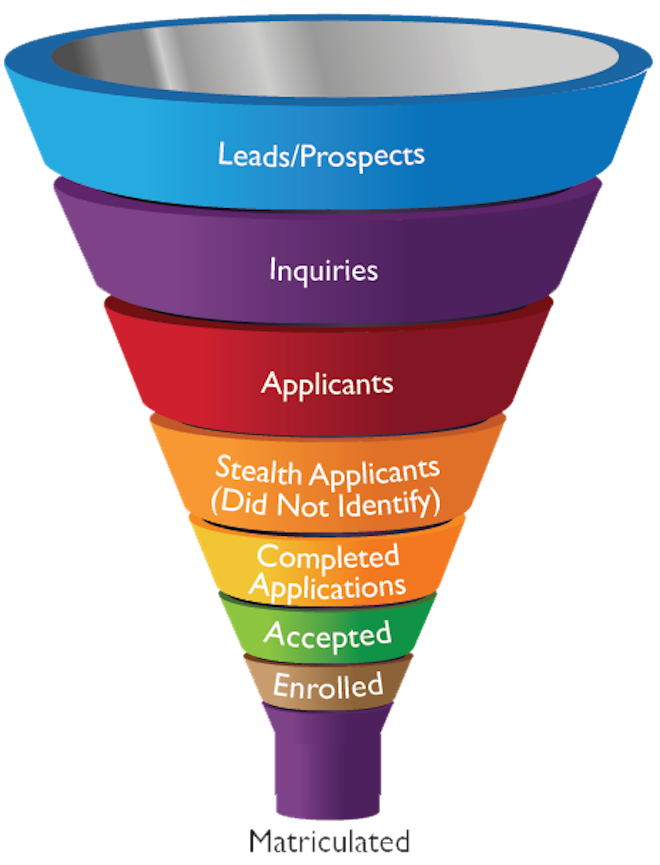
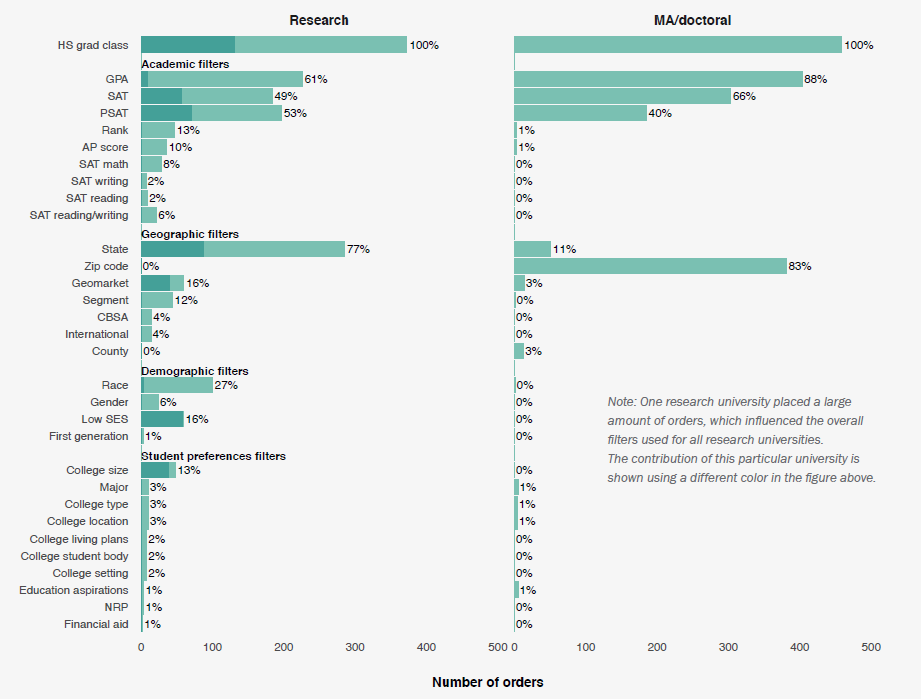

```{r setup, include= FALSE}
library(knitr)
library(bookdown)

# https://cran.r-project.org/web/packages/kableExtra/vignettes/awesome_table_in_pdf.pdf
library(kableExtra)
library(tidyverse)
library(gridExtra)
library(scales)

knitr::opts_chunk$set(echo = F, message = F, warning = F)

knitr::knit_hooks$set(inline = function(x) {   if(!is.numeric(x)){     x   }else{    prettyNum(round(x,2), big.mark=",")    } })

theme_set(
  theme(
    text = element_text(size = 7),
    panel.background = element_blank(),
    plot.title = element_text(color = '#444444', size = 7, hjust = 0.5, face = 'bold'),
    axis.ticks = element_blank(),
    axis.title = element_text(face = 'bold'),
    legend.title = element_text(face = 'bold'),
    legend.key.size = unit(0.3, 'cm')
  )
)
```


# Introduction

Colleges and universities (herein universities) identify prospective students by purchasing "student lists" from College Board, ACT, and other vendors. A Student list contains the contact information of prospective students who meet the search filter criteria (e.g., test score range, high school GPA, zip codes) specified by the university. Purchased lists are a fundamental input for undergraduate recruiting campaigns, which target individual prospects by mail, email, and on social media [@RN4728].

Recent research suggests that student lists are surprisingly important for college access -- and degree completion -- for millions of students each year. Howell et al. [-@RN4739] compared SAT test-takers who opted into the College Board Student Search Service -- allowing accredited institutions to "licence" their contact information -- to those who opted out.^[For a similar analysis of ACT's Educational Opportunity Service see @RN4752.] Figure \@ref(fig:cb-fig) reproduces the main results. After controlling for covariates (e.g., SAT score, parental education, high school), 41.1\% of students who participated in Search attended a 4-year college compared to 32.8\% of students who opted out, an 8.3 percentage point difference and a 25.3 (`(41.1-32.8)/32.8`) percent change in the relative probability. Participating in Search was associated with larger change in the relative probability of attending a 4-year college for students who identified as Black (24.5\%) and Latinx (34.4\%) than it was for students who identified as White (21.6\%), and this change was larger for students whose parents did not attend college (40.6\%) than it was for students whose parents had a BA (18.9\%).

A report series from _TICAS_ argues that student list products systematically exclude underrepresented students in two ways  [@list_biz; @list_empirics; @list_policy]. The first is which prospective students are in the underlying database. Historically, student list products sold by College Board and ACT exclude non test-takers, but rates of test-taking differ by race and class [CITE]. Second, several search filters (e.g., AP score, geodemographic segment) used to control which prospect profiles are purchased facilitate the exclusion of students from communities of color and low-income communities. Prior scholarship on recruiting [e.g., @RN4758; @RN3519] ignores student list products because this literature assumes that recruiting is something done by individual colleges and universities. However, @list_biz show that university recruiting behavior is structured by products sold by vendors and consultancies from the edtech/enrollment management industry.

Scholarship from critical data studies unpacks the business models and algorithms of digital platforms (e.g., Coursera). "Rentier capitalism" -- as in rent tenants pays a landlord -- generates profit by charging monetary rent and data rent [@RN4829; @RN4799]. Data rent is the "digital traces" created by users interacting with the platform, which often become the basis for new products. Student list data are extracted from user-data created by students laboring on platforms (e.g., taking the SAT, searching for college on Naviance) and these data are packaged to universities for monetary rent. 
Other scholarship shows how platforms reinforce racial inequality by embedding structural inequality within platform algorithms [e.g., @RN4775; @RN4772]. In student list products, several search filters used to target prospects (e.g., zip code, text score) reflect historical inequality in educational opportunity. The nascent "platform studies in education" literature [@RN4843] observes that platforms increasingly perform core functions in education and calls for critical scholarship to inform policy regulations about edtech. However, the literature has not investigated how third-party platforms structure educational opportunity along the dimensions of race, class, and geography. 

This study investigates the College Board Student Search Service product. We ask, what is the relationship between student list search filters and the characteristics of students who are included versus excluded in student lists purchased from College Board [KS - RQ HERE OR BEFORE ABOVE PARAGRAPH]? 

We develop a conceptual framework by drawing from scholarship about algorithmic products from the sociology of race and critial data studies. Student list products are algorithmic selection devices that –- similar to Google Ads or Facebook -– allow advertisers to control the prospective customers through the use of search filters. Structural racism is systematic racial bias in which processes viewed as neutral or common-sense systematically advantage dominant groups [@RN4814; @RN4421]. Structurally racist inputs are determinants of a selection device that are correlated with race because non-white people have been historically excluded from the input [@RN4778]. We conceptualize several student list search filters as structurally racist inputs. We develop propositions about the relationship between structurally racist search filters and racial exclusion.

We assess propositions using a nationally representative sample of high school students from the High School Longitudinal Study (HSLS:09) and also data about student lists purchased by public universities, which we collected via public records requests. We reconstruct search filters and filter thresholds from the College Board Student Search Service product. We simulate student list purchases using theoretically motivated and commonly observed search filters with the goal of understanding how combinations of search filters and filter thresholds yield racial and socioeconomic inequality included versus excluded prospects.

The manuscript is organized as follows. First, we provide background on student list products, situating them vis-a-vis the process of recruiting students and summarizing recent dynamics in the market for student list data. Second, we review empirical scholarship on recruiting, focusing on scholarship from sociology. Third, we develop a a conceptual framework and propositions. Next, we describe methods and present results. Finally, we discuss implications for policy and scholarship. Several search filters may satisfy all "unfair practices" criteria of the FTC Act. Because of the systematic link between student lists and student loans, student list vendors may be classified as Consumer Reporting Agencies, thereby falling under the regulatory jurisdiction of the Consumer Finance Protection Bureau. Our broader contribution is to policy research on college access. Extant scholarship analyzes students, schools, or universities, often in relation to federal or state policies. We propose a critical, empirical research program on college access that focuses on third-party organizations and products in the edtech sector, which now dwarfs the market for for-profit Title IV institutions. As courts challenge progressive policies like affirmative action, policy research should go on the offensive.  Use theories of structural inequality to investigate structural racism by edtech and target this research at regulatory agencies with relevant jurisdiction.

# Background: Student List Products

## Situating Lists Vis-a-vis Recruiting

Student lists are a match-making intermediary connecting universities to prospective students. The U.S. higher education market can be conceived as a national voucher system, whereby tuition revenue -- composed of household savings and grants and loans from federal, state, and private sources -- follow students to whichever institution they enroll in. Students want to attend college but do not know all their options, where they would be admitted, and how much it will cost. Universities have a financial incentive to provide access to students. Additionally, universities pursue some mix mix of broad enrollment goals (e.g., academic profile, racial diversity), while also meeting the needs of various campus constituencies (e.g., College of Engineering needs majors, marching band needs players) [@RN3519]. Universities cannot realize these goals solely from prospects who contact the university on their own. They must find prospects who can convinced to apply. However, universities don’t know who they are, where they are, or how to contact them. Student lists overcome the problem faced by universities, providing the contact information of prospects who satisfy their criteria. <!-- Student lists can also help overcome problems faced by students – what are their college options, where would they be admitted, how much would it cost – by enabling interested universities to contact them. But in practice, student list products are oriented to university enrollment goals rather than student opportunity goals because universities pay for the lists. -->


The "enrollment funnel" -- depicted in in Figure \@ref(fig:em-funnel) -- is a conceptual model used in the enrollment management industry to describe stages in the process of recruiting students. The funnel begins with a large pool of "prospects" (i.e., prospective students) that the university would like to convert into enrolled students. "Leads" are prospects whose contact information (or "profiles") has been purchased. "Inquiries" are prospects that contact your institution and consist of two types: first, inquiries who respond to an initial solicitation  (e.g., email) from the university; and second, "student as first contact" inquiries who reach out to the university on their own (e.g., sending ACT scores, taking a [virtual tours](https://eab.com/products/virtual-tours/) that records IP address). Applicants consist of inquiries who apply plus "stealth applicants" who do not contact the university before applying. The funnel narrows at each successive stage in order to convey the assumption of "melt" at each stage (e.g., a subset of "inquiries" will apply). Practically, the enrollment funnel informs interventions that increase the probability of "conversion" from one stage to another [@RN4322]. For example, financial aid packages are used to convert admits to enrolled students [e.g., @RN1948].
<!-- 
In order to situate student lists within the process of recruiting recruiting, Figure \@ref(fig:em-funnel) depicts the "enrollment funnel," a conceptual model used by enrollment management industry to visualize stages in the recruiting of students (e.g., prospects, leads, inquiries, applicants, admits, and enrolled students). "Prospects" are "all the potential students you would want to attract to your institution" [@RN4322]. We define "leads" as prospects whose contact information has been purchased. "Inquiries" are prospects that contact your institution and consist of two types: first, inquiries who respond to an initial solicitation  (e.g., email) from the university; and second, "student as first contact" inquiries who reach out to the university on their own, for example, by sending ACT scores or by taking a "[virtual tours](https://eab.com/products/virtual-tours/)" that records IP address. Applicants consist of inquiries who apply plus "stealth applicants" who do not contact the university before applying.
-->

At the top of the enrollment funnel, universities identify leads by buying student lists. The sum of purchased leads plus student-as-first-contact inquiries constitutes the set of all prospects the university has contact information for who may receive targeted recruiting interventions. Based on data provided by university clients, @RN4741 reported that 28\% of public universities purchased less than 50,000 names annually, 44\% purchased 50,000-100,000 names, 13\% purchased 100,000-150,000 names, and 15\% purchased more than 150,000 names. @RN4402 asked clients to rate different "first contact" interventions (e.g., off-campus recruiting visit) as sources of inquiries and enrolled students. For the median public university, purchased lists accounted for 26\% of inquiries, which ranked \#1, and accounted for 14\% of enrolled students, which ranked fourth after "application as first contact" (19\%), campus visit (17\%), and off-campus visit (16\%).^[For private non-profit institutions, 34\% of private institutions purchased fewer than 50,000 names, 24\% purchased 50,000-100,000 names, 23\% purchased 100,000-150,000 names, and 18\% purchased more than 150,000 names [@RN4741]. Additionally, student list purchases were the highest source of inquiries, accounting for 32\% of inquiries and were tied with off-campus recruiting visits as the highest source of enrolled students, accounting for 18\% of enrolled students [@RN4402].]


## The Market for Student List Data

<!-- 
Historically the market for student list data has been dominated by College Board and ACT, which capitalize on their database of test-takers. In the 21st Century, however, student lists have been central to market dynamics in the broader enrollment management industry. 
-->

Historically, the student list business has been dominated by College Board and ACT. In the 21st Century, student lists have been central a surprising level of dynamism in the broader enrollment management industry. @list_biz describes key dynamics that shaped the contemporary market for student list data. The first dynamic is the centrality of enrollment management consulting firms to the student list business. Although universities are the paying customers of student list products, many universities outsource student list purchases to enrollment management consulting firms. Furthermore, student lists are an essential input to the predictive models and recruiting interventions (e.g., emailing prospects) the consultancies provide.

The second dynamic is competition followed by concentration. In the 2000s, advances in technology yielded new sources of student list data, creating opportunities for new vendors. Start-ups entered the student list market by creating college search engines that asked students to submit information in order to receive recommendations about colleges and scholarships. Another new data source is college planning software (e.g., Naviance) sold to high schools and used by high school students and guidance counselors. In the 2010s, the enrollment management industry experienced a surge in horizontal followed by vertical acquisitions. Horizontal acquisitions occurred when one enrollment management consulting firm acquired a competitor (e.g., e.g., RuffaloCODY acquired Noel-Levitz in 2014) [CITE]. Vertical transformations transformed the student list business. For example, K-12 software provider PowerSchool entered the student list business by acquiring the Naviance college planning and Intersect student recruiting platforms from Hobsons. Enrollment consultant EAB entered the market for student list data through acquisitions (e.g., Cappex college search engine) and by becoming the exclusive reseller of the Intersect. As in the past, however, all student list products derive student list data from the user-data of students laboring on platforms.

Third, incumbents College Board and ACT attempted to retain their competitive advantage amidst the test-optional movement. Both organizations embraced data science by developing new search filters (e.g., ACT's predicted probability of enrolling) based on statistical models. Additionally, organizations leveraged their oligopoly position in the student list business to sell enrollment management consulting, offering clients information about prospects that is not included in purchased lists. However, the test-optional movement poses an existential threat to the college entrance exam. As fewer prospective students take College Board and ACT assessments, their competitive advantage in the coverage of college-going high school students is eroding, and private equity edtech firms such as EAB and PowerSchool are positioned to acquire market share ceded by College Board and ACT. Whereas College Board and ACT historically sold names at a price per-prospect (e.g., \$0.50 in 2021), for-profit edtech firms maximize profit by wrapping a large proprietary database of prospects within a software-as-service product (e.g., EAB's Enroll360) that universities must purchase in order to obtain access to these prospects. 


# Scholarship on Recruiting from Sociology

We position our study vis-a-vis scholarship on recruiting. Most scholarship on enrollment management focuses on latter stages of the enrollment funnel, particularly which applicants get admitted and financial aid leveraging to convert admits to enrolled students. Fewer studies investigate the earlier "recruiting" stages of identifying prospects, acquiring leads, and soliciting inquiries and applications. Whereas scholarship from economics tends to analyze the effects of specific recruiting interventions [e.g., @RN4850; @RN4341; @RN4740], scholarship from sociology tends to observe how recruiting happens "in the wild" so to speak. Our review focuses on scholarship from sociology. We identify a key blind spot, one that is shared by scholarship from economics and the broader interdisciplinary field of education research.

Scholarship from sociology has analyzed recruiting from the perspective of students, high schools, and postsecondary institutions [e.g., @RN4774; @RN4324; @RN3519; @RN4520; @RN4758]. This literature primarily utilizes ethnographic or case-study designs, and often analyzes recruiting as part of a broader analysis of college access or enrollment management. Holland's [-@RN4324] analysis of pathways from high school to college exemplifies scholarship that engages with recruiting from the perspective of high school students [e.g., @RN1814]. Students from groups underrepresented in higher education were drawn to colleges that made them feel wanted because they felt “school counselors had low expectations for them and were too quick to suggest that they attend community college” [@RN4324, p. 97]. These students were strongly influenced by marketing material and high school recruiting visits, including small-group representative visits and instant decision events. By contrast, affluent students with college-educated parents were less taken by such overtures and more concerned with college prestige.

Several studies analyze connections between colleges and high schools from an organizational perspective. Off-campus recruiting visits are often conceptualized as an indicator of enrollment priorities and/or a network tie indicating the existence of a substantive relationship [@RN4733]. @RN3519 provides an ethnography of enrollment management at a selective, tuition dependent private college sensitive about rankings. The college valued recruiting visits to (affluent) high schools as a means of maintaining relationships with guidance counselors at feeder schools. @RN4407 analyzes the other side of the coin, showing how guidance counselors at an elite private school get under-qualified appicants into top colleges by exploiting colleges' desire for information about which applicants will enroll if admitted. @RN4758 analyzed off-campus recruiting visits by 15 public research universities. Most universities made more out-of-state than in-state visits. These out-of-state visits focused on affluent, predominantly white public and private schools. @RN4759 analyzed by public research universities to out-of-state metropolitan areas, finding that universities engage in "recruitment redlining -- the circuitous avoidance of predominantly Black and Latinx communities along recruiting visit paths" [p. X]. In contrast to branding about the commitment to racial diversity [@RN4839], these studies find that the recruiting efforts of selective institutions prioritize affluent, predominantly white schools and communities.

A smaller set of studies analyze recruiting at open-access institutions that target working adults [e.g., @cottom2017lower; @RN4520]. @cottom2017lower is simultaneously an ethnography of enrollment management by for-profits and an analysis of political economy. For-profits found a niche in Black and Latinx communities precisely because traditional colleges ignored these communities. They systematically targeted women of color and generated profit by encouraging these students to take on federal and private loans. This business model exemplifies "predatory inclusion," the logic of "including marginalized consumer-citizens into ostensibly democratizing mobility schemes on extractive terms" [@RN4774, p. 443].

Collectively, empirical scholarship on recruiting from sociology -- and other disciplines -- assumes that recruiting is something done by individual colleges and universities. As a consequence, the recruiting literature ignores the role of third-party products and vendors. This blind spot has two root causes. First, scholarship on recruiting has not considered scholarship from critical data studies, which shows that digital platforms increasingly perform core organizational functions [e.g., @RN4799; @RN4829] and that digital platforms utilize algorithms that reinforce racial inequality [e.g., @RN4775]. Second, scholarship on recruiting ignores the broader enrollment management industry that surrounds colleges and universities.

@list_biz provide a conceptual analysis of the market for student list data in relation to the enrollment management industry. Although universities make choices about which names to purchase, these choices are structured by the algorithmic architecture of student list products –- which prospects are included in the product, the targeting behaviors allowed by the product, the targeting behaviors encouraged by the product. Furthermore, many universities are uninformed about which prospective students they target because they outsource student list purchases to enrollment management consultancies [@list_empirics]. These student list purchases substantially determine which prospective students will receive recruiting interventions at subsequent stages of the enrollment funnel. Thus, products and services sold by third-party vendors structure the recruiting behavior of individual universities and, in turn, college access opportunities for students.

@list_empirics issued public records request to collect data about student lists purchased by public universities in four states. Their analyses sought to investigate the College Board student list product, rather than the behavior of universities purchasing the product. The primary research question was, what is the relationship between student list filter criteria and the characteristics of prospects included in purchased lists? For example, an analysis of several "women in STEM" purchases -- which filtered on a combination of SAT/AP score, GPA, state, and intended major -- showed that the racial and socioeconomic composition of targeted prospects differed dramatically from their surrounding metro area.  Because of data limitations, however, @list_empirics could not determine which filters and filter thresholds were driving this exclusion. This paper advances beyond @list_empirics in two ways. First, we develop theoretically motivated propositions about search filters that are likely to yield racial inequality. Second, we test propositions using a nationally representative sample of high school students. These data allow us to examine who is included and excluded as filters and filter thresholds are changed and the analyses yield inferences that generalize to student populations of interest to policymakers.

<!-- 
Upon reflection, scholarship assumes that recruiting is something done by individual colleges and universities. But university enrollment management behaviors are increasingly structured by software and services purchased from third-party vendors. Scholarship on enrollment management must analyze the products being sold to universities and the vendors that create these products. For most universities, student list purchases largely determine which prospective undergraduate students will receive recruiting interventions. Although universities make choices about which names purchase, these choices are structured by the algorithmic architecture of student list products –- which prospects are included in the product, the targeting behaviors allowed by the product, and the targeting behaviors encouraged by the product. @RN4774 argues that algorithmic products are not race neutral. Rather, scholarship on the sociology of race shows that algorithmic products reproduce racial inequality by incorporating seemingly neutral inputs that systematically exclude non-white people. Therefore, we review key advances from the sociology of race in order to conceptualize how student list products reproduce racial inequality.
-->

<!--
CUT SUBSECTION

We position our scholarly contribution as a bridge between two literatures. First, we review scholarship that informs the nascent "platform studies in education" literature. Second, we review empirical scholarship on recruiting, focusing on scholarship from sociology.

## Platform Studies in Education

Digital platforms (e.g., Uber, Coursera, Naviance) are intermediaries for exchange that coordinate market transactions and create new markets [@RN4829]. Platforms are also the "ground on which all the user activity happens, allowing the platform to record everything happening in it" [@RN4793, p. 322]. An emerging literature examines digital platforms in education [e.g., @RN4847; @RN4843; @RN4815]. This literature consciouslly draws from a multidisciplinary, transnational set of literatures on "platform studies" [e.g., @RN4775; @RN4772; @RN4799]. 

One thread of platform studies deconstructs the "platform capitalism" business model. Platform capitalism is often called "rentier capitalism" because the dominant business model generates profit by charging customers “rent” – as in the rent a tenant pays a landlord – for the right to use the platform without transferring ownership rights to the customer [@RN4829]. Monetary rent refers to money a customer pays to an organization for access to digital products, for example a university pays annual subscription fees to Elsevier for access to academic journals [@RN4793]. Data rent refers to “digital traces” that platform users create by interacting with the platform (e.g., personal information they submit, interactions on the platform) [@RN4793]. Digital platforms gain ownership over user data via terms-of-use agreements. Drawing from @RN1025, @RN4799 develops the concept "data as capital," to describe how platforms monetize user-data, which may be used to improve the platform or may become the basis for a new platform.

Another thread of platform studies, emerging from critical data studies, examines how digital platforms reproduce structural inequality [e.g., @RN4772; @RN4775; @RN4849]. @RN4772 shows that the results of search algorithms reflect racist ideologies of people on the internet and the profit imperative of adverters that capitalize on these ideologies. @RN4775 develops _race critical code studies_ and attendant concepts. For example, "discriminatory design" is the process embedding structural inequality in platform algorithms, for example, by scoring customers based on an input that people of color have been excluded from. The concept "technological determinism" describes how biased algorithms affect society by amplying the effects of structurally racist inputs.

Student list products are exemplars of platform capitalism that reproduce structural inequality. Student list data are extracted from the user-data of students laboring on platforms to prepare for college (e.g., taking the SAT) or search for college. Terms-of-use agreements grant platforms ownership over these data. Following @RN4799, College Board monetizes this commodity by licensing names to universities for roughly $0.50 per prospect. New entrants to the market (e.g., EAB, PowerSchool) wrap proprietary databases of prospects within software-as-service products that recruit these prospects (e.g., Intersect, Enroll360), which are then sold to universities for an annual subscription. Student list products reproduce structural inequality because search filters used to target particular prospects -- for example, filters for zip code and AP test scores -- are themselves products of historical inequality in educational opportunity.

The Summer 2022 special issue of _Harvard Educational Review_ sets the commitments and direction of the nascent "platform studies in education" literature. @RN4843 reviews extant scholarship on technology within education research, observing that most scholarship focuses on technical questions about student learning outcomes and instructional practice. @RN4844[p. 207] states that, "platform studies scholars urge us to go beyond pedagogical and technical questions toward social, political, and economic critiques. Consistent with this call, a growing transnational literature examines the economic business models of platform capitalism in the education sector [e.g., @RN4816; @RN4815; @RN4827]. Big tech and edtech companies profit by developing software systems -- sold for an annual subscription -- that perform core functions of education systems [E.G., ]. Other studies observe that, as education systems outsource core functions, digital platforms exert influence on organizational governance and education policy [e.g., @RN4845; @RN4844].

We contribute to the platform studies in education literature. Most broadly, we contribute empirics to a literature that consists mostly of conceptual articles. More substantively, in contrast to scholarship from critical data studies [e.g., @RN4772], scholarship on education does not show how platforms structure educatonal opportunity along racial and class dimensions. Furthermore, while scholarship argues that digital platforms influence education policy [@RN4847], extant scholarship falls short of analyses that show how platforms should be regulated.


--> 


<!-- 
_**The digital economy and edtech**_. Shifts in the market for student list data are part of broader dynamics in the digital economy and the educational technology (edtech) industry. The digital economy refers to economic output "from digital technologies with a business model based on digital goods or surveces" [@RN4838, p. 13]. Digital platforms, the engines of the digital economy, are intermediaries that create markets and coordinate market transactions [@RN4829]. The platform is also the "ground on which all the user activity happens, alloweing the platform to record everything happening in it" [@RN4793, p. 322]. RN4816 (p. 9) describes three categories of digital platforms in the higher education sector: first, platforms that directly target individual students (e.g., apps for renting textbooks or taking notes); second, platforms that connect "service buyers (learners) and sellers (content providers)\ldots that "that almost serve as educational “institutions” in their own right (e.g., apps that allow self-employed teachers to offer micro- and other courses directly to prospective students); and third, platforms that perform some function for the university, which often integrate "directly into the work of a university" and "universities pay a subscription or fees for the use of such platforms. Examples include learning management systems (e.g., Canvas), student success platforms, and recruiting platforms that target prospective students.


“Platform capitalism” refers to the business model of generating profit from digital platforms. Platform capitalism generates profit by charging customers “rent” – as in the rent a tenant pays a landlord – for the right to use the platform without transferring ownership rights to the customer [@RN4829]. Monetary rent refers to money a customer pays to an organization for access to digital products, for example a university pays annual subscription fees to Elsevier for access to academic journals [@RN4793]. Data rent refers to “digital traces” that platform users create by interacting with the platform (e.g., personal information they submit, behavior and interactions on the platform) [@RN4793]. Digital platforms gain ownership over user data via terms-of-use agreements. These user data may be utilized to improve the platform, become the basis for new products, or may be sold to third-party entities.

@RN4799 builds on _Capital_ [@RN1025] to conceptualize data as capital. @RN1025 describes the process of generating profit from money ($M$) and commodities ($C$) (e.g., raw inputs, machinery, labor). The formula $M-C-M'$ represents economic capital, whereby money $M$ is invested to produce commodity $C$, which is sold for a larger amount of money $M'$. @RN4799 states that data are incorporated into the flow of economic capital in two ways, first, as an input material for the production of commodities [e.g., software predicting hospital staff needs depends on data about patients]. Second, data are a product (commodity) produced by the labor of people using digital platforms. @RN1025 states that the source of profit is not market exchanges  -- $M-C$ or $C-M'$ -- but rather the exploitation of workers, who are paid less than the value they add to commodities. Similarly, @RN4799 argues that the extraction of data from users is a substantial source of profit for digital platforms. @RN4799 (p. 5) quotes an artificial intelligence researcher, “‘At large companies, sometimes we launch products not for the revenue, but for the data. We actually do that quite often \ldots and we monetize the data through a different product.’”

We conceptualize student list data as capital. Student list data are a commodity valued by universities looking for customers. Student list data are derived from the user-data of students laboring on a platform. For example, student list data sold by College Board is created by the labor of students who fill out pre-test questionnaires about their college preferences and then complete the test. College Board extracts student list data from test-takers who complete a questionnaire about their college preferences. Similarly, “free” college search engines (e.g., Cappex) and college search software purchased by high schools (e.g., Naviance) extract student list data from the digital labor of students searching for college.

The process of profiting from student list data follows the formula of economic capital. An example of $M-C-M'$ is an organization (e.g., Cappex) invests money ($M$) to create a college search engine ($C$) that generates student list data, which is then sold to universities for more money ($M'$). @RN1025 observes that platform capitalism is defined by ever longer sequences of money ($M$) and commodities ($C$) because, as Marx [CITE; 1990 p 254)] explains, the "aim of the capitalist" is not "profit on any single transaction. His aim is rather the unceasing movement of profit-making." Thus, more lucrative approaches generate student list data as a by-product of another money-making product, following the formula $M-C-M'-C-M''$. College Board invests money ($M$) to tests ($C$), which are sold to households for $M'$ and also yield student list data ($C$), which are sold to universities ($M''$) looking for students. The Naviance college planning platform -- and sister product the Intersect recruiting platform -- follow a similar cycle. Whereas vendors historicaly sold student list data to universities at a per-prospect price, organizations increasingly leverage market power in the supply of student list data to sell more expensive software and/or consulting services, leading to cycle $M-C-M'-C-M''-C-M'''$. The most common approach -- exemplified by the PowerSchool's Intersect product and EAB's Enroll360 product -- is to wrap a large pool of proprietary prospects within a software-as-service product that serves recruiting interventions to these targets. Universities that want to recruit these prospects must purchase the software. 

PUT THIS IDEA SOMEWHERE? @list_biz observed that generating surplus value depends substantially on being an oligopolist supplier, that is extracting proprietary ownership over a large, unique pool of prospective students. For example, in 2011 the online textbook company Chegg tried to enter the student list business. Although Chegg extracted some student list data in-house -- through the acquisition of Zinch -- they were mostly a "lead aggregator," buying student list data from other venders ($M-C$) and reselling these data to universities ($M-C$). @RN1423 argues commodity exchange is not the source of surplus value because commodities are bought and sold at their market exchange-value. Consistent with this argument, the Chegg student list business failed to generate profit because they were paying market price for leads purcahsed from third-party suppliers [CITE].

Recent scholarship on edtech builds on the data studies literature to describe how digital platforms make money in the higher education space [e.g., @RN4793; @RN4815; @RN4827; @RN4820]. However, scholarship on edtech has not substantively engaged with recruiting or enrollment management more broadly, with the exception of online program managers (OPMs) [CITE]. Furthermore, whereas scholarship from critical data studies shows how digital platforms reproduce structural racism [@RN4772; @RN4775], scholarship on edtech has not investigated how digital platforms reproduce racial inequality in college access. [TRANSITION TO SOCIOLOGY?]
-->

# Conceptual Framework

We develop a conceptual framework in two parts. First, we introduce concepts at the nexus of algorithms and structural racism, drawing largely from the sociology of race, but also from critical data studies and critical geography. Second, we apply these concepts to student list products and develop propositions about the relationship between search filters and exclusion.

## Algorithms and Structural Racism

<!--
**Structural racism**. Contemporary sociology is largely concerned with a structural analysis of race. @RN4814 argues that most social sciences define racism as an ideology held by individuals (e.g., explicit or implicit racial bias). This approach measures societal racism by examining the attitudes of individuals and excludes the possibility that institutions can be racist. @RN4814 argues for a focus on the underlying social structure rather than the ideology associated with it. He defines "racialized social systems" as “societies that allocate differential economic, political, social, and even psychological rewards to groups along racial lines” (p. 474). Racial groups are a social construction of a racialized social system. For example, in the U.S. “black people” is a construct that emerges from the slave trade and its legacy. "Racial ideology" -- commonly known as racism -- is the ideological component of a racialized social system, which includes individual bias and also institutions that that benefit dominant racial groups. @RN4814[p. 476] argues “that the only way to ‘cure’ society of racism is by eliminating its systemic roots.” As the practices that produce racial inequality become increasingly covert, The sociology of race defines structural racism as a “a form of systematic racial bias embedded in the ‘normal’ functions of laws and social relations” [@RN4760, p. 1143], whereby processes viewed as neutral or common-sense systematically advantage dominant groups and disadvantage marginalized groups.
-->

<!-- As the practices that produce racial inequality become increasingly covert, the utility of the concept racialized social system is drawing attention to the systemic roots of seemingly neutral institutions and practices that produce racial inequality.  -->


<!-- PX: THIS PARAGRAPH DEFINES DEFINES STRUCTURAL RACISM; SAYS THAT CAPITALISM IS EXPLOITATION BASED ON RACE; AND SAYS THAT THIS ARTICLE FOCUSES ON STRUCTURAL RACISM IN CONSUMER SIDE OF THE ECONOMY; MAYBE THIS DEFINITION OF STRUCTURAL RACISM DOESN'T BELONG IN THIS PARRAGRAPH -->
<!-- The sociology of race is influenced by historical scholarship from @RN4782 and @RN4773, which defines capitalism as a system whereby the source of profit is exploitation based on the social construction of race (in contrast to @RN1025, who argues that capitalism is defined by exploitation of the working class. Analyses of racial capitalism that build on @RN4773 tend to focus on structural racism in the production side of the economy (labor), for example, the "gig economy" [@RN4774]. By contrast, this article is concerned with structural racism on the consumer side of the economy, whereby people of color experience systematic discrimination in credit market, housing markets, and education markets -- including products that help universities identify prospective students.-->


<!-- @RN4794 (215) define algorithms as "sets of instructions written as code and run on computers." Algorithmic products are attractive to investors because of the way these products scale. On the cost side, the marginal costs of adding more users is low. On the revenue side, each new user contributes new data to cull, improving the accuracy of the product and creating opportunities for new products.  -->

**Algorithms and actuarialism**. Algorithms are "sets of instructions written as code and run on computers" [@RN4794, p. 215]. Sociologists observe that algorithmic products utilize actuarial methods and are based on the logic of actuarialism [@RN4778;@RN4794; @RN4835]. Pioneered by the insurance industry, actuarial methods proceed in two steps. First, apply statistical techniques to previous cases in order to identify factors positively and negatively associated with an outcome of interest. Second, apply these results to future cases in order to make predictions and to assign levels of risk to each case. Actuarialism is the ideology that equates fairness with risk, as determined by predicted probabilities. Under the logic of actuarialism, individuals or businesses that have characteristics associated with loan default should be charged higher interest rates.

Actuarial methods standardize decision-making by replacing individual judgment with decisions based on a formula.^[@RN4794 observes that the adoption of actuarial methods across many industries was buoyed by concerns about racial equity following antidiscrimination legislation in the 1970s.]  @RN4778 observes that actuarial methods can promote racial equity if the primary source of inequality is racial bias of individual decision-makers. For example, @RN4801 shows that homes in predominantly white neighborhoods received higher appraisal values than those in non-white neighborhoods because appraisers have discretion in selecting similar comparision homes ("comps") for the valuation. 

However, scholarship from the sociology of race argues that actuarial methods may not reduce racial inequality due to structural racism. Drawing from Bonilla Silva's [-@RN4814] concept of "racialized social systems," structural racism is defined as “a form of systematic racial bias embedded in the ‘normal’ functions of laws and social relations” [@RN4760, p. 1143], whereby processes viewed as neutral or common-sense systematically advantage dominant groups and disadvantage marginalized groups. @RN4778[pp. 352-353] states that "actuarialism tends to bake [racial] inequality into the decision-making process, transmuting social disadvantages into seemingly objective measures of individual riskiness." We discuss two mechanisms of structural racism in algorithmic products: (1) structurally racist inputs; and (2) market segmentation and micro-targeting.


**Structurally racist inputs** Actuarial products predict future outcomes by modeling the determinants of the outcome using historical data. @RN4794[p. 224] state that “predicting the future on the basis of the past threatens to reify and reproduce existing inequalities of treatment by institutions." Even when actuarial products do not include race as a determinant, they often include determinants that are highly correlated with race. *Structurally racist inputs* are determinants of an outcome that systematically disadvantage non-white people and are correlated with race because non-white people have been historically excluded from this input [@RN4778; @RN4851].

@doi1011 provide an empirical example of structurally racist inputs. They found that an algorithm used by hospital systems to predict patient health care needs under-predicted the needs of Black patients because the algorithm used health care costs as a proxy for health needs, but Black patients tend to receive less care relative to their health needs than other patients. An example by @RN4786 reconstructed Moody's city government credit rating algorithm, which assigns credits scores to cities based on determinants thought to predict loan default. The algorithm does not include the percent of residents who are Black, but it does include median household income, which is correlated with percent black because of historic wage discrimination. Once household income is included in the model, percent Black is not longer a significant predictor of city credit rating. Thus, household income is a "racialized input" @RN4786, defined as a seemingly neutral, structurally racist input that masks the structural racism of an algorithm by "explaining away" the relationship between race and the outcome.
<!--
@RN4786 develops the concept "racialized input" by reconstructing Moody's city government credit rating algorithm, which assigns credits scores to cities based on determinants thought to predict the probability of loan default. When cities issue bonds, these credit scores affect bond interest rates. While Moody's does not use percent of residents who are Black as an input, @RN4786 shows that %Black is negatively associated with city credit rating. This negative relationship persists after controlling for all determinants (e.g., revenue divided by expenditures, total liabilities as a percent of revenue, etc.) with the exception of median household income. Household income is correlated with %Black because of centuries of wage discrimination. Once the model controls for household income, %Black is no longer a significant predictor city credit rating. Thus, @RN4786 argues that household income is a "racialized input," which he defines as a structurally racist but seemingly neutral input that masks the structural racism of an algorithm by "explaining away" the relationship between race and the outcome.
-->


Geographic structurally racist inputs emerge from algorithms that make predictions based on where people live [@RN4775]. Because targeting by race can be profitable, platforms often capitalize on residential segregation by using geography as an input to circumvent laws prohibiting race as an input. Thus, @RN4775[p. 147] writes, "racialized zip codes are the output of Jim Crow policies and the input of New Jim Code practices."

The concepts "space" and "place" from critical geography [@RN4754; @RN4755] provide insight about geographic structurally racist inputs. Place denotes a holistic understanding of a geographic location that incorporates the “history, peoples, and purposes within the political, social, and economic landscape” [@RN4755, p. 317]. By contrast, space simply refers to a physical location which can be described in terms of quantifiable spatial features (e.g., distance, demographics, economic activity). Geospatial analyses typically adopt this view of space “as a location on a surface where things ‘just happen’” [@RN4754, p. 318].

Market research conceives of geography as space and exploits racial segregation as a means of identifying customers [@RN4772; @RN4775]. For example, geodemography is a branch of market research that estimates the behavior of consumers based on where they live. @RN4565[p. 1], which develops geodemographic segment search filters, states that "the basic tenet of geodemography is that people with similar cultural backgrounds, means, and perspectives naturally gravitate toward one another or form relatively homogeneous communities; in other words, birds of a feather flock together." By contrast, scholarship on racial segregation conceives of geography as place. Racial segregation is a function of historic and contemporary structurally racist laws, policies, and practices promoting residential segregation [e.g., @rothstein2017color; @RN4551; @RN4801; @RN4800]. Algorithms that categorize people based on geographic location (space) without considering historic and contemporary structures (place) that produce residential segregation are to reproduce historical race-based inequality in opportunity.

<!--
Geographic search filters are built on the back of racial segregation. Targeting prospective students based on geographic location (space) without consideration to the historic and contemporary structures (place) that produce residential segregation is likely to reinforce historical race-based inequality in educational opportunity.
-->


**Market segments and micro-targeting**. A second source of structural racism in products utilizing actuarial methods are the related processes of market segmentation and micro-targeting. Market segmentation categorizes customers into groups (e.g., "married sophisticates," "rural everlasting") that are useful for advertisers [@RN4744]. Micro-targeting is the process of using data to precisely identify and target granular segments of society [@RN4789].

In sociology, @RN4810 define "classification situations" -- which encompasses market segmentation -- as the use of actuarial techniques to categorize consumers into different groups. Historically, classifications were binary; consumers with "good" credit were offered loans and those with bad credit were not. Advances in data analytics (e.g., individual credit scores) enabled finer classifications; customers are classified into many groups, or along a continuum, alongside the emergence of tiered products targeting different consumer groups with different benefit levels.<!--@RN4810[p. 566] offer a quote from a banking trade publication: "Stop trying to lend at low margin to accountants, lawyers and civil servants who are reliable but earn the bank peanuts. Instead, find the customers who used to be turned away; by using modern techniques, in credit scoring and securitization, they can be transformed into profitable business."-->For example, "payday loans" charge high interest rates to consumer groups that were previously denied credit altogether. Thus, at one end of the continuum, these classifications are similar to Cottom's [-@cottom2017lower;-@RN4774] concept "predatory inclusion," while at the other end of the continuum marginalized populations are excluded from attractive product offerings.

Scholarship from critical data studies shows that racial exclusion is a predictable consequence market segmentation [@RN4775; @RN4772; @RN4795]. The process of developing a classification system requires developers to make a series of inherently subjective decisions (e.g., who is in the dataset, which measures to utilize, which categories to identify), creating opportunities for individual biases of developers and structurally racist inputs to enter the algorithm [@RN4772]. Furthermore, classification systems are developed to optimize profit. In turn, "audiences are treated as a commodity to be bought and sold. When audience segments are under-valued in the market, demand among advertisers for the ability to reach them will be relatively low, which decreases the likelihood that a corresponding segment will be produced" [@RN4795, p. 3].

Critical data studies has also investigated micro-targeting [e.g., @RN4775; @RN4795; @RN4789]. For example, @RN4795[p. 1] state that micro-targeting by Facebook "is driven not by a goal of making all users available to advertisers, but of making the 'right' individuals available. Facebook advises that advertisers 'Implement a targeting strategy that focuses on reach and precision and eliminates waste.'" A theme from scholarship on micro-targeting in politics is that these technologies *could* be used to to increase outreach to marginalized groups, but in practice they are not. Instead, "campaigns routinely 'redline' the electorate, ignoring individuals they model as unlikely to vote, such as unegistered, uneducated, and poor voters (Kreiss, 2012, p. 74-75).^[WE PULLED THIS QUOTE FROM COTTER 2021]

## Mechanisms of Exclusion in Student List Products

**Conceptualizing student-list products**. Student list products allow universities to choose prospective students from within some database of prospects by selecting on search filters. @list_empirics categorize the filters available in the College Board Student Search Service product into the four buckets of geographic, academic, demographic, and student preferences (e.g., desired campus size, intended major), as shown in Table X.

Student list products have similarities and differences to algorithmic products that have been analyzed within sociology and critical data studies. Sociologists often study algorithmic products that assign scores based on the value of input determinants. For example, Moody's algorithm assigns credit scores to cities based on inputs correlated with default in previous cases [@RN4786]. Similar to these products, student lists utilize search filters tha can be conceptualized as structurally racist inputs. For example, the College Board product enables universities to filter prospects based on 5-digit zip code, but zip codes are racially segregated. 

Algorithmic products that make decisions purely based on scores (e.g., most credit offers) remove racial inequality caused by explicit or implicit individual decision-making bias [@RN4778]. By contrast, student list products are similar to purchasing ads from Google or Facebook in that advertisers (universities) choose prospective customers by selecting on search filters. Universities purchasing lists may be thoughtful about avoiding structurally racist search filters. However, this individual discretion raises the possibility of racial disparities due to individual bias or lack of knowledge about the products.

Market segmentation and micro-targeting are at the core of student list products. Universities are encouraged to execute multiple student list purchase, each targeting different market segments [@waxman]. Purchases target granular populations by simultaneously filtering on several filters. As in political advertising [@RN4789], micro-targeting has become a branding strategy for student list products. For example, College Board Student Search promises to “create a real pipeline of best-fit prospects” @RN1623 while ACT Encoura uses the tag-line “find and engage your best-fit students” @RN1624. Recently, student list products have developed new search filters that utilize market segmentation and micro-targeting approaches that have been analyzed within critical data studies [@RN4772; @RN4795]. For example, @RN4565 utilized market segmentation methodologies to create "geodemographic segment" filters, which classify each high school and each neighborhood to a group based on the past college-going behaviors of students.^[In 2021, College Board added three new geodemographic filters [@cb_vid_2021].] Other new filters are designed to increase precision, for example College Board's "interest in my peers" filter and ACT's predicted probability of enrollment filter. To the extent that universities want to target students from affluent schools and communities [@RN4758], contemporary student list products facilitate this goal with great efficiency.

<!-- 
Enrollment management consulting firms promise precision when marketing list buying services. For example, Ruffalo Noel Levitz states the “RNL Student Search and Engagement” product enables universities to “target the right students in the right markets” by making “the most efficient name purchases using predictive modeling” [@ruffalo_noel_levitz_2021].
-->


### Predicting Exclusion

Our analyses focus exclusion due to structural inequality embedded in the underlying student list product as opposed to exclusion that emerges from the individual bias of people purchasing lists. We posit two broad sources of structural inequality in student list products: (1) who is included in the underlying database; and (2) utilizing structurally racist inputs as search filters for selecting prospects from the underlying database. <!--We conceptualize a search filter as a structurally racist input if it is correlated with race due to historic exclusion from the input.-->This section draws from the theoretical discussion above to develop propositions about the relationship between search filters and exclusion, focusing on academic and geographic search filters.

**Academic filters**. College Board academic filters include high school graduating class, SAT score, PSAT score, AP score by subject, high school GPA, and high school class rank.

The first source of structural inequality in student list products is which prospective students are included in the underlying database. Historically, College Board and ACT student list products exclude students who do not take at least one of their assessments (e.g,. SAT, AP, PSAT).^[footnote: recently added college search engine blah blah]. Prior research shows that rates of SAT/ACT test-taking differ by race and class [e.g., @RN2275]. Similarly, the percentage of students who take AP exams vary across race, particularly for STEM exams [@RN4855], and Black students are more likely than white students to attend a high school with few AP course offerings [@RN4854]. These findings motivate the following proposition, which we analyze separately by assessment (SAT, PSAT, AP) and for taking any assessment.

**P1**: The condition of taking standardized assessments (X) is associated with racial disparities in who is included versus excluded (Y)

Second, search filters that condition on test scores thresholds are a source of exclusion that builds on differences in test-taking. Average standardized test scores differ by race and by class [CITE]. Prior research finds that access to test preparation varies by race and class [@RN4856]. Furthermore, prior research finds that SAT question items are racially and socioeconomically biased [e.g., @RN6011; @RN6012]. Therefore, we conceptualize test score filters as a structurally racist input in student list products. By contrast, prior research suggests that high school GPA is a less biased measure of performance [@RN2517;@RN1749; @RN2275] and that GPA is a strong predictor of postsecondary student success [@RN2301; @RN6019]. We test the following proposition separately by assessment (SAT, PSAT, AP) and for GPA:

**P2**: As test score threshold increases, the proportion of underrepresented minority students included in student lists declines relative to the proportion who are excluded


**Geographic filters**. Geographic search filters enable universities to target prospects based on where they live. College Board Student Search Service offers two kinds of geographic search filters: filters based on known geographic borders (e.g., state, CBSA, county, zip code); and filters based on new geographic borders that College Board creates using historic data about test-takers (e.g, geomarket, geodemographic segment). At present we do not have access to data on borders created by College Board.

We conceptualize geographic search filters as structurally racist inputs because these search filters are built on the back of historic and contemporary policies and practices promoting racial segregation in American schools and communities. Drawing from critical geography [e.g., @RN4754], targeting prospective students based on geographic location (space) without consideration to the historic and contemporary structures (place) that produce residential segregation is likely to reinforce historical race-based inequality in educational opportunity.

We expect that utilizing finer geographic filters (e.g., zip code rather than county) is associated with greater racial and socioeconomic dispairities in student list purchases because American residential segregation occurs at fine-grained geographic levels [@RN4779].

**P3**. Filtering on smaller geographic localities is associated with greater racial disparities in included vs. excluded than filtering on larger geographic localities.

Prior research on recruiting consistently finds that selective private and public research universities disproportionately target affluent schools and communities [@RN3519; @RN4759; @RN4758; @RN4733]. These findings suggest that universities may filter on affluent zip codes when purchasing student lists. We expect that filtering for affluent neighborhoods is positively associated with racial exclusion because of historical and contemporary practices that exclude people of color from living in many affluent neighborhoods.

**P4**. As purchases filter on higher levels of zip-code affluence, the proportion of underrepresented minority students included in student lists declines relative to the proportion who are excluded


<!--

In addition to filters for known geographic borders, College Board uses data on test-takers from previous admissions cycles to create new geographic borders for the purpose of filtering prospective students. "Geomarkets" divide metropolitan areas into smaller pieces. For example, the San Francisco Bay Area is divided into eight geomarkets, including CA10 the "City of San Jose" and CA11 "Santa Clara County excluding San Jose" [[CITE](https://drive.google.com/drive/u/0/folders/1mqvLpSZZ6k7EWHPh0btt2hWy2J-jXs_y)]. Geodemographic segment filters utilize cluster analysis allocate each high school and each neighborhood (census tract) to a market segment based on based on past college-going behaviors of students from that school or neighborhood [@RN4565]. The resulting classification is highly correlated with race because communities of color that have been historically excluded from higher education are more likely to be lumped together. More generally, we argue that filtering on geographic borders created from past education data is associated with racial exclusion because these borders likely reflect historic disparities in educational opportunity. Further, these filters increase the effects of historic place-based inequality because they enable universities to discriminate between prospects based on previously unknown geographic borders.[BUT CAN'T ANALYZE THESE CUZ WE DON'T HAVE/NEED TO CREATE THE BORDERS]
-->

**Filtering on academics and geography**. Actual student list purchases filter on several criteria rather than one. @list_empirics analyzed data on 830 student lists purchased by 14 public universities. The average purchase specified X.X criteria and XX% of purchases simultaneously specified at least one academic and one geographic filter. Filtering on multiple search criteria facilitates micro-targeting of desired prospects. The flipside of micro-targeting is exclusion. We suggest that filtering on multiple structurally racist inputs has a compounding effect on racial inequality in which prospects are included versus excluded. To assess this claim, we draw on the @list_empirics sample of orders placed by public research universities and select several orders that utilized common, but potentially problematic filter criteria. We analyze the racial composition of students included versus excluded from these purchases. Next, we simulate marginal changes to order criteria to gain insight about how structurally racist inputs drive exclusion.


<!--  CUT THIS BECAUSE NOT GOING TO ANALYZE DEMOGRAPHIC FILTERS IN EEPA?
### Demographic filters THIS SHOULD BE FOCUS OF THE MARTIN + JAQUETTE ARTICLE

Demographic filters include race, ethnicity, gender, low SES, and first generation status. We focus on filtering by race, which was the most commonly used demographic filter in @list_empirics.

Drawing from critical legal scholarship [@RN4685;@RN4551], we argue that race/ethnicity filters tend to exclude students from communities of color even when they are used to target non-white prospects. @RN4551 conceptualizes "whiteness as property" as tangible, legally sectioned economic benefits that accrue to white people because of four "property functions of whiteness (rights of disposition, right to use and enjoyment; right to reputation and status; right to exclude). Whiteness and non-whiteness also define the “reputation and status” ascribed to localities, whereby “‘the inner city,’ ‘the ghetto,’ and ‘urban’ are linked to communities of color” [@RN4759, p. X]. The “absolute right to exclude is exemplified in exclusionary zoning ordinances prohibiting multi-family units) historically used to discourage Black residents from living in predominantly White areas” [@RN4759, p. X].

Whereas "nonwhiteness" was historically "used as a basis for withholding value by denying nonwhite people legal rights and privileges” [@RN4685, p. 2155], nonwhiteness now confers social and legal value as a function with society's preoccupation with diversity. The commodification of nonwhiteness -- a “commodity to be pursued, captured, possessed, and used” (p. 2155) -- encourages organizations to prioritize representational diversity, which @RN4685 argues is exemplified by universities enrolling and marketing a diverse student body as a marker of status and prestige. However, selective universities pursue representational diversity while simultaneously privileging characteristics  associated with whiteness (e.g., a "good high school", "interesting extracurricular activities", "good scores") [@RN4720;@RN4495; @RN3519]. By combining race/ethnicity filters with academic achievement (e.g., AP test score range), geographic, and/or geodemographic filters, universities can screen for Students of Color who have characteristics perceived to be associated with whiteness, often as a function of living in a predominantly white community or attending a predominantly white school.

Building from these ideas, we expect that filtering for underrepresented students of color in combination with racialized inputs (e.g., AP scores, PSAT scores, affluent zip codes) systematically excludes students of color who live in predominantly non-white communities and attend predominantly non-white schools.
-->

# Methods

## Data 

Analyses utlize two data sources. First, the primary data source is the High School Longitudinal Study of 2009 (HSLS09) conducted by the National Center for Education Statistics (NCES). HSLS09 is a nationally representative survey that follows a cohort of more than 23,000 students from 944 schools entering the ninth grade in Fall 2009. Follow-up surveys were administered to students in Spring 2012 (when most were in 11th grade), in 2013, in 2016, and NCES collected high school transcripts in 2013-14. HSLS provides the extensive student-level demographic, geographic, and academic variables needed to create academic and geographic filters used within student list purchases. 

<!-- cut text, original text from karina

Surveys collected during the base year include responses from students' parents, teachers, school administrators, and school counselors. Five subsequent data collection waves capture students' schooling experiences through 11th grade, high school graduation and postsecondary plans, and enrolling in college or entering the labor market. 

HSLS provides the extensive student-level demographic, geographic, and academic variables needed to create academic and geographic filters used within student list purchases. Moreover, HSLS09's nationally representative sample of high school students allows us to analyze patterns of who is included and excluded in simulated student list purchases as filter combinations and filter thresholds change.
-->

Our analysis sample includes students who meet all of the following conditions: completed Spring 2012 follow-up 1 survey; completed 2013 update survey; and obtained high school transcript data. Of the 23,503 respondents included in HSLS09, our unweighted analysis sample consists of the 16,525 students who meet all conditions. The survey weight variable `W3W2STUTR` is designed for respondents who meet these conditions. After weighting, these 16,525 students represent the population of approximately 4.187 million U.S. 9th graders in 2009 [STATE 95% CI FOR THIS POINT ESTIMATE?]. The analysis sample is smaller for analyses that utilize variables that have missing values for some respondents. [? SAY MIN ANALYSIS SAMPLE SIZE IS THIS?].

The second data source consists of the "order summaries" of student lists that public universities purchased from College Board. These data are used to inform hypothetical student list purchases in the final set of analyses. As described in @list_empirics, we collected these data by issuing public records requests to all public universities in five states (CA, IL, TX, MN, and one anonymous state) about student lists purchased from 2016-2020. @list_empirics analyzed 804 College Board orders, which yielded XXXX prospect profiles. These orders were placed by 14 public universities. @list_empirics shows that some universities placed many more orders and/or purchased many more prospect profiles than others. Figure \@ref(fig:order-filters-empirical-report) shows the filters utilized in these orders, separately for research universities and ma/doctoral universities.

## Variables 

<!-- 
We ask, what is the relationship between student list search filters (e.g., test score range, zip code) and the characteristics of students who are included vs. excluded in student lists purchased from College Board?
X = student list filters
Y = characteristics of students included in student list filters
-->
Our research question is, what is the relationship between student list search filters and the characteristics of students who are included versus excluded from College Board student list purchases? In turn, our dependent variable measures student demographic characteristics and our independent variables are measures of student list filters, which can be utilized in isolation or in combination with one another. Descriptive statistics for analysis variables are shown in Table X [KARINA  NEEDS TO CREATE TABLE].

**Dependent variable**. Following our conceptual framework, this manuscript is primarily concerned with the racial composition of prospects who are included in student list purchases compared to the racial composition of prospects who are excluded. Our primary dependent variable is the student race/ethnicity composite variable `X2RACE`, which includes the following seven categories: American Indian/Alaska Native, non-Hispanic; Asian, non-Hispanic; Black/African-American, non-Hispanic; Hispanic; More than one race, non-Hispanic; Native Hawaiian/Pacific Islander, non-Hispanic; and White, non-Hispanic.^[We collapse the categories "Hispanic, no race specified" and "Hispanic, race specified" into a single category.] We also conducted analyses that utilized parental education (`X2PAREDU`) and family income (`X2FAMINCOME`) as dependent variables, but we exclude these analyses because of manuscript space limits.

**Independent variables**. Independent variables are measures of student list filters. Choices about independent variables were based on our conceptual framework and the set of student list filters observed in our public records request data collection, shown in Figure \@ref(fig:order-filters-empirical-report). Our conceptual framework restricts analytic focus to academic filters and geographic filters, leaving demographic filters and student preferences filters for a future analysis [?EXCEPT INTENDED MAJOR FOR WOMEN IN STEM?]. 

Propositions **P1** and **P2** focus on academic filters. **P1** is concerned about which students take standardized assessments, which determines inclusion in the underlying College Board student list database. **P2** is concerned with test score thresholds utilized to filter prospects. We create. For **P1**, we create dichotomous measures for each of the following assessments (input variables in parentheses) based on test score variables from the high school transcript file: PSAT/PreACT (`X3TXPSATCOMP`); SAT/ACT (`X3TXSATCOMP`); any AP exam (variables with names that start with `X3TXAP`); and any STEM AP exam. For **P2**, we use these same input variables to create test score measures for PSAT/PreACT; SAT/ACT; highest AP exam score; and highest AP STEM exam score. We also create a measure of high school GPA in academic courses (`X3TGPAACAD`), which is a question asked in the pre-test questionnaire of College Board assessments. Consistent with how College Board filters work, **P2** variables are analyzed as categorical rather than continuous variable. To select thresholds for **P2** variables -- for example, an SAT score thresholds of 1000+, 1100+, 1200+, etc. -- we considered what the product allows, what we observed in orders collected via public records requests, and the goal of parsimony.

A limitation of measures created for **P1** and **P2** is that HSLS does have separate measures for SAT and ACT. Instead, SAT and ACT test scores are converted to the same scale, but we do not know which students took which assessments. The same is true for PSAT and PreACT assessment.

Propositions **P3** and **P4** focus on geographic filters filters. Drawing from Figure \@ref(fig:order-filters-empirical-report), we create measures for student home state (`X2GSTATE`), county (`X2GCNTY`), zip code  (`X2GZIPCD`), and CBSA (based on crosswalk with home zip code). Next, we attach income data to localities by merging in data from the American Community Survey (ACS) YYYY 5-year estimates. We do not create independent variables for geomarket filter or geodemograhic segment filter because these filters utilize geographic borders that College Board created using proprietary, historical data about test-takers.

## Analyses

<!-- 
Analyses utilize simple descriptive statistics, with appropriate statistical tests. Analyses examine who is included when particular filters and/or filter thresholds are utilized to purchase prospect profiles. 

All analyses compare the racial composition of included versus excluded prospects associated with some student list purchase.
-->

Analyses utilize simple descriptive statistics, with appropriate statistical tests. All analyses compare the racial composition of included versus excluded prospects when particular filters and/or filter thresholds are utilized to purchase prospect profiles.

Consider a hypothetical purchase that that all prospects took an AP STEM exam. Conceptually, two types of comparisons are possible. Comparison type one compares the proportion of students from a particular race/ethnicity group (e.g. Black) who are included to the proportion of students not from that particular race who are included. For example, using unweighted sample sizes, `91/1,655=5.5%` of Black students took an AP STEM exam and `1,712/14,870=11.5%` of non-Black students took an AP STEM exam. The test for difference in proportions compares the 5.5% of Black students who are included to the 11.5% of non-Black students who are included, and this test is run separately for each race/ethnicity group. 

Comparison type two compares the racial composition of the included group to the racial composition of the excluded group. For example, Black students comprise 5.05% (`=91/1803`) of AP STEM test-takers and Black students comprise 10.6% (`=1564/14722`) of students who do not take an AP STEM exam. The test for difference in proportions compares whether the proportion of included prospects who identify are Black differs from the proportion of excluded prospects who identify as Black, and this test is run separately for each race/ethnicity group. 

While the significance tests from comparison type one and comparison type two are mathematically equivalent, the two comparisons differ conceptually. The first comparison analyzes the probability of being targeted from the student perspective; that is, do students who identify as Black have a higher/lower probability of being included than students who do not identify as Black? The second comparison focuses on the racial composition targeting from the university perspective; that is, what is the racial composition of prospects who are targeted by a particular set of filters versus the racial composition of prospects who are excluded by these filters? This manuscript focuses on comparison type two because we are interested in how student list products structure the racial composition of university recruiting efforts.

<!-- 
# comparison 1
df_stu %>% filter(x2race == 'black') %>% count(apstem01) %>% mutate(pct = n/sum(n)*100)

df_stu %>% filter(x2race != 'black') %>% count(apstem01) %>% mutate(pct = n/sum(n)*100)


# comparison 2 = compares the racial composition of the included group to the racial composition of the excluded group

df_stu %>% filter(apstem01 == 'yes') %>% count(re_black) %>% mutate(pct = n/sum(n)*100)

df_stu %>% filter(apstem01 == 'no') %>% count(re_black) %>% mutate(pct = n/sum(n)*100)
-->

Analyses for propositions P1 through P4 examine purchases that utilize individual filters in isolation. The final set of analyses examine purchases that utilize academic and geographic filters in combination with one another, with choice of filters informed by commonly observed combinations from the public request data and also by theoretical considerations. 

## Limitations

This manuscript uses HSLS09 to recreate the College Board Student Search Service. One limitation is that HSLS variables for SAT test-taking and test scores also include ACT test-takers, with ACT scores converted to the SAT scale. The same is true for the PSAT and PreACT. The Student Search service includes students who take at least one College Board assessment, but we cannot differentiate between College Board and ACT test-takers, so our analyses incorrectly treat ACT test-takers as College Board test-takers. We considered restricting the analysis sample to states where the majority of students take the SAT rather than the ACT. We chose not to take this approach because the ACT "Educational Opportunity Service" student list product -- now, named Encoura -- includes academic and geographic filters that are nearly identical to the College Board filters that are the focus of this manuscript [@schmidt_2022]. Thus, analyses can be interpreted as who would be included/excluded by both College Board and ACT student list products.

Second, test-takers have the opportunity to opt-out of the College Board Student Search Service and the ACT Educational Opportunity Service but HSLS09 has no reasonable proxy for whether students opt-in or opt-out. @RN4752 finds that 86% of ACT test-takers opt-in, but does not investigate the student characteristics associated with opting in. Third, the HSL09 cohort pre-dates the increase in test-optional admissions policies and decline in test-takers which occurred since the onset of Covid. This undermines the external validity of our findings with respect to current cohorts of high school students. That said, several for-profit vendors have developed student list products  (e.g., Intersect by PowerSchool) poised to acquire market share ceded by College Board and ACT, and these products use filters that are similar to College Board and ACT products [@markup_naviance]. Our analysis of structurally racist inputs and exclusion yields insights across student list products. Fourth, we could not make measures for high school class rank, an academic filter, or for geomarket and geodemographic filters, which utilize proprietary College Board data.

# Discussion

<!-- 
Universities identify prospective students by purchasing student lists. College Board began selling student lists in 1972 [@belkin2019-studata], but prior research has not investigated how student list products structure the connection between universities and prospective students. 
. College Board began selling student lists in 1972 [@belkin2019-studata]
-->

Prior scholarship on recruiting [e.g., @RN4758] assumes that recruiting is something done by individual colleges and universities. Universities identify prospective students by purchasing student lists, but prior research has not investigated how student list products structure the connection between universities and prospective students. We ask, what is the relationship between student list search filters and the characteristics of students who are included versus excluded in student lists purchased from College Board? We develop a conceptual framework about structural racism in algorithmic products by drawing from sociology and critical data studies. Structurally racist inputs are determinants of a selection device that are correlated with race because historically dominated racial groups have been historically excluded from the input [@RN4778]. We propose that several academic filters and geographic filters are structurally racist inputs. We assess propositions about the relationship between search filters and racial exclusion using a nationally representative sample of 9th graders from 2009.

Results for proposition **P1** .... [KARINA WRITE HIGH-LEVEL SUMMARY OF RESULTS; ONE OR TWO PARAGRAPHS]

These results have policy implications for federal regulatory agencies concerned with consumer protection and equality of opportunity. Consider zip code filters. Given the history of racial segregation, there is no equality of opportunity rationale for products that enable universities to target particular zip codes. Over the last decade, the Federal Trade Commission (FTC) has become increasingly concerned about algorithmic products that "categorize consumers in ways that can result in exclusion of certain populations" [@RN4743, p. 9]. The FTC enforces the FTC Act, which applies to all organizations engaged in interstate commerce. Section 5 of the FTC Act prohibits "unfair" practices, defined as practices that meet three criteria: (1) causes substantial harm to consumers; (2) harm cannot be reasonably avoided; and (3) harm not outweighed by benefits to other consumers and to competition [@fdic_2018]. Zip code filters may cause substantial harm to consumers (criterion \#1) because students who live in nearby non-targeted zip codes are excluded from college access opportunities. Consumers cannot reasonably avoid the injury (criterion \#2) because they cannot easily move to a different zip code. The benefit to targeted consumers may not outweigh the harm to excluded consumers (criterion \#3). However, other student list filters may satisfy the unfair practices criteria more unequivocally.

This manuscript is the first word on student list products, not the last word. Future research should examine filters that utilize predictive analytics, which make predictions about future cases from models of past cases. One example is ACT's "Enrollment Predictor" filter, in which "every student in the Encoura\textregistered Data Cloud is scored on their likelihood to enroll at your institution" [@schmidt_2022]. College Board developed geographic filters that create geographic borders based on historic, proprietary data on college enrollment. The "geomarket" filter carves metropolitan areas into distinct markets. "Geodemographic Segment" filters utilize cluster analysis to allocate individual high schools and individual census tracts into distinct clusters based on historic college-going behavior. The analysis of Moody's city government credit rating algorithm by @RN4786 shows that these filters can be recreated -- or closely approximated -- using publicly available data sources. 

Another topic for future research is demographic search filters, which allow universities to target prospects by race, ethnicity, gender, and first-generation status. College Board argues that these filters facilitate the recruitment of underrepresented student populations [CITE]. However, analyses by @list_empirics observed that "women in STEM" purchases yielded profound racial and socioeconomic inequality. Additionally, purchases that filtered for underrepresented minority students often disproportionately targeted students from affluent, predominantly white schools and communities.

In addition to empirical analyses, legal scholarship informs how regulatory agencies interpret the law [e.g., @RN4858]. For example, @berk_law_2021[p. 4] argue that when universities "give advice and assistance to students seeking loans to pay for tuition" -- the activities of financial aid office -- they become "covered persons" under the Consumer Financial Protection Act (CFPA) and may be regulated by the Consumer Financial Protection Bureau (CFPB). Legal scholarship can inform how the FTC and the CFPB intepret regulatory authority over student list vendors and products. Future scholarship should analyze whether and how student list vendors can be regulated as "consumer reporting agencies," which are regulated by the  Fair Credit Reporting Act and the CFPA. A consumer reporting agency is an entity that sells information about prospective consumers that leads to the extension of credit (i.e., loans) ([15 U.S.C \S 1681a ](https://www.law.cornell.edu/uscode/text/15/1681a)). We suggest that student list vendors are consumer reporting agencies because there is a systematic link between student lists and student loans. That is, the first stage of the enrollment funnel is to identify "leads" by purchasing student lists and the last stage is convert admits to enrolled students by offering financial aid packages. 

The broader contribution of this manuscript is to motivate critical education policy research that focuses on third-party products and vendors. The majority of policy research in education analyzes students, schools, or universities, often in relation to federal, state, or local policies. Scholarship from critical data studies shows that structural racism in digital platforms is "a feature, not a bug" [@RN4775; @RN4772] because racial exploitation is the defining feature of capitalism [@RN4773] and the defining feature of platform capitalism [@RN4774]. Drawing from critical data studies, the nascent "platform studies in education" literature urges scholars "to go beyond pedagogical and technical questions toward social, political, and economic critiques" [@RN4844, p. 207]. However, this literature has not investigated how platforms structure educatonal opportunity along racial, class, and geographic dimensions. We propose a critical, empirical literature that bridges education policy and platform studies by utilizing structural theories of inequality to investigate third-party products and vendors in education. Student list products represent a model topic for this literature.

<!-- Our analysis of student list products provides a model for this literature 
@RN1025 describes the process of generating profit from money ($M$) and commodities ($C$) (e.g., raw inputs, machinery, labor)

Student list products are a model topic for this critical, empirical literature because they substantially structure college access and are a source of profit for third-party vendors. 
-->
One thread within this critical policy research agenda -- already present in transnational education literatures [e.g., @RN4815; RN4827] -- should examine the business models of edtech platform capitalism. @RN4799 develops the concept "data as capital," drawing from @RN1025 to describe how platforms monetize user-data, often by becoming the basis for a new product. The formula $M-C-M'$ represents economic capital, whereby money $M$ is invested to produce commodity $C$, which is sold for a larger amount of money $M'$ [@RN1025]. Student list data exemplify this process. Student list data are capital derived from the user-data of students laboring on a platform, whether that be taking a standardized assessment or searching for scholarships on a 'free' college search engine. Processes that profit from student list data follow the general formula for economic capital. College Board uses the cycle $M-C-M'-C-M''$, investing money ($M$) to create tests ($C$), which are sold to households for $M'$ and also yield student list data ($C$), which are sold to universities ($M''$) looking for students. New entrants to the market for student list data (e.g., PowerSchool, EAB) add another link to the cycle. Instead of selling names at a price-per-prospect (e.g., \$0.50) like College Board, they wrap proprietary databases of prospects within software-as-service products that recruit these prospects (e.g., Intersect, Enroll360), which are then sold to universities for an annual subscription.

Future research should examine how college access is structured by vendors and consultancies in the broader enrollment management industry. Many universities depend on enrollment management consulting firms to develop and implement recruiting campaigns. In our data collection, roughly half the public universities outsourced student list buys to consulting firms [@list_empirics], and these universities tended to be uninformed about who they were recruiting. Several enrollment management consultancies sell algorithmic products designed to make recommendations about list buys [@fire_engine_red_search_modeling; @ruffalo_noel_levitz_2021]. For example, Ruffalo Noel Levitz offers an algorithm that tells universities how many names to buy from each zip code [CITE]. Beyond name buys, consultancies develop and implement strategy about digital advertising, direct mail, which high schools to visit, and tuition pricing and financial aid. To the extent that unviersities outsource enrollment management to consultancies, these consultancies substantially structure college access, but scholarship on college access assumes that universities perform these functions in-house.

The enrollment management industry also structures "student success" in higher education and k-12. For example, EAB's Starfish student success software that incorporates university administrative data, issues notifications when students get "off-track," promising to "make student intervention easy and integrated" [@eab_starfish]. A growing number of scholars are harnessing advances in machine learning to assess the fairness of alternative predictive models of student success [CITE STUFF LIKE THIS](https://mobile.twitter.com/MIE_UIC/status/1499130022078078990). Commercial student success products also utilize machine learning, but scholarship has not investigated the fairness of third-party predictive models sold to universities. Do these models use race/ethicity as an input? Do commercial student success platforms achieve higher graduation rates by pushing students out of certain majors?

Difficulty obtaining data has been a fundamental barrier to empirical scholarship on third-party vendors and products. @RN4842[. 6] observes that "deconstructing the black boxes of Big Data isn’t easy" because platform capitalism creates intentional barriers to inspection. @RN4842 explores strategies for keeping black boxes closed, including legal secrecy, which "obliges those privy to certain information to keep it secret" and obfuscation, which "involves deliberate attemps at concealment." The end goal of secrecy and obfuscation is opacity. @RN4774[p. 443] argues that "administrative opacity is a deliberate strategy to manage regulatory environments. It shields organizations, both public and private, from democratic appeals for access and equity."

Student list products exemplify this opacity. College Board began selling student lists in 1972 [@belkin2019-studata], but prior scholarship failed to investigate student list products because few people know they exist and because of difficulty obtaining the data. In order to write @list_empirics, we spent three years -- years we would like back! -- attempting to collect data about student list products via public records requests to public universities. We gained traction only after obtaining pro bono representation from four multinational law firms. 

However, this manuscript suggests that investigating third-party products need not be so laborious. @list_empirics believed (incorrectly) that in order to analyze College Board student list products, we needed to obtain (1) the order summary (i.e., filter criteria) and (2) de-identified prospect-level student list data for each purchase. This manuscript shows that quantitative analyses of student list products depends on (1) knowledge of product specifications and (2) NCES longitudinal survey data, which contains the variables necessary to recreate these product specifications. Additionally, the analyses presented here benefited from data on order summaries collected via public records requests, but this is not so tall a task as obtaining both the order summary and associated prospect-level student list data.

Future research can investigate third-party products by combining rich NCES longitudinal survey data with methods from investigative journalism. Consider commercial "student success" products like EAB's Starfish. Scholars can learn about product specifications by attending trade shows (e.g., NACAC) where vendors peddle their wares. State contract databases, for example the [Illinois Procurement Bulletin](https://www.procure.stateuniv.state.il.us/search.cfm), show which public universities purchased Starfish. Additional information about product specifications can be obtained by issuing public records requests to universities that purchased a Starfish contract (the best use of public records requests is obtaining contracts and product documentation). Next, researchers use NCES longtitudinal data to recreate -- or approximate -- the input measures utilized by the product. Finally, researchers can recreate the predictive analytic approaches utilized by the product in order to identify potential biases. 

The policy payoff for developing a critical literature on third-party vendors/products is great, and so is the cost of inaction. Third-party providers do not want to be the subject of academic research because scrutiny from scholars will lead to scrutiny from regulators, which may disrupt profitable practices. However, third-party providers increasingly perform core functions of schools and universities [@RN4843; @RN4815]. If education researchers continues to ignore these products, then policy research will have diminishing influence on core functions of schools and universities. Thus, as conservative courts challenge progressive education policies like affirmative action, policy research should go on the offensive by applying theory about structural mechanisms to investigate structural racism by third-party products and vendors.

In federal higher education policy, the Higher Education Act (HEA) -- enforced by the US Department of Education -- is concerned about regulating for-profit Title IV institutions, but remains agnostic about "third-party servicers" (with the exception of lenders and guaranty agencies) even though third-party providers now dwarf the market for for-profit direct providers. For example, in response to policy concerns about incentive-based compensation for online program management (OPM) companies, the @usde2011[p. 11] argues that tuition sharing with third-party vendors is not problematic because enrollment goals are determined by the institution rather than the vendor:

> The independence of the third party (both as a corporate matter and as a decision-maker) from the institution that provides the actual teaching and educational services is a significant safeguard against the abuses the Department has seen heretofore. When the institution determines the number of enrollments and hires an unaffiliated third party to provide bundled services that include recruitment, payment based on the amount of tuition generated does not incentivize the recruiting as it does when the recruiter
is determining the enrollment numbers.


Therefore, developing a critical literature on third-party vendors and products demands that policy researchers be "price-makers" rather than "price-takers" when it comes to which issues demand policy attention. Instead of doing research that fits within the constraints of federal education policy, do research on pressing problems that shifts the focus of federal policy. Given the narrow focus of the HEA and the Department of Education, this research agenda should target the Federal Trade Commission, the Consumer Finance Protection Bureau and other agencies that enforce laws concerned with equality of opportunity for consumers.  This shift in target audience will require researchers to learn more about these regulatory agencies, the laws they enforce, and to develop relationships with regulatory staff. This new research focus is represents a "paradigm shift" in education policy research, as opposed to "normal science" [@RN924]. This is a heavy lift, but will be well remunerated with policy impact and scholarly productivity.


<!--

Although filtering on specific zip codes may be instrumentally rational from the perspective of university enrollment goals, there is no equality of opportunity rationale for a product that enables universities to target students living in one zip code and exclude students from the neighboring zip code [?MOVE SENTENCE TO DISCUSSION?]. 
TEXT CUT FROM END OF INTRO, SOME OF IT STILL IN INTRO

Our broader contribution is to policy research on college access. Extant research analyzes students, schools, or universities, often in relation to local, state, or federal policies. Although federal higher education policies often focus on for-profit colleges, third-party for-profit vendors now dwarf direct providers. We propose a critical, empirical research program on college access that focuses on organizations and products in the edtech sector. Like student list data, most digital platforms in education are derived from the user-data of students laboring on platforms. What these platforms do with student data is opaque, because obfuscation is a deliberate strategy to avoid regulation [@RN4774]. 


As courts challenge progressive college access policies like affirmative action, policy research should go on the offensive by applying theory about structural mechanisms to investigate structural racism by third-party products and vendors. 

Given the narrow scope of the Department of Education and the Higher Education Act (HEA), this research should target the FTC, the CFPB, and other agencies that serve equality of opportunity for consumers.

-->


\pagebreak

# References

<div id="refs"></div>

\pagebreak

# Figures


<!-- \pagebreak -->


```{r cb-fig, fig.height = 5, out.width = '85%', fig.cap = 'Student Search Service and four-year college enrollment/completion'}

create_cb_figure <- function(categories, values, plot_title) {
  cb_fig_df <- data.frame(
    category = rep(categories, each = 2),
    subcategory = rep(c('Not Licensed', 'Gain from being Licensed'), length(categories)), 
    value = values
  )
  
  cb_fig_df$category <- factor(cb_fig_df$category, levels = categories)
  
  cb_fig_df %>%
    left_join(
      cb_fig_df %>%
        pivot_wider(id_cols = category, names_from = subcategory, values_from = value) %>%
        mutate(
          total = `Not Licensed` + `Gain from being Licensed`,
          pct_change = `Gain from being Licensed` / `Not Licensed` * 100
        ),
      by = 'category') %>% 
    ggplot(aes(x = category, y = value, fill = subcategory, width = 0.6)) +
    geom_bar(position = 'stack', stat = 'identity') +
    geom_text(aes(y = value, label = if_else(subcategory == 'Not Licensed', str_c(sprintf('%.1f', value), '%'), '')), color = '#444444', size = 2, position = position_stack(vjust = 0.5)) +
    geom_text(aes(y = total + 3, label = if_else(subcategory == 'Not Licensed', str_c('(', sprintf('%.1f', pct_change), '%)'), '')), color = '#444444', size = 2) +
    geom_text(aes(y = total + 7, label = if_else(subcategory == 'Not Licensed', str_c(sprintf('%.1f', `Gain from being Licensed`), 'pp'), '')), color = '#444444', size = 2) +
    ggtitle(plot_title) +
    xlab('') + ylab('') + 
    scale_y_continuous(expand = expansion(mult = c(0, 0.05)), limits = c(0, 80)) +
    scale_fill_manual(values = c('#ba9a88', '#bbcfd7')) +
    theme(
        plot.margin = margin(t = 0.6, unit = 'cm'),
        panel.grid.major.y = element_line(size = 0.1, color = 'gray'),
        legend.title = element_blank(),
        legend.position = 'bottom',
        legend.margin = margin(t = -0.5, unit = 'cm'),
        legend.text = element_text(margin = margin(r = 0.2, unit = 'cm'))
      ) +
      guides(fill = guide_legend(reverse = T))
}

grid.arrange(
  create_cb_figure(
    c('Overall', 'Asian', 'Black', 'Hispanic', 'AI/AN', 'HI/PI', 'White'),
    c(32.8, 8.3, 37.5, 5.7, 31.8, 7.8, 24.1, 8.3, 26.5, 6.3, 22.2, 5.8, 44.4, 9.6),
    'Enrollment'
  ),
  create_cb_figure(
    c('Overall', 'Asian', 'Black', 'Hispanic', 'AI/AN', 'White'),
    c(15.7, 4.9, 17.7, 5.0, 7.2, 2.9, 6.7, 2.9, 8.7, 4.2, 24.0, 6.7),
    'BA Completion within 4 Years'
  ),
  create_cb_figure(
    c('Overall', 'No College', 'College,\nNo BA', 'College,\nBA or Higher'),
    c(32.8, 8.3, 24.9, 10.1, 36.5, 11.0, 53.4, 10.1),
    'Enrollment'
  ),
  create_cb_figure(
    c('Overall', 'No College', 'College,\nNo BA', 'College,\nBA or Higher'),
    c(15.7, 4.9, 13.6, 6.8, 21.3, 8.5, 39.9, 10.1),
    'BA Completion within 4 Years'
  ),
  ncol = 2
)
```

\begingroup\fontsize{8}{12}\selectfont
_Notes: AI/AN = American Indian or Alaska Native. HI/PI = Hawaiian or Pacific Islander. Sample for enrollment outcomes is all SAT takers in the 2015–2018 high school graduation cohorts. Sample for completion outcomes is students in the 2015–2016 cohorts. Results are estimated from regressions that include student-level controls for: sex, race/ethnicity, SAT score, parental education level, last Student Search Service opt-in status, graduation cohort, and high school fixed effects. All differences between licensed versus non-licensed students are statistically significant at the 1% level._
\endgroup


\pagebreak

```{r em-funnel, echo = FALSE, fig.align = 'center', fig.cap = "The enrollment funnel", out.width = "45%"}

#knitr::include_graphics('./../../outputs/figures/enrollment_funnel.png')
#
```

\pagebreak

```{r order-filters-empirical-report, echo = FALSE, fig.align = 'center', fig.cap = "Filters used in College Board orders purchased by 14 public universities", out.width = "100%"}

#knitr::include_graphics('./../../outputs/figures/enrollment_funnel.png')
#
```

```{r women-in-stem, eval = FALSE, echo = FALSE, fig.align = 'center', fig.cap = "Women in STEM purchases compared to metro, average income and racial composition", out.width = "100%"}
knitr::include_graphics('./../../outputs/images/women_in_stem.png')
#knitr::include_graphics('./../../outputs/figures/enrollment_funnel.png')
#
```
