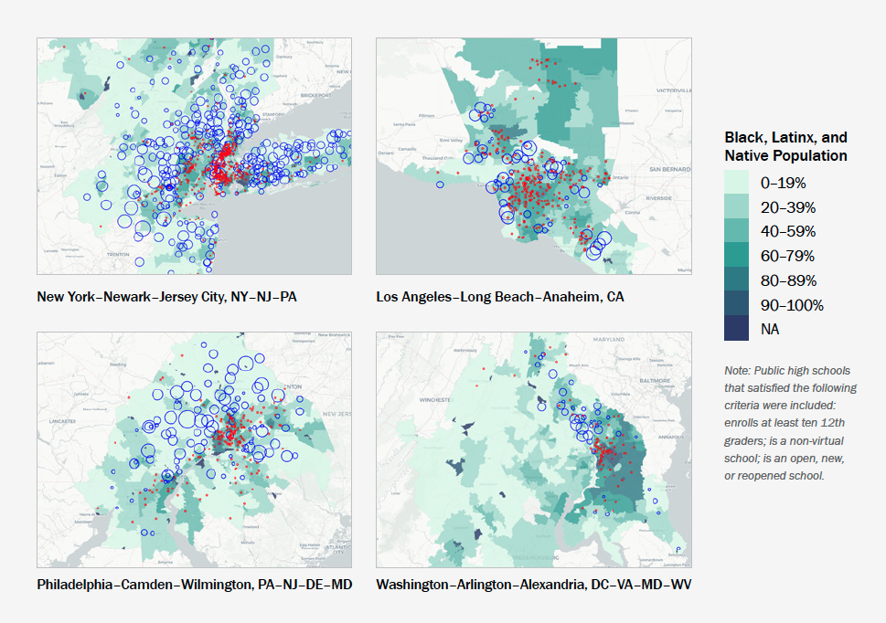

```{r setup, include= FALSE}
library(knitr)
library(bookdown)

# https://cran.r-project.org/web/packages/kableExtra/vignettes/awesome_table_in_pdf.pdf
library(kableExtra)
library(tidyverse)
library(gridExtra)
library(scales)

knitr::opts_chunk$set(echo = F, message = F, warning = F)

knitr::knit_hooks$set(inline = function(x) {   if(!is.numeric(x)){     x   }else{    prettyNum(round(x,2), big.mark=",")    } })

theme_set(
  theme(
    text = element_text(size = 7),
    panel.background = element_blank(),
    plot.title = element_text(color = '#444444', size = 7, hjust = 0.5, face = 'bold'),
    axis.ticks = element_blank(),
    axis.title = element_text(face = 'bold'),
    legend.title = element_text(face = 'bold'),
    legend.key.size = unit(0.3, 'cm')
  )
)
```

<!-- Structurally Racist Inputs in Student List Products -->

**Introduction and background**. Colleges and universities (herein universities) identify prospective students by purchasing "student lists" from College Board, ACT, and other vendors. A student list contains the contact information of prospective students who meet the search filter criteria (e.g., test score range, GPA, zip codes) specified by the university, who can then be recruited via mail, email, and on social media. Recent research suggests that student lists are important for the college access outcomes of millions of students each year [@RN4739]. After controlling for covariates, students who opt into College Board Student Search Service -- allowing accredited institutions to "licence" their contact information -- were 25% more likely to enroll in a 4-year college than students who opted out (see these results reproduced in Figure \@ref(fig:cb-outcomes)). Furthermore, the results were stronger for students who identified as Black, Latinx, and first-generation.

However, a series of recent reports by Author (XXXXa, XXXXb, XXXXc) argue that student list products systematically exclude underrepresented student populations in two ways. The first source of exclusion is which prospective students are in the underlying database. Historically, student list products sold by College Board and ACT exclude non test-takers, but rates of test-taking differ by race and class. Second, several "search filters" (e.g., zip code, AP score) used to control which prospect profiles are purchased further facilitate the exclusion of students from communities of color and low-income communities. 

This paper examines the exclusionary effects of student list products. We ask, what is the relationship between student list search filters and the characteristics of students who are included vs. excluded in student lists purchased from College Board? We reconstruct College Board student list products using nationally representative data on high school students from the High School Longitudinal Study of 2009 (HSLS:09). We create measures for each search filter and measures that identify whether students are included in the underlying student list database. Empirical analyses investigate the relationship between particular filters and combinations of filters -- our "X" variables of interest -- and the racial and socioeconomic composition of students who are included vs. excluded from purchases that utilize these filters.

**Literature Review**. A growing literature within the sociology of education examines the relationship between recruiting and college access. For example, @RN4324 analyzes recruiting from the perspective of high school students. @RN3519 analyzes recruiting from the perspective of a selective liberal arts college. @cottom2017lower analyzes the recruiting behavior of for-profit universities. Authors (XXXXD, XXXXE) investigated off-campus recruiting visits by public research universities. All of these studies assume that recruiting is primarily a practice of individual colleges and universities. 

By contrast, Authors (XXXXA) argue that university enrollment management behaviors are increasingly structured by products purchased from third-party software and consulting firms. Historically, the market for student list data has been dominated by College Board and ACT. However, advances in technology and the test-optional movement have created opportunities for edtech software and consulting firms to become suppliers of student list data. 

Author (XXXXB) issued public records requests to public universities to collect data about student list purchases. Empirically, Authors (XXXB) showed that student list filters that utilized particular combinations of search filters were associated with profound racial and socioeconomic exclusion. Because of data limitations, Authors (XXXB) cannot determine which particular filters and filter thresholds are driving the exclusion. This paper overcomes this limitation, by recreating College Board student list products using HSLS:09 and then simulating who is included/excluded as filters and filter thresholds are changed.


**Theory**. We develop a conceptual framework from scholarship at the nexus of sociology of race and digital platforms [@RN4774; @RN4786; @RN4778; @RN4777; @RN4421; @RN4794]. Student list products are algorithmic selection devices that – similar to Google Ads or Facebook – allow advertisers to control the prospective customers through the use of search filters. Structural racism is “systematic racial bias embedded in the ‘normal’ functions of laws and social relations” [@RN4760, p. 1143], whereby processes viewed as neutral or common-sense systematically advantage dominant groups. Structurally racist inputs are determinants of a selection device that are correlated with race because non-white people have been historically excluded from the input [@RN4786]. After establishing foundational concepts, we conceptualize several "geographic" and "academic" search filters as structurally racist inputs. For example, prospects may be filtered by zip code, but zip codes are correlated with race because of residential segregation [@RN4775]. Next, we develop testable propositions about the relationship between specific filters and racial exclusion from purchased lists.

**Methods, analyses, progress to date**. Propositions will be tested using data from HLS:09 and student list order summaries by public universities collected from public records requests. The nationally representative analysis dataset will include measures of whether students are included in College Board student list products and measures for each search filter. Figure \@ref(fig:filters), based on data from public records requests, shows that search filters can be categorized into the four buckets of geographic, academic, demographic, and student preferences.

Analyses will consist of simple descriptive statistics -- with appropriate tests of significance -- and interactive maps. First, we will analyze the racial and socioeconomic composition of purchases that filter only on particular geographic filters discussed in the conceptual framework. Second, we will analyze purchases that filter on particular academic filters. However, actual student list purchases utilize multiple search filters. Drawing from data on actual purchases made by public universities, the third stage of analyses will analyze purchases that filter on both geographic and academic filters. We will then simulate marginal changes to filters to identify the drivers of exclusion.

To date, we have created an analysis dataset from public-use HSL:09 data. We have submitted a request for restricted HLS:09 data and expect to receive data by 12/1/2022. Additionally, we have created scripts that produce desired descriptive statistics and interactive maps. These can be seen in Figures \@ref(fig:zipcode) and \@ref(fig:metromaps), respectively.


**Significance**. This research contributes to the sociology of education in two ways. First, whereas scholarship on college access focuses on students, schools, and policies, we push scholarship to consider how third-party products structure college access. Second, we encourage the sociology of education to analyze structural barriers to opportunity by drawing from recent advances in the sociology of race. 

<!-- Third, we contribute empirical analyses to the nascent "platform studies in education" literature [@RN4843; @RN4847; @RN4827; @RN4815]. -->


\pagebreak

<!-- \pagebreak -->


# References

<div id="refs"></div>

\pagebreak


# Figures


```{r cb-outcomes, echo = FALSE, fig.cap = "Student Search Service: College Enrollment and Degree Completion", out.width=500, fig.align='center'}
knitr::include_graphics('../../assets/images/cb_outcomes.png')
#
```

```{r filters, echo = FALSE, fig.cap = "Filters Used in Order Purchases by Research vs. MA/Doctoral Universities", out.width=500, fig.align='center'}
knitr::include_graphics('../../assets/images/filters.png')
#
```


```{r zipcode, echo = FALSE, fig.cap = "Los Angeles Prospects from Top Income Decile Zip Codes by Racial Composition", out.width=500, fig.align='center'}
knitr::include_graphics('../../assets/images/zipcode.png')
#
```

```{r metromaps, echo = FALSE, fig.cap = "Segment Filter Prospects by Metro Maps (Average Income and Racial Composition)", out.width=500, fig.align='center'}

#
```


