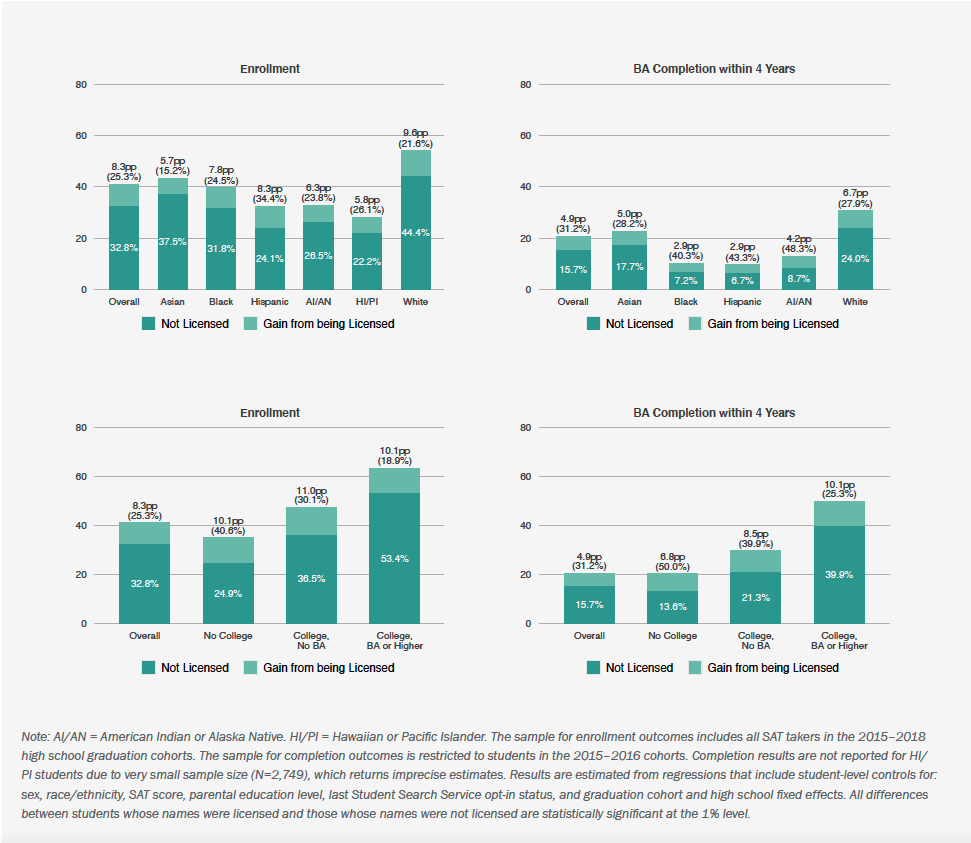
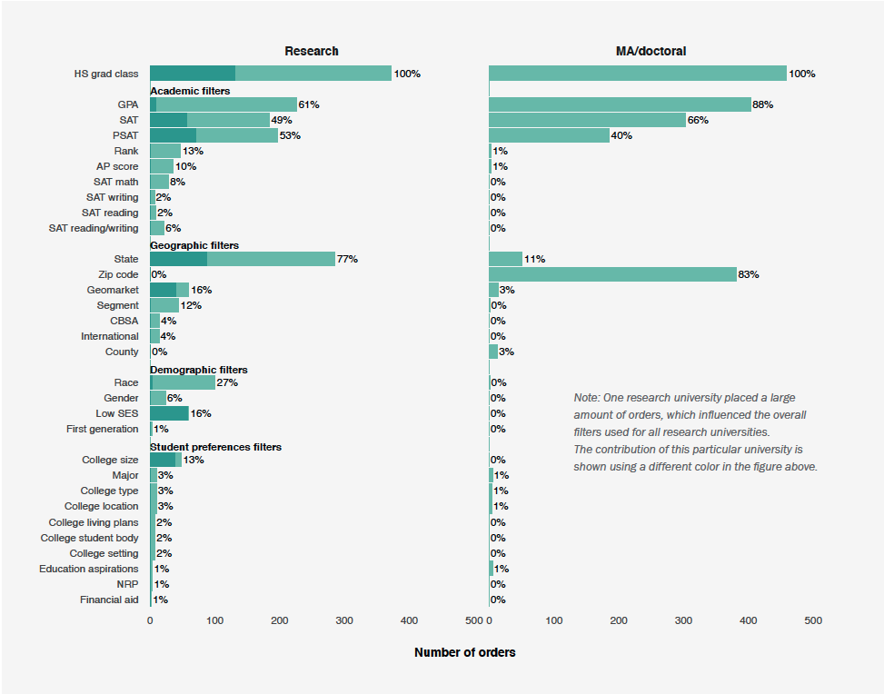
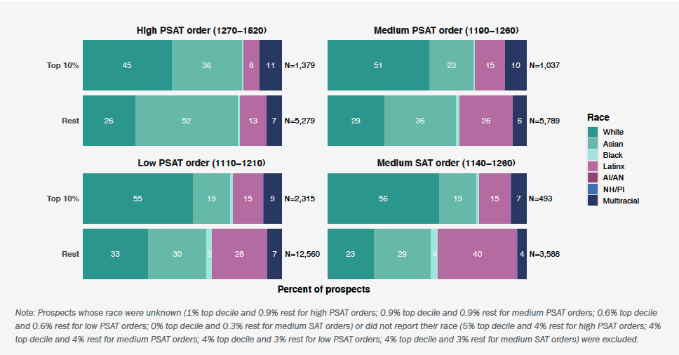

```{r setup, include= FALSE}
library(knitr)
library(bookdown)

# https://cran.r-project.org/web/packages/kableExtra/vignettes/awesome_table_in_pdf.pdf
library(kableExtra)
library(tidyverse)
library(gridExtra)
library(scales)

knitr::opts_chunk$set(echo = F, message = F, warning = F)

knitr::knit_hooks$set(inline = function(x) {   if(!is.numeric(x)){     x   }else{    prettyNum(round(x,2), big.mark=",")    } })

theme_set(
  theme(
    text = element_text(size = 7),
    panel.background = element_blank(),
    plot.title = element_text(color = '#444444', size = 7, hjust = 0.5, face = 'bold'),
    axis.ticks = element_blank(),
    axis.title = element_text(face = 'bold'),
    legend.title = element_text(face = 'bold'),
    legend.key.size = unit(0.3, 'cm')
  )
)
```


# Figures


```{r cb-outcomes, echo = FALSE, fig.cap = "Student Search Service: College Enrollment and Degree Completion", out.width=500, fig.align='center'}

#
```

```{r filters, echo = FALSE, fig.cap = "Filters Used in Order Purchases by Research vs. MA/Doctoral Universities", out.width=500, fig.align='center'}

#
```


```{r zipcode, echo = FALSE, fig.cap = "Los Angeles Prospects from Top Income Decile Zip Codes by Racial Composition", out.width=500, fig.align='center'}

#
```

```{r metromaps, echo = FALSE, fig.cap = "Segment Filter Prospects by Metro Maps (Average Income and Racial Composition)", out.width=500, fig.align='center'}
knitr::include_graphics('../../assets/images/metromaps.png')
#
```


